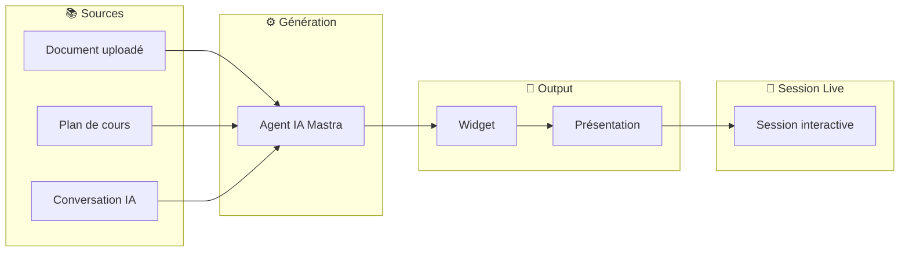
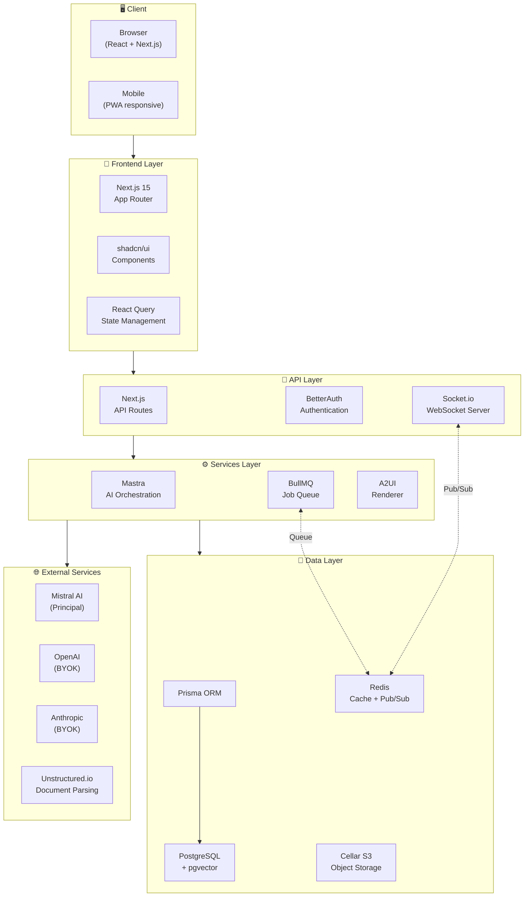
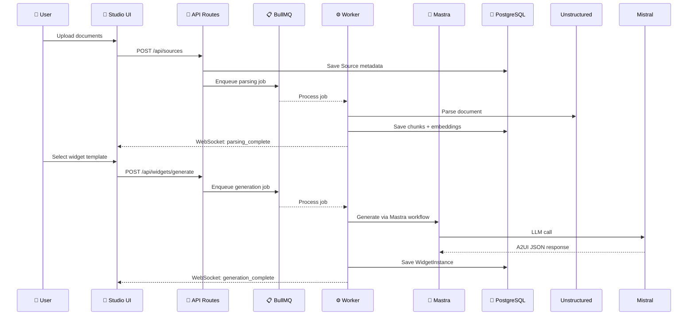
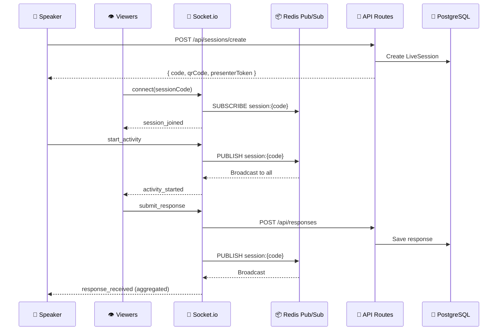
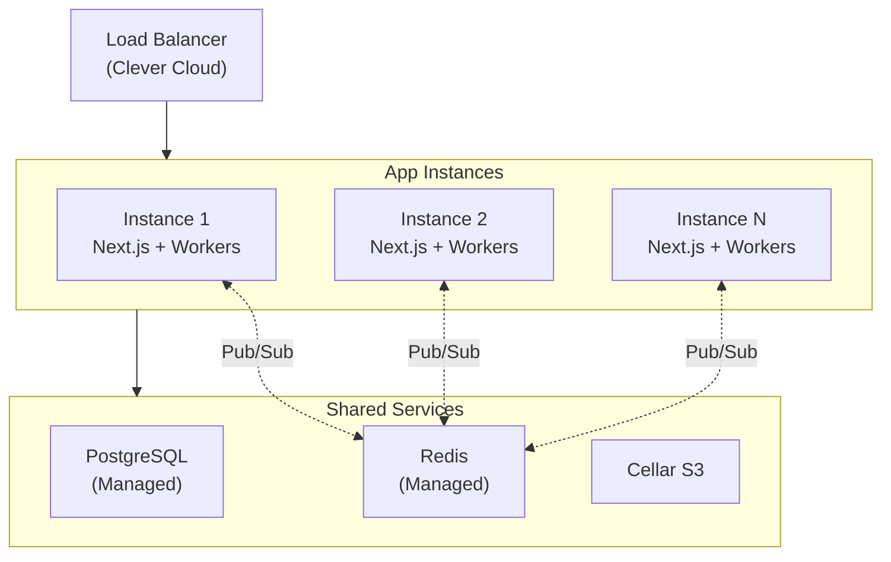

# Architecture Globale - Qiplim Studio

## Vue d'ensemble

Qiplim Studio est une application de création de contenu pédagogique interactif, inspirée de **NotebookLM**. Elle permet aux formateurs de générer des widgets (activités, contenus pédagogiques) à partir de leurs sources documentaires via une interface conversationnelle avec l'IA.

### Studio vs Engage : Deux Applications Distinctes

> **Important** : Studio et Engage sont **2 applications distinctes** avec des **bases de données séparées**, partageant des packages via un **monorepo**.

| Aspect | Studio | Engage |
|--------|--------|--------|
| **Style** | NotebookLM (chat IA conversationnel) | Ahaslides/Slido (génération automatique) |
| **Interface** | 3 panneaux (sources, chat, templates) | Flux linéaire (upload → suggestions → session) |
| **Widgets** | 2 catégories (Activités + Contenus pédagogiques) | 4 types MLP (activités uniquement) |
| **Sources** | Centrales, explorables, persistantes | Utilisées pour générer, non explorables |
| **Historique IA** | Conversations gardées | Pas d'historique |
| **Base de données** | PostgreSQL séparée | PostgreSQL séparée |
| **Packages** | Partagés via monorepo | Partagés via monorepo |

### Stack Technique

- **Monorepo** avec Turborepo
- **Next.js 15** App Router pour le frontend et les API routes
- **Prisma** pour l'ORM avec PostgreSQL
- **BullMQ** pour les jobs asynchrones
- **Mastra** pour l'orchestration des agents IA
- **Socket.io + Redis** pour le temps réel

---

## Interface Studio : 3 Panneaux

Studio utilise une interface à **3 panneaux** inspirée de NotebookLM :

```
┌─────────────────────────────────────────────────────────────────┐
│                        STUDIO LAYOUT                            │
├────────────────┬─────────────────────┬──────────────────────────┤
│                │                     │                          │
│   📚 SOURCES   │     💬 CHAT IA      │    🧩 TEMPLATES/WIDGETS  │
│                │                     │                          │
│  • Documents   │  • Conversation     │  • Templates disponibles │
│  • Upload      │  • Génération       │  • Widgets générés       │
│  • Analyse     │  • Historique       │  • Bibliothèque          │
│  • Extraits    │  • Suggestions      │  • Présentations         │
│                │                     │                          │
├────────────────┴─────────────────────┴──────────────────────────┤
│                     Navigation / Actions                        │
└─────────────────────────────────────────────────────────────────┘
```

### Panneau Sources (gauche)
- Upload de documents (PDF, DOCX, PPTX, etc.)
- Visualisation des sources avec analyse IA
- Exploration des extraits et concepts clés
- Sélection de sources pour la génération

### Panneau Chat IA (centre)
- Conversation avec l'IA sur les sources
- Demandes de génération de widgets
- Historique des conversations **persisté**
- Suggestions contextuelles

### Panneau Templates/Widgets (droite)
- Liste des templates disponibles par catégorie
- Widgets générés (bibliothèque)
- Présentations créées
- Drag & drop pour composer des présentations

---

## Catégories de Widgets Studio

Studio supporte **2 catégories** de widgets :

### 1. Activités (jouables en session live)

Comme dans Engage, ces widgets peuvent être joués avec des participants :

| Type | Description |
|------|-------------|
| **Quiz** | Questions à choix multiples avec scoring |
| **Wordcloud** | Nuage de mots collaboratif |
| **Postit** | Post-its avec catégorisation et vote |
| **Roleplay** | Jeux de rôle avec agent IA |

### 2. Contenus Pédagogiques

Widgets de contenu, non interactifs en session :

| Type | Description |
|------|-------------|
| **Presentation slides** | Diaporama généré depuis les sources |
| **Plan de cours** | Structure pédagogique |
| **Contenus de cours** | Textes, résumés, synthèses |
| **Déroulé pédagogique** | Timeline de formation |
| **Page web** | Contenu exportable en page web |

---

## Flux de Génération Studio



### Sources de Génération

Une **Présentation** peut être générée depuis :
1. Un ou plusieurs **documents uploadés** (RAG)
2. Un **plan de cours** existant
3. Une **conversation** avec le chat IA

### Relation Présentation ↔ Session

- Une **Présentation** = séquence ordonnée de widgets/slides
- Une **Session Live** peut jouer une présentation complète
- Les activités peuvent aussi être jouées directement (hors présentation)

---

## Diagramme d'Architecture



---

## Flux de Données Principal

### 1. Création de Contenu (Widget Generation)



### 2. Session Live (Real-time Interaction)



---

## Architecture des Composants

### Frontend Studio

L'app principale `apps/studio` gère la création de contenu :

```
apps/studio/
├── app/
│   ├── (public)/              # Routes publiques
│   │   └── create/            # Création rapide sans login
│   ├── (auth)/                # Routes authentifiées
│   │   ├── dashboard/         # Dashboard utilisateur
│   │   ├── studio/[id]/       # Éditeur Studio (3 panneaux)
│   │   │   ├── sources/       # Gestion des sources
│   │   │   ├── chat/          # Chat IA avec historique
│   │   │   └── widgets/       # Gestion des widgets
│   │   └── session/[code]/
│   │       └── presenter/     # Vue présentateur
│   ├── api/                   # API Routes (tout le backend)
│   │   ├── auth/              # BetterAuth handlers
│   │   ├── studios/           # CRUD studios
│   │   ├── sources/           # CRUD sources
│   │   ├── widgets/           # CRUD widgets
│   │   ├── conversations/     # Historique chat IA
│   │   ├── sessions/          # CRUD sessions
│   │   ├── ai/                # AI endpoints (génération)
│   │   └── ws/                # WebSocket endpoint
│   └── _providers/            # Context providers
├── components/
│   ├── studio/                # Composants Studio
│   │   ├── studio-layout.tsx  # Layout 3 panneaux
│   │   ├── sources-panel.tsx  # Panneau sources
│   │   ├── chat-panel.tsx     # Panneau chat IA
│   │   └── widgets-panel.tsx  # Panneau widgets/templates
│   ├── widgets/               # Renderers A2UI
│   ├── session/               # Composants session live
│   └── ui/                    # shadcn/ui wrappers
├── workers/                   # BullMQ Workers
│   ├── document-worker.ts
│   └── generation-worker.ts
└── lib/
    ├── api/                   # API clients
    ├── hooks/                 # Custom hooks
    └── utils/                 # Utilitaires
```

### Note sur Engage

> **⚠️ Important** : L'application `apps/engage` est une **application séparée** avec sa propre base de données. Elle est documentée dans les **specs Engage** séparées (`engage/00-specs-engage.md`).
>
> Les deux applications partagent des **packages communs** via le monorepo (voir `03-monorepo-structure.md` pour les détails).

### Backend Services (packages/)

```
packages/
├── db/                        # Prisma + migrations
│   ├── prisma/
│   │   ├── schema.prisma      # Schéma complet
│   │   └── migrations/        # Historique migrations
│   └── src/
│       ├── client.ts          # Prisma client singleton
│       └── types.ts           # Types générés
├── shared/                    # Types partagés
│   └── src/
│       ├── types/             # DTOs, interfaces
│       ├── schemas/           # Zod schemas
│       └── constants/         # Constantes
├── ui/                        # Design system
│   └── src/
│       └── components/        # shadcn/ui
└── ai/                        # Agents IA (Mastra)
    └── src/
        ├── agents/            # Définitions agents
        ├── workflows/         # Workflows Mastra
        └── tools/             # Tools pour agents
```

---

## Points de Décision Architecturale

### 1. API Routes vs NestJS

**Choix : Next.js API Routes uniquement**

| Critère | API Routes | NestJS |
|---------|------------|--------|
| Simplicité | ✅ | ❌ |
| Déploiement | ✅ Single app | ❌ Multi-services |
| Type safety | ✅ Avec Zod | ✅ Avec decorators |
| Performance | ✅ Edge-ready | ❌ Node only |

### 2. WebSocket Strategy

**Choix : Socket.io + Redis Adapter**

```typescript
// Configuration Socket.io avec Redis
import { createAdapter } from '@socket.io/redis-adapter';
import { createClient } from 'redis';

const pubClient = createClient({ url: process.env.REDIS_URL });
const subClient = pubClient.duplicate();

io.adapter(createAdapter(pubClient, subClient));
```

### 3. Job Processing

**Choix : BullMQ avec workers intégrés**

Les workers BullMQ démarrent via `instrumentation.ts` de Next.js :

```typescript
// instrumentation.ts
export async function register() {
  if (process.env.NEXT_RUNTIME === 'nodejs') {
    await import('./workers/document-worker');
    await import('./workers/generation-worker');
  }
}
```

---

## Scalabilité

### Horizontal Scaling



### Quotas et Limites

| Resource | Limite | Scaling |
|----------|--------|---------|
| Concurrent WS | 10K/instance | Horizontal |
| Job concurrency | 5/instance | Workers BullMQ |
| DB connections | 20/instance | Pool Prisma |
| AI calls | Rate limited | Queue + retry |

---

## Sécurité

### Couches de Sécurité

1. **Transport** : HTTPS obligatoire (TLS 1.3)
2. **Authentication** : BetterAuth (JWT + sessions)
3. **Authorization** : Middleware custom
4. **Validation** : Zod schemas
5. **Rate Limiting** : Redis-based

### Middleware Stack

```typescript
// Ordre des middlewares
export const middleware = [
  rateLimitMiddleware,      // 1. Rate limiting
  corsMiddleware,           // 2. CORS
  authMiddleware,           // 3. Authentication
  validationMiddleware,     // 4. Input validation
  loggingMiddleware,        // 5. Logging
];
```

---

## Monitoring & Observabilité

### Logs

- Format JSON structuré
- Niveaux : debug, info, warn, error
- Contexte : requestId, userId, sessionId

### Métriques

| Métrique | Type | Description |
|----------|------|-------------|
| `http_requests_total` | Counter | Requêtes HTTP |
| `http_request_duration_ms` | Histogram | Latence p50/p95/p99 |
| `ws_connections_active` | Gauge | Connexions WS actives |
| `jobs_processed_total` | Counter | Jobs BullMQ traités |
| `ai_calls_total` | Counter | Appels IA |

### Alertes

- Erreurs 5xx > 1% du trafic
- Latence p95 > 2s
- Queue backlog > 100 jobs
- WS disconnects spike
