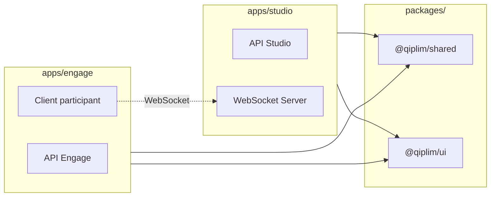

# Structure du Monorepo

## Vue d'ensemble

Le projet utilise **Turborepo** pour gérer un monorepo contenant **deux applications distinctes** (Studio et Engage) qui partagent des packages communs.

> **⚠️ Important** : Studio et Engage sont des **applications séparées avec des bases de données séparées**. Elles ne partagent que du code (types, UI, utilitaires) via les packages.

```
qiplim-v2/
├── apps/
│   ├── engage/                 # App Engage (BD séparée) - voir specs Engage
│   └── studio/                 # App Studio (BD séparée) - cette documentation
├── packages/
│   ├── db/                     # Schémas Prisma (chaque app a son instance)
│   ├── shared/                 # Types et utilitaires partagés
│   ├── ui/                     # Composants shadcn/ui (partagé)
│   └── ai/                     # Agents Mastra (utilisé par Studio)
├── tooling/
│   ├── eslint/                 # Config ESLint partagée
│   └── tsconfig/               # Config TypeScript partagée
├── docker-compose.yml          # Services locaux
├── turbo.json                  # Config Turborepo
├── pnpm-workspace.yaml         # Workspace pnpm
└── package.json                # Root package
```

---

## Frontières entre Apps

### Ce qui est SÉPARÉ

| Aspect | Studio | Engage |
|--------|--------|--------|
| **Base de données** | `qiplim_studio` (PostgreSQL) | `qiplim_engage` (PostgreSQL) |
| **Authentification** | BetterAuth (users formateurs) | JWT temporaires (participants) |
| **URL** | `studio.qiplim.fr` | `app.qiplim.fr` |
| **Déploiement** | Instance séparée | Instance séparée |
| **Documentation** | Cette documentation | `engage/00-specs-engage.md` |

### Ce qui est PARTAGÉ (packages/)

| Package | Usage |
|---------|-------|
| `@qiplim/shared` | Types TypeScript, Zod schemas, constantes |
| `@qiplim/ui` | Composants shadcn/ui, design system |
| `@qiplim/db` | Client Prisma (schéma commun, instances différentes) |
| `@qiplim/ai` | Agents Mastra (Studio uniquement) |

### Communication entre Apps



> **Note** : Les participants Engage se connectent au WebSocket **de Studio** pour les sessions live. Il n'y a pas de communication directe BD entre les deux apps.

---

## Applications (apps/)

### apps/studio

Application Next.js 15 principale pour l'**authoring** (création de contenu) :

```
apps/studio/
├── app/
│   ├── (public)/               # Routes sans authentification
│   │   ├── page.tsx            # Landing page
│   │   └── create/             # Création rapide
│   │       └── page.tsx
│   │
│   ├── (auth)/                 # Routes authentifiées
│   │   ├── layout.tsx          # Auth layout
│   │   ├── dashboard/
│   │   │   └── page.tsx        # Dashboard utilisateur
│   │   ├── studio/
│   │   │   ├── page.tsx        # Liste des studios
│   │   │   └── [id]/
│   │   │       ├── page.tsx    # Éditeur Studio
│   │   │       ├── sources/
│   │   │       │   └── page.tsx
│   │   │       └── widgets/
│   │   │           └── page.tsx
│   │   └── session/
│   │       └── [code]/
│   │           └── presenter/
│   │               └── page.tsx  # Vue présentateur
│   │
│   ├── api/                    # API Routes (backend complet)
│   │   ├── auth/
│   │   │   └── [...all]/
│   │   │       └── route.ts    # BetterAuth handlers
│   │   ├── studios/
│   │   │   ├── route.ts        # CRUD studios
│   │   │   └── [id]/
│   │   │       ├── route.ts
│   │   │       ├── sources/
│   │   │       │   └── route.ts
│   │   │       └── widgets/
│   │   │           └── route.ts
│   │   ├── sessions/
│   │   │   ├── route.ts
│   │   │   └── [code]/
│   │   │       └── route.ts
│   │   ├── ai/
│   │   │   ├── generate/
│   │   │   │   └── route.ts    # Génération widgets
│   │   │   └── analyze/
│   │   │       └── route.ts    # Analyse documents
│   │   └── ws/
│   │       └── route.ts        # WebSocket endpoint
│   │
│   ├── _providers/
│   │   ├── query-provider.tsx  # TanStack Query
│   │   ├── auth-provider.tsx   # BetterAuth
│   │   └── socket-provider.tsx # Socket.io
│   │
│   ├── globals.css
│   ├── layout.tsx              # Root layout
│   └── not-found.tsx
│
├── components/
│   ├── studio/                 # Composants Studio
│   │   ├── studio-layout.tsx   # Layout tri-panneaux
│   │   ├── sources-panel.tsx   # Panel sources
│   │   ├── chat-panel.tsx      # Panel chat IA
│   │   └── widgets-panel.tsx   # Panel widgets
│   │
│   ├── widgets/                # Renderers A2UI
│   │   ├── quiz/
│   │   │   ├── quiz-edit.tsx
│   │   │   ├── quiz-speaker.tsx
│   │   │   └── quiz-viewer.tsx
│   │   ├── wordcloud/
│   │   ├── postit/
│   │   └── roleplay/
│   │
│   ├── session/                # Composants session (présentateur)
│   │   ├── presenter-view.tsx
│   │   └── qr-display.tsx
│   │
│   └── ui/                     # Wrappers shadcn
│       └── ... (re-exports)
│
├── lib/
│   ├── api/                    # Clients API
│   │   ├── studios.ts
│   │   ├── sessions.ts
│   │   └── ai.ts
│   │
│   ├── hooks/                  # Custom hooks
│   │   ├── use-studio.ts
│   │   ├── use-session.ts
│   │   └── use-socket.ts
│   │
│   ├── utils/                  # Utilitaires
│   │   ├── cn.ts               # Class names
│   │   ├── format.ts
│   │   └── validation.ts
│   │
│   ├── auth.ts                 # BetterAuth config
│   ├── socket.ts               # Socket.io client
│   └── query-client.ts         # TanStack Query
│
├── workers/                    # BullMQ Workers
│   ├── document-worker.ts
│   └── generation-worker.ts
│
├── instrumentation.ts          # Next.js instrumentation
├── middleware.ts               # Auth middleware
├── next.config.ts
├── tailwind.config.ts
├── tsconfig.json
└── package.json
```

### apps/engage

> **📚 Documentation complète** : Voir `engage/00-specs-engage.md` pour les specs détaillées de l'application Engage.

Application distincte avec sa propre base de données. Elle gère :
- Le flux de création rapide (upload → suggestions → session)
- Les 4 types d'activités MLP
- L'interface participant pour les sessions live

**Points clés :**
- Base de données PostgreSQL séparée (`qiplim_engage`)
- Pas d'authentification utilisateur (JWT temporaires pour participants)
- Se connecte au WebSocket de Studio pour les sessions

---

## Packages (packages/)

### packages/db

Gestion de la base de données avec Prisma :

```
packages/db/
├── prisma/
│   ├── schema.prisma           # Schéma complet
│   ├── migrations/             # Historique migrations
│   │   ├── 20260115_init/
│   │   └── ...
│   └── seed.ts                 # Données de seed
│
├── src/
│   ├── client.ts               # Prisma client singleton
│   ├── types.ts                # Types générés
│   └── index.ts                # Re-exports
│
├── package.json
└── tsconfig.json
```

```json
// packages/db/package.json
{
  "name": "@qiplim/db",
  "version": "1.0.0",
  "main": "./src/index.ts",
  "types": "./src/index.ts",
  "scripts": {
    "db:generate": "prisma generate",
    "db:push": "prisma db push",
    "db:migrate-dev": "prisma migrate dev",
    "db:migrate-deploy": "prisma migrate deploy",
    "db:studio": "prisma studio",
    "db:seed": "tsx prisma/seed.ts"
  },
  "dependencies": {
    "@prisma/client": "^6.19.0"
  },
  "devDependencies": {
    "prisma": "^6.19.0",
    "tsx": "^4.7.0"
  }
}
```

### packages/shared

Types et utilitaires partagés :

```
packages/shared/
├── src/
│   ├── types/
│   │   ├── studio.ts           # Types Studio
│   │   ├── widget.ts           # Types Widget
│   │   ├── session.ts          # Types Session
│   │   ├── activity.ts         # Types Activity
│   │   └── index.ts
│   │
│   ├── schemas/                # Zod schemas
│   │   ├── studio.schema.ts
│   │   ├── widget.schema.ts
│   │   ├── session.schema.ts
│   │   └── index.ts
│   │
│   ├── constants/
│   │   ├── activity-types.ts
│   │   ├── session-states.ts
│   │   └── index.ts
│   │
│   └── index.ts
│
├── package.json
└── tsconfig.json
```

Types principaux :

```typescript
// packages/shared/src/types/studio.ts
export interface Studio {
  id: string;
  userId: string;
  title: string;
  description?: string;
  sources: Source[];
  widgets: WidgetInstance[];
  createdAt: Date;
  updatedAt: Date;
}

export interface Source {
  id: string;
  studioId: string;
  filename: string;
  url: string;
  mimeType: string;
  size: number;
  status: 'PENDING' | 'PROCESSING' | 'COMPLETED' | 'FAILED';
  analysis?: SourceAnalysis;
  createdAt: Date;
}

export interface SourceAnalysis {
  themes: string[];
  concepts: string[];
  suggestedWidgets: SuggestedWidget[];
}

// packages/shared/src/types/widget.ts
export interface WidgetTemplate {
  id: string;
  name: string;
  description: string;
  category: WidgetCategory;
  inputsSchema: Record<string, InputSchema>;
  promptTemplate: string;
  outputSchema: Record<string, unknown>;
  views: {
    edit: string;
    speaker: string;
    viewer: string;
  };
}

export interface WidgetInstance {
  id: string;
  studioId: string;
  templateId: string;
  inputs: Record<string, unknown>;
  sourceRefs: string[];
  activitySpec: Record<string, unknown>;
  a2uiViews: A2UIViews;
  version: number;
  createdAt: Date;
}

export interface A2UIViews {
  edit: A2UIComponent[];
  speaker: A2UIComponent[];
  viewer: A2UIComponent[];
}

export type WidgetCategory =
  | 'quiz'
  | 'poll'
  | 'wordcloud'
  | 'postit'
  | 'roleplay'
  | 'flashcard';
```

### packages/ui

Design system basé sur shadcn/ui :

```
packages/ui/
├── src/
│   ├── components/
│   │   ├── button.tsx
│   │   ├── card.tsx
│   │   ├── dialog.tsx
│   │   ├── dropdown-menu.tsx
│   │   ├── input.tsx
│   │   ├── select.tsx
│   │   ├── tabs.tsx
│   │   ├── toast.tsx
│   │   └── ... (autres composants)
│   │
│   ├── hooks/
│   │   └── use-toast.ts
│   │
│   └── index.ts                # Re-exports
│
├── tailwind.config.ts
├── package.json
└── tsconfig.json
```

```json
// packages/ui/package.json
{
  "name": "@qiplim/ui",
  "version": "1.0.0",
  "main": "./src/index.ts",
  "types": "./src/index.ts",
  "scripts": {
    "ui:add": "npx shadcn@latest add"
  },
  "dependencies": {
    "@radix-ui/react-dialog": "^1.0.5",
    "@radix-ui/react-dropdown-menu": "^2.0.6",
    "@radix-ui/react-select": "^2.0.0",
    "@radix-ui/react-tabs": "^1.0.4",
    "class-variance-authority": "^0.7.0",
    "clsx": "^2.1.0",
    "lucide-react": "^0.310.0",
    "tailwind-merge": "^2.2.0"
  },
  "peerDependencies": {
    "react": "^18.0.0",
    "react-dom": "^18.0.0"
  }
}
```

### packages/ai

Agents et workflows Mastra pour le Studio :

```
packages/ai/
├── src/
│   ├── agents/
│   │   ├── document-analyzer.ts    # Analyse de documents
│   │   ├── quiz-generator.ts       # Génération de quiz
│   │   ├── wordcloud-generator.ts  # Génération wordcloud
│   │   ├── postit-analyzer.ts      # Analyse post-its
│   │   ├── roleplay-agent.ts       # Agent jeu de rôle
│   │   └── index.ts
│   │
│   ├── workflows/
│   │   ├── parse-document.workflow.ts
│   │   ├── generate-widget.workflow.ts
│   │   ├── analyze-session.workflow.ts
│   │   └── index.ts
│   │
│   ├── tools/
│   │   ├── retriever.tool.ts       # RAG retrieval
│   │   ├── embeddings.tool.ts      # Génération embeddings
│   │   └── index.ts
│   │
│   ├── prompts/
│   │   ├── quiz.prompt.ts
│   │   ├── wordcloud.prompt.ts
│   │   ├── postit.prompt.ts
│   │   ├── roleplay.prompt.ts
│   │   └── index.ts
│   │
│   ├── mastra.ts                   # Configuration Mastra
│   └── index.ts
│
├── package.json
└── tsconfig.json
```

---

## Tooling (tooling/)

### tooling/eslint

```
tooling/eslint/
├── base.js                     # Config de base
├── nextjs.js                   # Config Next.js
├── react.js                    # Config React
└── package.json
```

### tooling/tsconfig

```
tooling/tsconfig/
├── base.json                   # Config de base
├── nextjs.json                 # Config Next.js
├── react-library.json          # Config packages React
└── package.json
```

---

## Configuration Root

### turbo.json

```json
{
  "$schema": "https://turbo.build/schema.json",
  "globalDependencies": [".env"],
  "tasks": {
    "build": {
      "dependsOn": ["^build"],
      "outputs": [".next/**", "!.next/cache/**", "dist/**"]
    },
    "dev": {
      "cache": false,
      "persistent": true
    },
    "lint": {
      "dependsOn": ["^lint"]
    },
    "typecheck": {
      "dependsOn": ["^typecheck"]
    },
    "db:generate": {
      "cache": false
    },
    "db:push": {
      "cache": false
    }
  }
}
```

### pnpm-workspace.yaml

```yaml
packages:
  - 'apps/*'
  - 'packages/*'
  - 'tooling/*'
```

### package.json (root)

```json
{
  "name": "qiplim-v2",
  "private": true,
  "scripts": {
    "dev": "turbo dev",
    "build": "turbo build",
    "lint": "turbo lint",
    "typecheck": "turbo typecheck",
    "format": "prettier --write \"**/*.{ts,tsx,md}\"",
    "clean": "turbo clean && rm -rf node_modules"
  },
  "devDependencies": {
    "@qiplim/eslint-config": "workspace:*",
    "@qiplim/tsconfig": "workspace:*",
    "prettier": "^3.2.0",
    "turbo": "^2.0.0"
  },
  "packageManager": "pnpm@9.0.0",
  "engines": {
    "node": ">=20"
  }
}
```

### docker-compose.yml

```yaml
version: '3.8'

services:
  postgres:
    image: pgvector/pgvector:pg16
    environment:
      POSTGRES_USER: qiplim
      POSTGRES_PASSWORD: qiplim
      POSTGRES_DB: qiplim_engage
    ports:
      - '5432:5432'
    volumes:
      - postgres_data:/var/lib/postgresql/data
    healthcheck:
      test: ['CMD-SHELL', 'pg_isready -U qiplim']
      interval: 5s
      timeout: 5s
      retries: 5

  redis:
    image: redis:7-alpine
    ports:
      - '6379:6379'
    volumes:
      - redis_data:/data
    healthcheck:
      test: ['CMD', 'redis-cli', 'ping']
      interval: 5s
      timeout: 5s
      retries: 5

volumes:
  postgres_data:
  redis_data:
```

---

## Workflow de Développement

### Installation

```bash
# Cloner le repo
git clone git@github.com:Pando-Studio/qiplim-v2.git
cd qiplim-v2

# Installer les dépendances
pnpm install

# Démarrer les services Docker
docker compose up -d

# Configurer les variables d'environnement
cp apps/studio/.env.example apps/studio/.env.local
cp apps/engage/.env.example apps/engage/.env.local

# Initialiser la base de données
pnpm --filter @qiplim/db db:push

# Démarrer le développement (les deux apps)
pnpm dev
```

### Commandes Utiles

| Commande | Description |
|----------|-------------|
| `pnpm dev` | Démarre toutes les apps en dev |
| `pnpm --filter @qiplim/studio dev` | Démarre uniquement Studio |
| `pnpm --filter @qiplim/engage dev` | Démarre uniquement Engage |
| `pnpm build` | Build de production |
| `pnpm lint` | Lint tous les packages |
| `pnpm typecheck` | Vérifie les types |
| `pnpm --filter @qiplim/db db:studio` | Ouvre Prisma Studio |
| `pnpm --filter @qiplim/ui ui:add <component>` | Ajoute un composant shadcn |
