# Modèle de Données - Vue d'ensemble

## Diagramme ERD Complet

```mermaid
erDiagram
    %% ============================================
    %% Authentication (BetterAuth)
    %% ============================================
    user ||--o{ session : has
    user ||--o{ account : has
    user ||--o{ Studio : owns
    user ||--o{ Document : uploads

    %% ============================================
    %% Studio Core
    %% ============================================
    Studio ||--o{ Source : contains
    Studio ||--o{ WidgetInstance : contains
    Studio ||--o{ Presentation : has
    Studio }o--|| user : "owned by"

    Source ||--o{ SourceChunk : "parsed into"
    Source }o--|| Studio : "belongs to"

    WidgetTemplate ||--o{ WidgetInstance : "instantiates"

    WidgetInstance }o--|| Studio : "belongs to"
    WidgetInstance }o--|| WidgetTemplate : "based on"
    WidgetInstance ||--o{ PresentationWidget : "used in"

    %% ============================================
    %% Presentations & Sessions
    %% ============================================
    Presentation ||--o{ PresentationWidget : contains
    Presentation ||--o{ LiveSession : plays
    Presentation }o--|| Studio : "belongs to"

    PresentationWidget }o--|| Presentation : "in"
    PresentationWidget }o--|| WidgetInstance : "uses"

    LiveSession ||--o{ Participant : has
    LiveSession ||--o{ SessionEvent : logs
    LiveSession }o--|| Presentation : "plays"

    Participant ||--o{ ActivityResponse : submits
    Participant }o--|| LiveSession : "joined"

    ActivityResponse }o--|| Participant : "from"
    ActivityResponse }o--|| WidgetInstance : "for"

    SessionEvent }o--|| LiveSession : "in"
    SessionEvent }o--o| Participant : "by"
    SessionEvent }o--o| WidgetInstance : "on"

    %% ============================================
    %% Entities Detail
    %% ============================================
    user {
        string id PK
        string email UK
        boolean emailVerified
        string name
        string image
        datetime createdAt
        datetime updatedAt
    }

    Studio {
        string id PK
        string userId FK
        string title
        string description
        json settings
        datetime createdAt
        datetime updatedAt
    }

    Source {
        string id PK
        string studioId FK
        string filename
        string url
        string mimeType
        int size
        enum status
        json analysis
        datetime createdAt
    }

    SourceChunk {
        string id PK
        string sourceId FK
        text content
        vector embedding
        json metadata
        int pageNumber
        int chunkIndex
    }

    WidgetTemplate {
        string id PK
        string name
        string description
        enum category
        json inputsSchema
        text promptTemplate
        json outputSchema
        json views
        boolean isOfficial
    }

    WidgetInstance {
        string id PK
        string studioId FK
        string templateId FK
        json inputs
        json sourceRefs
        json activitySpec
        json a2uiViews
        int version
        datetime createdAt
    }

    Presentation {
        string id PK
        string studioId FK
        string name
        json settings
        datetime createdAt
        datetime updatedAt
    }

    PresentationWidget {
        string id PK
        string presentationId FK
        string widgetInstanceId FK
        int order
        json transitionSettings
    }

    LiveSession {
        string id PK
        string presentationId FK
        string code UK
        string qrCode
        enum state
        string presenterToken UK
        int currentWidgetIndex
        int participantCount
        json metadata
        datetime startedAt
        datetime endedAt
    }

    Participant {
        string id PK
        string sessionId FK
        string displayName
        enum role
        json metadata
        datetime joinedAt
        datetime lastActivity
        boolean isActive
    }

    ActivityResponse {
        string id PK
        string sessionId FK
        string widgetInstanceId FK
        string participantId FK
        json response
        int score
        boolean isCorrect
        datetime submittedAt
    }

    SessionEvent {
        string id PK
        string sessionId FK
        string participantId FK
        string widgetInstanceId FK
        string type
        json scope
        json payload
        datetime occurredAt
    }
```



---

## Relations Principales

### Hiérarchie des Entités

```
User
└── Studio
    ├── Source[]
    │   └── SourceChunk[] (avec embeddings)
    ├── WidgetInstance[]
    │   └── basé sur WidgetTemplate
    └── Presentation[]
        ├── PresentationWidget[] (ordonnés)
        └── LiveSession[]
            ├── Participant[]
            │   └── ActivityResponse[]
            └── SessionEvent[]
```

### Cardinalités

| Relation | Cardinalité | Description |
|----------|-------------|-------------|
| User → Studio | 1:N | Un utilisateur peut avoir plusieurs studios |
| Studio → Source | 1:N | Un studio contient plusieurs sources |
| Source → SourceChunk | 1:N | Une source est découpée en chunks |
| Studio → WidgetInstance | 1:N | Un studio contient plusieurs widgets |
| WidgetTemplate → WidgetInstance | 1:N | Un template peut être instancié plusieurs fois |
| Studio → Presentation | 1:N | Un studio peut avoir plusieurs présentations |
| Presentation → PresentationWidget | 1:N | Une présentation contient des widgets ordonnés |
| Presentation → LiveSession | 1:N | Une présentation peut être jouée plusieurs fois |
| LiveSession → Participant | 1:N | Une session a plusieurs participants |
| Participant → ActivityResponse | 1:N | Un participant soumet plusieurs réponses |

---

## Index et Performance

### Index Recommandés

```sql
-- Sources
CREATE INDEX idx_sources_studio ON sources(studio_id, created_at DESC);
CREATE INDEX idx_sources_status ON sources(status) WHERE status != 'COMPLETED';

-- Source Chunks (recherche vectorielle)
CREATE INDEX idx_chunks_source ON source_chunks(source_id);
CREATE INDEX idx_chunks_embedding ON source_chunks
USING ivfflat (embedding vector_cosine_ops) WITH (lists = 100);

-- Widget Instances
CREATE INDEX idx_widgets_studio ON widget_instances(studio_id, created_at DESC);
CREATE INDEX idx_widgets_template ON widget_instances(template_id);

-- Sessions
CREATE INDEX idx_sessions_code ON live_sessions(code) WHERE state != 'CLOSED';
CREATE INDEX idx_sessions_presenter ON live_sessions(presenter_token);
CREATE INDEX idx_sessions_presentation ON live_sessions(presentation_id, started_at DESC);

-- Participants
CREATE INDEX idx_participants_session ON participants(session_id, is_active);

-- Responses
CREATE INDEX idx_responses_session_widget ON activity_responses(session_id, widget_instance_id);
CREATE INDEX idx_responses_participant ON activity_responses(participant_id);

-- Events
CREATE INDEX idx_events_session ON session_events(session_id, occurred_at DESC);
CREATE INDEX idx_events_session_widget ON session_events(session_id, widget_instance_id, type);
```

### Requêtes Optimisées

```typescript
// Récupérer un studio avec ses relations
const studio = await db.studio.findUnique({
  where: { id: studioId },
  include: {
    sources: {
      orderBy: { createdAt: 'desc' },
      where: { status: 'COMPLETED' },
    },
    widgets: {
      include: {
        template: true,
      },
      orderBy: { createdAt: 'desc' },
    },
    presentations: {
      orderBy: { updatedAt: 'desc' },
    },
  },
});

// Recherche sémantique dans les chunks
const similarChunks = await db.$queryRaw`
  SELECT id, content, metadata,
         1 - (embedding <=> ${queryEmbedding}::vector) as similarity
  FROM source_chunks
  WHERE source_id = ANY(${sourceIds})
  ORDER BY embedding <=> ${queryEmbedding}::vector
  LIMIT ${topK}
`;
```

---

## Migrations

### Migration Initiale

```sql
-- 0001_init.sql
-- Création des tables principales

-- Extensions
CREATE EXTENSION IF NOT EXISTS "uuid-ossp";
CREATE EXTENSION IF NOT EXISTS "vector";

-- Enum types
CREATE TYPE source_status AS ENUM ('PENDING', 'PROCESSING', 'COMPLETED', 'FAILED');
CREATE TYPE widget_category AS ENUM ('QUIZ', 'POLL', 'WORDCLOUD', 'POSTIT', 'ROLEPLAY', 'FLASHCARD');
CREATE TYPE session_state AS ENUM ('WAITING', 'ACTIVE', 'CLOSED');
CREATE TYPE participant_role AS ENUM ('VIEWER', 'SPEAKER', 'OBSERVER', 'COACH');

-- Studios
CREATE TABLE studios (
    id TEXT PRIMARY KEY DEFAULT gen_random_uuid()::text,
    user_id TEXT NOT NULL REFERENCES "user"(id) ON DELETE CASCADE,
    title VARCHAR(255) NOT NULL,
    description TEXT,
    settings JSONB DEFAULT '{}',
    created_at TIMESTAMP DEFAULT NOW(),
    updated_at TIMESTAMP DEFAULT NOW()
);

-- Sources
CREATE TABLE sources (
    id TEXT PRIMARY KEY DEFAULT gen_random_uuid()::text,
    studio_id TEXT NOT NULL REFERENCES studios(id) ON DELETE CASCADE,
    filename VARCHAR(255) NOT NULL,
    url TEXT NOT NULL,
    mime_type VARCHAR(100) NOT NULL,
    size INTEGER NOT NULL,
    status source_status DEFAULT 'PENDING',
    analysis JSONB,
    created_at TIMESTAMP DEFAULT NOW()
);

-- Source Chunks
CREATE TABLE source_chunks (
    id TEXT PRIMARY KEY DEFAULT gen_random_uuid()::text,
    source_id TEXT NOT NULL REFERENCES sources(id) ON DELETE CASCADE,
    content TEXT NOT NULL,
    embedding vector(1024),
    metadata JSONB,
    page_number INTEGER,
    chunk_index INTEGER DEFAULT 0,
    created_at TIMESTAMP DEFAULT NOW()
);

-- Widget Templates
CREATE TABLE widget_templates (
    id TEXT PRIMARY KEY DEFAULT gen_random_uuid()::text,
    name VARCHAR(100) NOT NULL,
    description TEXT,
    category widget_category NOT NULL,
    inputs_schema JSONB NOT NULL,
    prompt_template TEXT NOT NULL,
    output_schema JSONB NOT NULL,
    views JSONB NOT NULL,
    is_official BOOLEAN DEFAULT false,
    created_at TIMESTAMP DEFAULT NOW()
);

-- Widget Instances
CREATE TABLE widget_instances (
    id TEXT PRIMARY KEY DEFAULT gen_random_uuid()::text,
    studio_id TEXT NOT NULL REFERENCES studios(id) ON DELETE CASCADE,
    template_id TEXT NOT NULL REFERENCES widget_templates(id),
    inputs JSONB NOT NULL DEFAULT '{}',
    source_refs JSONB DEFAULT '[]',
    activity_spec JSONB NOT NULL,
    a2ui_views JSONB NOT NULL,
    version INTEGER DEFAULT 1,
    created_at TIMESTAMP DEFAULT NOW()
);

-- Presentations
CREATE TABLE presentations (
    id TEXT PRIMARY KEY DEFAULT gen_random_uuid()::text,
    studio_id TEXT NOT NULL REFERENCES studios(id) ON DELETE CASCADE,
    name VARCHAR(255) NOT NULL,
    settings JSONB DEFAULT '{}',
    created_at TIMESTAMP DEFAULT NOW(),
    updated_at TIMESTAMP DEFAULT NOW()
);

-- Presentation Widgets (junction table)
CREATE TABLE presentation_widgets (
    id TEXT PRIMARY KEY DEFAULT gen_random_uuid()::text,
    presentation_id TEXT NOT NULL REFERENCES presentations(id) ON DELETE CASCADE,
    widget_instance_id TEXT NOT NULL REFERENCES widget_instances(id) ON DELETE CASCADE,
    "order" INTEGER NOT NULL DEFAULT 0,
    transition_settings JSONB DEFAULT '{}'
);

-- Live Sessions
CREATE TABLE live_sessions (
    id TEXT PRIMARY KEY DEFAULT gen_random_uuid()::text,
    presentation_id TEXT NOT NULL REFERENCES presentations(id) ON DELETE CASCADE,
    code VARCHAR(6) NOT NULL UNIQUE,
    qr_code TEXT,
    state session_state DEFAULT 'WAITING',
    presenter_token VARCHAR(64) NOT NULL UNIQUE,
    current_widget_index INTEGER DEFAULT 0,
    participant_count INTEGER DEFAULT 0,
    metadata JSONB DEFAULT '{}',
    started_at TIMESTAMP,
    ended_at TIMESTAMP,
    created_at TIMESTAMP DEFAULT NOW()
);

-- Participants
CREATE TABLE participants (
    id TEXT PRIMARY KEY DEFAULT gen_random_uuid()::text,
    session_id TEXT NOT NULL REFERENCES live_sessions(id) ON DELETE CASCADE,
    display_name VARCHAR(100) NOT NULL,
    role participant_role DEFAULT 'VIEWER',
    metadata JSONB DEFAULT '{}',
    joined_at TIMESTAMP DEFAULT NOW(),
    last_activity TIMESTAMP DEFAULT NOW(),
    is_active BOOLEAN DEFAULT true
);

-- Activity Responses
CREATE TABLE activity_responses (
    id TEXT PRIMARY KEY DEFAULT gen_random_uuid()::text,
    session_id TEXT NOT NULL,
    widget_instance_id TEXT NOT NULL REFERENCES widget_instances(id) ON DELETE CASCADE,
    participant_id TEXT NOT NULL REFERENCES participants(id) ON DELETE CASCADE,
    response JSONB NOT NULL,
    score INTEGER,
    is_correct BOOLEAN,
    submitted_at TIMESTAMP DEFAULT NOW()
);

-- Session Events
CREATE TABLE session_events (
    id TEXT PRIMARY KEY DEFAULT gen_random_uuid()::text,
    session_id TEXT NOT NULL REFERENCES live_sessions(id) ON DELETE CASCADE,
    participant_id TEXT REFERENCES participants(id) ON DELETE SET NULL,
    widget_instance_id TEXT REFERENCES widget_instances(id) ON DELETE SET NULL,
    type VARCHAR(50) NOT NULL,
    scope JSONB DEFAULT '{}',
    payload JSONB NOT NULL,
    occurred_at TIMESTAMP DEFAULT NOW()
);

-- Create indexes
CREATE INDEX idx_sources_studio ON sources(studio_id, created_at DESC);
CREATE INDEX idx_chunks_source ON source_chunks(source_id);
CREATE INDEX idx_widgets_studio ON widget_instances(studio_id, created_at DESC);
CREATE INDEX idx_sessions_code ON live_sessions(code);
CREATE INDEX idx_participants_session ON participants(session_id, is_active);
CREATE INDEX idx_responses_session ON activity_responses(session_id, widget_instance_id);
CREATE INDEX idx_events_session ON session_events(session_id, occurred_at DESC);
```

---

## Stratégie de Rétention

| Données | Rétention | Politique |
|---------|-----------|-----------|
| Studios | Illimitée | Jamais supprimés |
| Sources | Illimitée | Suppression manuelle |
| SourceChunks | Liée à Source | Cascade |
| WidgetInstances | Illimitée | Suppression manuelle |
| LiveSessions | 90 jours après fermeture | Archivage |
| Participants | Liée à Session | Cascade |
| ActivityResponses | Liée à Session | Archivage |
| SessionEvents | 30 jours | Purge automatique |
