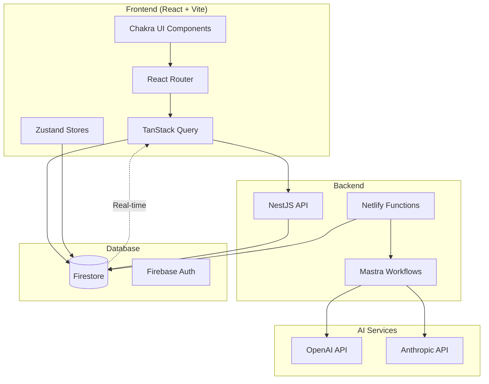
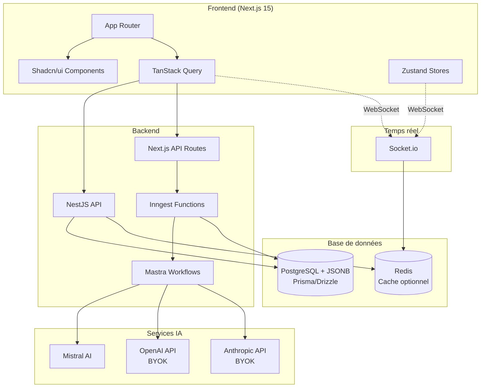
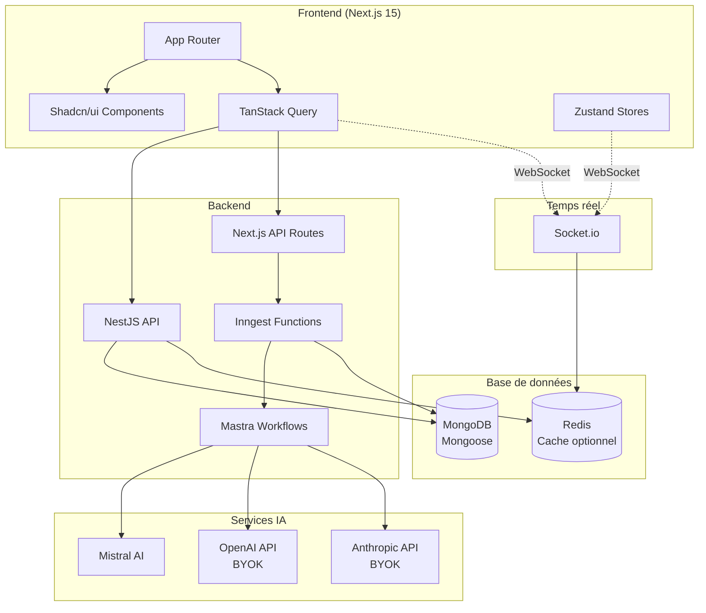
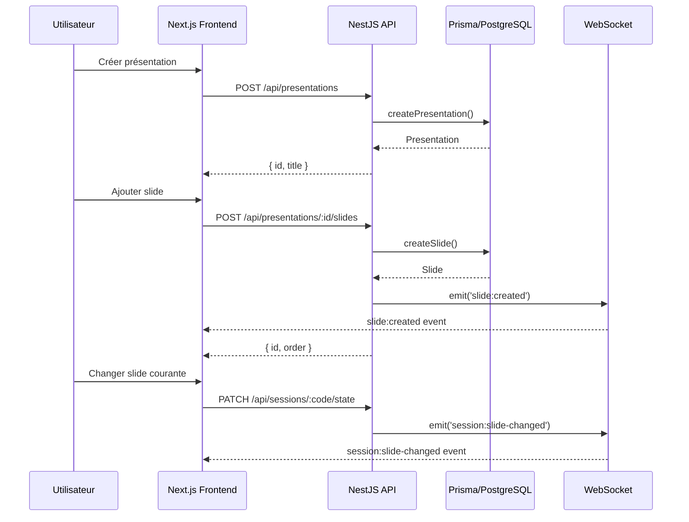
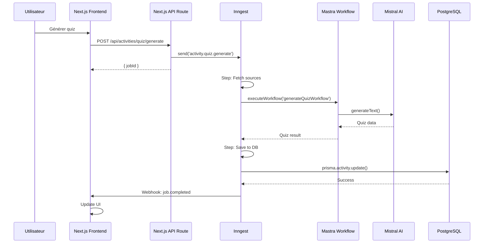
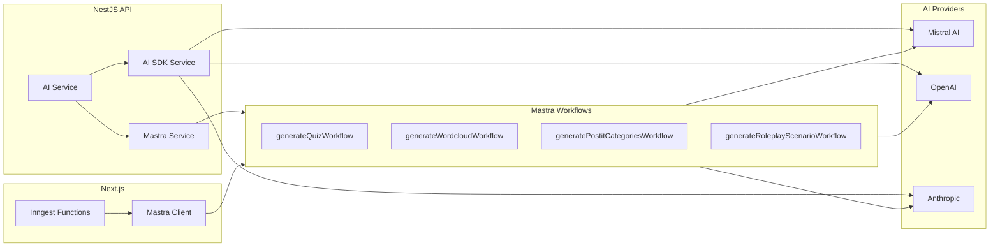
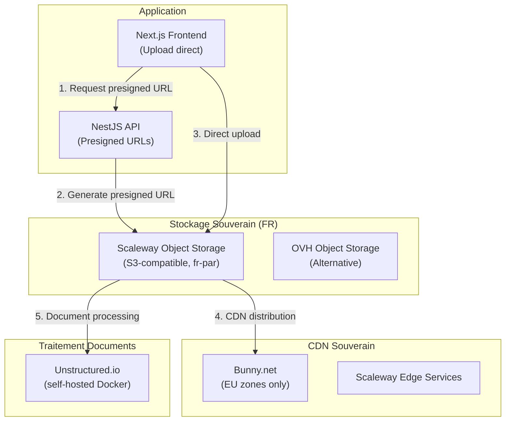

# Plan de Migration Qiplim Engage - Spécifications Techniques

**Version** : 1.0  
**Date** : Janvier 2026  
**Statut** : Spécifications Techniques  
**Objectif** : Analyser le code existant de Qiplim3 et proposer un plan de migration/réutilisation vers Qiplim Engage

---

## Table des Matières

1. [Analyse de l'Architecture Existante (Qiplim3)](#1-analyse-de-larchitecture-existante-qiplim3)
2. [Mapping Architecture Qiplim3 → Qiplim Engage](#2-mapping-architecture-qiplim3--qiplim-engage)
   - 2.1 Changements Majeurs
   - 2.2 Modèles de Données - Mapping
   - 2.3 Authentification avec Better Auth
   - 2.4 Observabilité avec Mastra
3. [Composants Réutilisables - Analyse Détaillée](#3-composants-réutilisables---analyse-détaillée)
4. [Réutilisation de la Logique Métier](#4-réutilisation-de-la-logique-métier)
5. [Fichiers Clés à Analyser en Détail](#5-fichiers-clés-à-analyser-en-détail)
6. [Approches de Développement](#6-approches-de-développement)
7. [Risques et Mitigations](#7-risques-et-mitigations)
8. [Analyse des Services de Génération IA Netlify](#8-analyse-des-services-de-génération-ia-netlify)
9. [Schémas d'Architecture](#9-schémas-darchitecture)
10. [Stockage Média et Souveraineté](#10-stockage-média-et-souveraineté)
11. [Comparaison et Choix Technologiques](#11-comparaison-et-choix-technologiques)

---

## 1. Analyse de l'Architecture Existante (Qiplim3)

### 1.1 Stack Technique Actuelle

**Frontend**

- React 18.3 + Vite 6.3
- TanStack Query 5.76 (gestion état serveur)
- Chakra UI 2.10 (composants UI)
- TipTap 2.12 (éditeur riche)
- React Router 6.30 (routing)
- Zustand 5.0 (état client)
- TypeScript strict

**Backend**

- NestJS (API REST)
- Firebase Admin SDK (Firestore)
- Netlify Functions (serverless)

**Base de données**

- Firestore (NoSQL document)
- Collections imbriquées (presentations/{id}/slides, sessions/{id}/users)

**Authentification**

- Firebase Auth
- Middleware `withAuthAndValidation` pour Netlify Functions

**Real-time**

- Firestore listeners (onSnapshot)
- Synchronisation automatique via Firestore

**IA et Génération**

- Mastra (workflows et agents)
- AI SDK (via Mastra)
- Langfuse (télémétrie)
- Providers : OpenAI, Anthropic

### 1.2 Structure des Modules Existants

#### Presentations (`src/features/presentation/`)

**Composants**

- `presentation.page.tsx` : Page principale présentation
- `slide.tsx` : Composant slide individuel
- `interactive-slide-renderer.tsx` : Rendu slides interactives
- `ListSlides.tsx` : Liste des slides
- `presentation-header-menu.tsx` : Menu header

**Services**

- `studio-presentation.service.ts` (374 lignes) : CRUD complet présentations
  - `createEmptyPresentation()` : Création présentation vide
  - `addSlide()`, `updateSlide()`, `deleteSlide()` : Gestion slides
  - `reorderSlides()` : Réorganisation slides
  - Utilise Firestore avec collections imbriquées

**Hooks**

- `use-presentation-data.ts` : Récupération données présentation
- `use-presentation-realtime-sync.ts` : Synchronisation temps réel
- `use-create-slide.ts` : Création slide
- `use-move-slide.ts` : Déplacement slide
- `use-duplicate-presentation.ts` : Duplication présentation

**Queries** (TanStack Query)

- `presentation.queries.ts` :
  - `getPresentationQuery()` : Récupération présentation
  - `getSlidesQuery()` : Liste slides (filtrée par state)
  - `getSlideQuery()` : Slide individuelle
  - `getPresentationSessionsQuery()` : Sessions d'une présentation

**Types**

- `presentation.d.ts` :
  - `IPresentation` : Structure présentation
  - `ISlidePresentation` : Structure slide (discriminated union avec `isInteractive`)
  - `TSlideType` : 'text' | 'quiz' | 'atelier' | 'wordcloud'

**Stores** (Zustand)

- `slide.store.ts` : État slides (sélection, édition)

#### Sessions (`src/features/session/`)

**Composants**

- `session.page.tsx` : Page session principale
- `player.tsx` : Lecteur slide pour participants
- `speaker-controls.tsx` : Contrôles présentateur
- `viewer-header.tsx` : Header participant
- `waiting-room.tsx` : Salle d'attente
- `active-users.tsx` : Liste utilisateurs actifs

**Hooks**

- `use-create-session.ts` : Création session
- `use-generate-session-code-pin.ts` : Génération code PIN (6 chiffres)
- `use-session-loader-data.ts` : Données loader session
- `use-slide-navigation.ts` : Navigation slides (présentateur)
- `use-viewer-slide-navigation.ts` : Navigation slides (participant)
- `use-create-user.ts` : Création participant
- `use-ping-active-users.ts` : Ping utilisateurs actifs

**Queries**

- `session.queries.ts` :
  - `getSessionQuery()` : Récupération session
  - `getUserQuery()` : Récupération participant

**Stores** (Zustand)

- `active-users.store.ts` : État utilisateurs actifs
- `widget-state.store.ts` : État widgets/activités
- `zoom-store.ts` : Niveau zoom

**Types**

- `session.d.ts` :
  - `ISession` : Structure session (state: 'closed' | 'waiting' | 'playing')
  - `IUser` : Structure participant (role: 'speaker' | 'viewer')
  - `ICodePin` : Structure code PIN (références Firestore)

#### Widgets/Activities (`src/features/widgets/`)

**Structure par widget** :

```
widgets/items/{type}/
├── builder/          # Édition widget
├── session/          # Vue session (temps réel)
├── share/            # Vue partage
└── plan/             # Vue plan
```

**Types de widgets** :

- `quiz` : Questions à choix multiples
- `wordcloud` : Nuage de mots
- `atelier` : Ateliers/workshops (à transformer en `roleplay`)
- `text` : Contenu texte
- `module` : Module de formation
- `part` : Partie de module

**Composants réutilisables** :

- `widget-renderer.tsx` : Rendu dynamique selon type
- `widget-icon-mapper.tsx` : Mapping icônes
- `widget-title-mapper.tsx` : Mapping titres

**Types**

- `widget.d.ts` :
  - `TWidget` : Union type de tous les widgets
  - `IQuizWidget` : Structure quiz (questions, answers)
  - `IWordcloudWidget` : Structure wordcloud (question, responses)
  - `IAtelierWidget` : Structure atelier (workshopType, typeConfig)

**Quiz** (`widgets/items/quiz/`)

- `quiz-session.view.tsx` : Vue session quiz
- `leaderboard.tsx` : Tableau des scores (réutilisable)
- `multiple-choice-question.tsx` : Question Choix multiple
- `use-submit-quiz-answer.ts` : Soumission réponse
- Logique scoring : Calcul points, tri leaderboard

**Wordcloud** (`widgets/items/wordcloud/`)

- `wordcloud-session.view.tsx` : Vue session wordcloud
- `word-cloud.tsx` : Visualisation nuage (réutilisable)
- `wordcloud-stats.tsx` : Statistiques réponses
- `word-frequency.ts` : Calcul fréquences mots

**Atelier** (`widgets/items/atelier/`)

- `atelier-session.view.tsx` : Vue session atelier
- `workshop-types.config.ts` : Types d'ateliers (brainstorm, roleplay, etc.)
- Structure scénarios et rôles existante

#### Backend API (`api/src/`)

**Services NestJS**

- `presentations.service.ts` : CRUD présentations, slides
- `sessions.service.ts` : Gestion sessions, participants, analytics
- `widgets.service.ts` : Gestion widgets
- Architecture modulaire NestJS avec Firebase Service

**Patterns**

- DTOs pour validation entrées/sorties
- Guards d'authentification
- Exception filters
- Firebase Service injecté

### 1.3 Services Netlify Functions

**Fonctions identifiées** (`netlify/functions/`) :

1. **`generate-content-background`** (317 lignes)

   - Génération widgets (text, quiz, wordcloud, workshop, module, part)
   - Utilise générateurs backend (`backend/program-materials/generators/`)
   - Gestion crédits utilisateur
   - Tracking jobs avec statuts (ACCEPTED, IN_PROGRESS, FINISHED)
   - Pattern : Background handler avec middleware `withAuthAndValidation`

2. **`generate-studio-quiz-background`** (360 lignes)

   - Génération quiz depuis sources Studio
   - Appels LLM directs (OpenAI API)
   - Récupération contenu sources Firestore
   - Sauvegarde dans bibliothèque Studio
   - Pattern : Background handler avec progression détaillée

3. **`generate-studio-workshop-background`**

   - Génération ateliers/workshops
   - Structure similaire à quiz

4. **`generate-studio-plan-background`**

   - Génération plans de formation

5. **`generate-module-studio-background`**

   - Génération modules

6. **`generate-skeleton-studio-background`**

   - Génération skeleton programmes

7. **`generate-plans-background`**

   - Génération plans

8. **`studio-chat`** (272 lignes)
   - Chat IA avec Studio
   - Modes : `plan`, `agent`, `ask`
   - RAG avec sources (Pinecone prévu)
   - Historique chat Firestore

### 1.4 Utilisation de Mastra et AI SDK

**Mastra** (`src/mastra/index.ts`) :

- Configuration Mastra avec workflows et agents
- Workflows disponibles :

  - `summarizerWorkflow`
  - `plannerWorkflow`, `multiplePlansWorkflow`
  - `parserWorkflow`
  - `contentWorkflow`
  - `generateQuizWorkflow`
  - `generateWorkshopWorkflow`
  - `generateWordcloudWorkflow`
  - `generateModuleWorkflow`
  - `generatePartWorkflow`
  - `generateSlidesWorkflow`
  - `createSlideWorkflow`

- Agents disponibles :

  - `AnthropicSummarizerAgent`, `OpenAISummarizerAgent`
  - `AnthropicParserAgent`, `OpenAIParserAgent`
  - `GenerateSlideAgent`
  - `AnthropicQuizAgent`, `OpenAIQuizAgent`
  - `AnthropicWorkshopAgent`, `OpenAIWorkshopAgent`

- Télémétrie : Langfuse exporter configuré
- Observabilité : Mastra intègre nativement tracing, logging et métriques
- **Note** : Mastra configuré mais pas toujours utilisé dans les Netlify functions (certaines utilisent appels API directs)

**AI SDK** :

- Utilisé via Mastra (workflows/agents)
- Appels directs OpenAI/Anthropic dans certaines functions
- Support multi-providers (OpenAI, Anthropic)

**Générateurs Backend** (`backend/program-materials/generators/`) :

- `module-generator.ts`
- `part-generator.ts`
- `quiz-generator.ts` : Utilise Mastra `generateQuizWorkflow`
- `text-generator.ts`
- `workshop-generator.ts`
- `wordcloud-generator.ts`
- Utilisent Mastra workflows ou appels LLM directs

---

## 2. Mapping Architecture Qiplim3 → Qiplim Engage

### 2.1 Changements Majeurs

| Aspect              | Qiplim3             | Qiplim Engage                                                  |
| ------------------- | ------------------- | -------------------------------------------------------------- |
| **Frontend**        | React + Vite        | Next.js 15 (App Router)                                        |
| **UI Library**      | Chakra UI           | Shadcn/ui + Tailwind                                           |
| **Routing**         | React Router        | Next.js App Router                                             |
| **State Server**    | TanStack Query      | TanStack Query (conservé)                                      |
| **State Client**    | Zustand             | Zustand (conservé) ou React Context                            |
| **Base de données** | Firestore           | PostgreSQL + JSONB (Prisma/Drizzle) - _MongoDB en alternative_ |
| **Backend**         | NestJS + Firebase   | NestJS (réutilisé, adapté)                                     |
| **Real-time**       | Firestore listeners | WebSockets (Socket.io)                                         |
| **Auth**            | Firebase Auth       | Better Auth (optionnel, sans login par défaut)                 |
| **Serverless**      | Netlify Functions   | Next.js API Routes + Inngest                                   |
| **IA**              | Mastra + AI SDK     | Mastra + AI SDK (conservé)                                     |

### 2.2 Modèles de Données - Mapping

#### Presentations

**Qiplim3 (Firestore)** :

```typescript
// Collection: presentations/{id}
interface IPresentation {
  title: string;
  admins: string[];
  author: string;
  programId: string;
  themeId: string;
  state: "active" | "trash" | "building";
  // ...
}

// Subcollection: presentations/{id}/slides/{slideId}
interface ISlidePresentation {
  type: "text" | "quiz" | "wordcloud" | "atelier";
  title: string;
  order: number;
  content: string; // HTML
  isInteractive: boolean;
  widgetRef?: DocumentReference; // Référence widget si interactive
  // ...
}
```

**Qiplim Engage (PostgreSQL)** :

```prisma
model Presentation {
  id            String   @id @default(uuid())
  title         String
  presenterId   String?  // Nullable (anonyme possible)
  isPublic      Boolean  @default(false)
  sourceFileUrl String?
  sourceType    String?  // 'upload' | 'google_slides' | 'powerpoint'
  createdAt     DateTime @default(now())
  updatedAt     DateTime @updatedAt

  slides        Slide[]
  sessions      Session[]
}

model Slide {
  id            String   @id @default(uuid())
  presentationId String
  order         Int
  type          String   // 'text' | 'activity'
  content       Json     // Structure flexible
  activityId    String?  // FK vers Activity si type='activity'
  createdAt     DateTime @default(now())

  presentation  Presentation @relation(fields: [presentationId], references: [id])
  activity      Activity?    @relation(fields: [activityId], references: [id])
}
```

**Mapping** :

- `IPresentation` → `Presentation` (PostgreSQL)
- `ISlidePresentation` → `Slide` avec `activity_id` nullable
- Structure Firestore nested → Structure relationnelle PostgreSQL
- `widgetRef` (DocumentReference) → `activityId` (UUID FK)

#### Sessions

**Qiplim3 (Firestore)** :

```typescript
// Collection: sessions/{id}
interface ISession {
  name: string;
  state: "closed" | "waiting" | "playing";
  currentSlideIndex: number;
  speakerRef: DocumentReference;
  codePinRef?: DocumentReference<ICodePin>;
  // ...
}

// Collection: session-code-pins/{pin}
interface ICodePin {
  programRef: DocumentReference;
  presentationRef: DocumentReference;
  sessionRef: DocumentReference;
  // ...
}

// Subcollection: sessions/{id}/users/{userId}
interface IUser {
  name: string;
  role: "speaker" | "viewer";
  character: "savant" | "emerveille" | "vague";
  lastPing: Date;
  // ...
}
```

**Qiplim Engage (PostgreSQL)** :

```prisma
model Session {
  id                String   @id @default(uuid())
  presentationId    String
  code              String   @unique // 6 chiffres (ex: "123456")
  qrCode            String?  // base64 image
  shortUrl          String?  // "https://engage.qiplim.com/j/abc123"
  state             String   @default("waiting") // 'waiting' | 'active' | 'closed'
  currentSlideIndex Int      @default(0)
  presenterToken    String   @unique @default(uuid())
  createdAt         DateTime @default(now())
  startedAt         DateTime?
  endedAt           DateTime?

  presentation      Presentation @relation(fields: [presentationId], references: [id])
  participants      SessionParticipant[]
  responses         ActivityResponse[]
}

model SessionParticipant {
  id           String   @id @default(uuid())
  sessionId    String
  name         String
  isActive     Boolean  @default(true)
  joinedAt     DateTime @default(now())
  lastActivity DateTime @default(now())

  session      Session @relation(fields: [sessionId], references: [id])
  responses    ActivityResponse[]
}
```

**Note** : Redis est optionnel. PostgreSQL gère des milliers de sessions actives. Redis devient utile pour le scaling horizontal Socket.io ou >10k sessions simultanées.

**Mapping** :

- `ISession` → `Session` (PostgreSQL)
- `ICodePin` → Code PIN intégré dans `Session.code`
- `IUser` → `SessionParticipant` (PostgreSQL)
- Firestore nested → Structure relationnelle PostgreSQL

#### Widgets/Activities

**Qiplim3 (Firestore)** :

```typescript
// Collection: widgets/{widgetId}
interface IQuizWidget {
  type: "quiz";
  title: string;
  questions: IQuestion[];
  generateConfig: IQuizGenerateConfig;
  // ...
}

interface IWordcloudWidget {
  type: "wordcloud";
  question: string;
  responses?: string[];
  // ...
}

interface IAtelierWidget {
  type: "atelier";
  workshopType?: TWorkshopType;
  typeConfig?: TWorkshopTypeConfig;
  // ...
}
```

**Qiplim Engage (PostgreSQL)** :

```prisma
model Activity {
  id            String   @id @default(uuid())
  type          String   // 'quiz' | 'wordcloud' | 'postit' | 'roleplay'
  title         String
  config        Json     // Configuration spécifique au type
  presentationId String
  slideId       String?
  createdAt     DateTime @default(now())
  requiresAuth  Boolean  @default(false)

  presentation  Presentation @relation(fields: [presentationId], references: [id])
  slide         Slide?        @relation(fields: [slideId], references: [id])
  responses     ActivityResponse[]
}

model ActivityResponse {
  id            String   @id @default(uuid())
  sessionId     String
  activityId    String
  participantId String
  response      Json     // Réponse flexible selon type activité
  score         Int?     // Score pour quiz
  createdAt     DateTime @default(now())

  session       Session @relation(fields: [sessionId], references: [id])
  activity      Activity @relation(fields: [activityId], references: [id])
  participant   SessionParticipant @relation(fields: [participantId], references: [id])
}
```

**Mapping** :

- `IQuizWidget` → `Activity` avec `type='quiz'` et `config` JSONB
- `IWordcloudWidget` → `Activity` avec `type='wordcloud'`
- `IAtelierWidget` → `Activity` avec `type='roleplay'` (adaptation)
- Nouveau : `postit` activity (à créer)
- Réponses participants → `ActivityResponse` (quiz answers, wordcloud submissions, etc.)
- Structure Firestore document → Structure relationnelle + JSONB config

### 2.3 Authentification avec Better Auth

**Stratégie d'authentification** :

- **Par défaut** : Pas de login requis pour les participants
- **Optionnel** : Better Auth pour les présentateurs souhaitant sauvegarder leurs présentations

**Better Auth** (https://better-auth.com/) :

- Solution d'authentification moderne pour Next.js
- Support natif : Email/Password, OAuth (Google, GitHub, etc.), Magic Link
- Session management intégré
- Compatible avec Prisma

**Flows d'identification** :

| Utilisateur                  | Identification          | Persistance                         |
| ---------------------------- | ----------------------- | ----------------------------------- |
| **Participant**              | Pseudo + code session   | Session uniquement (sessionStorage) |
| **Présentateur anonyme**     | `presenterToken` (UUID) | localStorage / cookie               |
| **Présentateur authentifié** | Better Auth session     | Base de données                     |

**Configuration Better Auth** :

```typescript
// lib/auth.ts
import { betterAuth } from "better-auth";
import { prismaAdapter } from "better-auth/adapters/prisma";

export const auth = betterAuth({
  database: prismaAdapter(prisma, {
    provider: "postgresql",
  }),
  emailAndPassword: {
    enabled: true,
  },
  socialProviders: {
    google: {
      clientId: process.env.GOOGLE_CLIENT_ID!,
      clientSecret: process.env.GOOGLE_CLIENT_SECRET!,
    },
  },
});
```

**Gestion BYOK (Bring Your Own Key)** :

- Les clés API IA sont stockées chiffrées en base (AES-256)
- Accessibles uniquement pour les utilisateurs authentifiés
- Option : stockage côté client (localStorage) pour utilisateurs non authentifiés

### 2.4 Observabilité avec Mastra

**Mastra Observability** (natif depuis v1.x) :

- Tracing automatique des workflows et agents
- Logging structuré des appels LLM
- Métriques de performance (latence, tokens, coûts)
- Dashboard intégré ou export vers outils externes

**Configuration observabilité** :

```typescript
// mastra/index.ts
import { Mastra } from "@mastra/core";

export const mastra = new Mastra({
  // ... workflows, agents
  telemetry: {
    enabled: true,
    serviceName: "qiplim-engage",
    // Export optionnel vers Langfuse
    exporter: langfuseExporter,
    // Ou export natif Mastra
    dashboard: {
      enabled: true,
      port: 4111,
    },
  },
});
```

**Métriques collectées** :

- Durée d'exécution des workflows
- Nombre de tokens consommés par provider
- Taux de succès/échec des générations
- Coûts estimés par activité générée

---

## 3. Composants Réutilisables - Analyse Détaillée

### 3.1 Presentations

#### Réutilisable directement

**Logique de navigation slides** :

- `use-slide-navigation.ts` : Logique navigation précédent/suivant
- Structure slide avec type (text/activity)
- Gestion ordre slides

**Composant slide renderer** :

- `interactive-slide-renderer.tsx` : Rendu dynamique selon type slide
- Logique conditionnelle pour slides interactives vs texte

#### À adapter

**Queries TanStack Query** :

- `presentation.queries.ts` : Migrer de Firestore vers Prisma
  - `getPresentationQuery()` → Query Prisma équivalente
  - `getSlidesQuery()` → Query Prisma avec `orderBy`
  - Supprimer dépendances Firestore (`where`, `orderBy` Firestore)

**Service CRUD** :

- `studio-presentation.service.ts` : Adapter pour PostgreSQL
  - Remplacer `addDoc`, `updateDoc`, `deleteDoc` Firestore
  - Utiliser Prisma `create`, `update`, `delete`
  - Supprimer `DocumentReference`, utiliser UUIDs

**Hooks real-time** :

- `use-presentation-realtime-sync.ts` : Adapter pour WebSocket
  - Remplacer Firestore `onSnapshot` par WebSocket events
  - Événements : `session:slide-changed`

#### À créer

**Service Prisma** :

```typescript
// engage/lib/prisma/presentation.service.ts
export class PresentationService {
  async getPresentation(id: string) {
    return prisma.presentation.findUnique({
      where: { id },
      include: { slides: { orderBy: { order: "asc" } } },
    });
  }

  async createSlide(presentationId: string, slideData: CreateSlideInput) {
    return prisma.slide.create({
      data: {
        presentationId,
        ...slideData,
      },
    });
  }
}
```

**Hooks Next.js App Router** :

```typescript
// engage/app/(presenter)/session/[code]/presenter/page.tsx
export default async function PresenterPage({
  params,
}: {
  params: { code: string };
}) {
  const session = await getSessionByCode(params.code);
  const presentation = await getPresentation(session.presentationId);

  return <PresenterView session={session} presentation={presentation} />;
}
```

**Composants Shadcn/ui** :

- Adapter `interactive-slide-renderer.tsx` pour Shadcn
- Remplacer composants Chakra UI par équivalents Shadcn

### 3.2 Sessions

#### Réutilisable directement

**Logique génération code PIN** :

- `use-generate-session-code-pin.ts` : Algorithme génération PIN unique
  - Génération 6 chiffres aléatoires
  - Vérification unicité
  - **Réutilisable** : Logique métier pure

**Gestion participants** :

- `use-create-user.ts` : Création participant
- Logique validation nom, génération ID

**Navigation slides** :

- `use-slide-navigation.ts` : Logique navigation
- `use-viewer-slide-navigation.ts` : Navigation côté participant

#### À adapter

**Queries** :

- `session.queries.ts` : Migrer vers PostgreSQL
  - Remplacer Firestore queries par Prisma queries
  - Adapter types (pas de `DocumentReference`)

**Stores Zustand** :

- `active-users.store.ts` : Adapter pour WebSocket
  - Remplacer Firestore listeners par WebSocket events
  - Événements : `session:participant-joined`, `session:participant-left`
- `widget-state.store.ts` : Adapter pour nouvelle structure activités
  - Adapter types widgets → activities
  - WebSocket events : `session:activity-started`, `session:activity-completed`

**Composants** :

- `player.tsx` : Adapter pour WebSocket au lieu de Firestore listeners
- `speaker-controls.tsx` : Adapter pour nouvelles API
- `viewer-header.tsx` : Adapter UI pour Shadcn

#### À créer

**Service WebSocket** :

```typescript
// engage/lib/websocket/session.service.ts
export class SessionWebSocketService {
  emitSlideChange(sessionCode: string, slideIndex: number) {
    io.to(`session:${sessionCode}`).emit("session:slide-changed", {
      slideIndex,
      slideId: slide.id,
    });
  }

  emitActivityStarted(sessionCode: string, activityId: string) {
    io.to(`session:${sessionCode}`).emit("session:activity-started", {
      activityId,
      activityType: activity.type,
    });
  }
}
```

**Service PostgreSQL** :

```typescript
// engage/lib/db/session.service.ts
export class SessionService {
  async createSession(presentationId: string): Promise<Session> {
    const code = await this.generateUniqueCode();

    const session = await prisma.session.create({
      data: {
        presentationId,
        code,
        qrCode: await this.generateQRCode(code),
        state: "waiting",
        currentSlideIndex: 0,
      },
    });

    return session;
  }
}
```

> **Note Redis** : Redis est optionnel pour démarrer. PostgreSQL gère des milliers de sessions actives sans problème. Redis devient utile uniquement pour :
>
> - Scaling horizontal de Socket.io (Redis adapter)
> - Cache des sessions actives (>10k sessions simultanées)
> - Pub/Sub pour architectures multi-serveurs

**Composants Next.js** :

- Routes `/session/[code]` pour participants
- Routes `/session/[code]/presenter` pour présentateur

### 3.3 Widgets/Activities

#### Quiz

**Réutilisable** :

- Logique scoring : Calcul points, tri leaderboard
- Composant `leaderboard.tsx` : Tableau scores (UI à adapter)
- Composant `multiple-choice-question.tsx` : Question Choix multiple
- Hook `use-submit-quiz-answer.ts` : Logique soumission réponse

**Composants réutilisables** :

- `quiz-session.view.tsx` → Adapter pour nouvelle structure
- `leaderboard.tsx` → Réutilisable avec adaptations mineures (Chakra → Shadcn)
- `multiple-choice-question.tsx` → Réutilisable

**À adapter** :

- Structure données : Firestore → JSONB config

  ```typescript
  // Avant (Firestore)
  interface IQuizWidget {
    questions: IQuestion[];
  }

  // Après (PostgreSQL)
  interface Activity {
    type: "quiz";
    config: {
      questions: IQuestion[];
      showLeaderboard: boolean;
      allowMultipleAttempts: boolean;
    };
  }
  ```

**Migration IA** :

- Générer code adapté avec prompts structurés
- Adapter composants Chakra → Shadcn
- Adapter hooks Firestore → WebSocket

#### Wordcloud

**Réutilisable** :

- Logique regroupement mots : `word-frequency.ts`
- Visualisation : `word-cloud.tsx` (réutilisable)
- Statistiques : `wordcloud-stats.tsx`

**Composants réutilisables** :

- `word-cloud.tsx` → Réutilisable (peut nécessiter adaptation librairie)
- `wordcloud-stats.tsx` → Réutilisable

**À améliorer** :

- Ajouter regroupement IA (Mistral) pour synonymes
  - Détection "majuscules/minuscules", "singulier/pluriel"
  - Regroupement sémantique intelligent

**Migration IA** :

- Générer service IA pour regroupement intelligent
- Intégrer Mistral pour analyse sémantique

#### Atelier/Roleplay

**Réutilisable** :

- Structure scénarios : Configuration existante
- Rôles : Structure `IRolePlayConfig` existante
- Types d'ateliers : `workshop-types.config.ts`

**À adapter** :

- Transformer en `roleplay` activity avec agents IA
- Adapter `IAtelierWidget` → `Activity` avec `type='roleplay'`
- Intégrer agents conversationnels Mistral

**Composants à créer** :

- Interface conversationnelle avec agent Mistral
- Composant chat pour jeux de rôle
- Débriefing automatique avec analyse IA

**Migration IA** :

- Générer intégration agent conversationnel
- Créer workflow Mastra pour génération scénarios roleplay

#### Post-it (Nouveau)

**À créer** :

- Nouvelle activité complète
- Composants création post-its (dessin, texte, photo)
- Catégorisation IA automatique
- Matrice impact/effort générée IA

**Réutilisable** :

- Logique de vote (inspirée quiz)
- Structure de vote similaire

**Migration IA** :

- Générer composants avec catégorisation IA
- Créer workflow Mastra `generatePostitCategoriesWorkflow`

---

## 4. Réutilisation de la Logique Métier

### 4.1 Stratégie : Repartir de Zéro avec Réutilisation Ciblée

**Approche recommandée** : Plutôt que de "migrer" le code existant, il est plus efficace de **repartir de zéro** en s'inspirant de la logique métier de Qiplim3. Le code existant est trop couplé à Firestore/Chakra UI pour être migré efficacement.

**Pas de migration de données** : Qiplim Engage démarre avec une base de données vierge. Les données existantes de Qiplim3 (présentations, sessions, utilisateurs) ne seront pas migrées. Cela simplifie considérablement le projet :

- Pas de scripts de migration Firestore → PostgreSQL
- Pas de période de transition avec double écriture
- Pas de rollback à prévoir
- Schéma PostgreSQL optimisé sans contraintes d'héritage

**Ce qui est réutilisable** (copier/adapter manuellement) :

| Catégorie               | Éléments                                                         | Action                   |
| ----------------------- | ---------------------------------------------------------------- | ------------------------ |
| **Logique métier pure** | Algorithmes scoring quiz, génération PIN, calcul fréquences mots | Copier et adapter        |
| **Workflows Mastra**    | `generateQuizWorkflow`, `generateWorkshopWorkflow`, etc.         | Réutiliser directement   |
| **Types/Interfaces**    | Structures de données (IPresentation, ISlide, etc.)              | Base pour schémas Prisma |
| **Configurations**      | `workshop-types.config.ts`, configs widgets                      | Réutiliser               |

**Ce qui doit être réécrit** :

| Catégorie           | Raison                                         | Nouvelle implémentation |
| ------------------- | ---------------------------------------------- | ----------------------- |
| **Composants UI**   | Chakra UI ≠ Shadcn/ui (patterns différents)    | Réécrire en Shadcn      |
| **Hooks Firestore** | `onSnapshot` ≠ WebSocket (paradigme différent) | Réécrire avec Socket.io |
| **Services CRUD**   | `addDoc`/`updateDoc` ≠ Prisma                  | Réécrire avec Prisma    |
| **Queries**         | Firestore queries ≠ SQL                        | Réécrire avec Prisma    |

### 4.2 Ordre de Développement Recommandé

**Ordre logique de développement** :

1. **Infrastructure** (base technique)

   - Setup PostgreSQL + Prisma schema
   - Setup Socket.io server
   - Setup Inngest pour jobs asynchrones

2. **Presentations** (base fonctionnelle)

   - Services Prisma CRUD
   - Composants Next.js App Router
   - Tests et validation

3. **Sessions** (dépend de Presentations)

   - Services PostgreSQL sessions
   - WebSocket events (join, slide-change)
   - Composants temps réel
   - Tests synchronisation

4. **Activities** (dépend de Sessions)
   - Quiz (priorité) - réutiliser logique scoring
   - Wordcloud - réutiliser `word-frequency.ts`
   - Post-it (nouveau)
   - Roleplay (adapter atelier)

### 4.3 Fichiers de Référence Qiplim3

**À consulter pour la logique métier** :

```
# Logique métier à réutiliser
src/features/widgets/items/quiz/session/hooks/use-submit-quiz-answer.ts  # Scoring
src/features/session/hooks/use-generate-session-code-pin.ts              # Génération PIN
src/features/widgets/items/wordcloud/utils/word-frequency.ts             # Fréquences mots

# Workflows Mastra à réutiliser directement
src/mastra/workflows/generateQuizWorkflow.ts
src/mastra/workflows/generateWorkshopWorkflow.ts
src/mastra/workflows/generateWordcloudWorkflow.ts

# Configurations à réutiliser
src/features/widgets/items/atelier/configs/workshop-types.config.ts
```

---

## 5. Fichiers Clés à Analyser en Détail

### 5.1 Presentations

**Services** :

- `src/features/studio/services/studio-presentation.service.ts` (374 lignes)
  - CRUD complet présentations
  - Gestion slides (add, update, delete, reorder)
  - Structure à migrer vers Prisma

**Queries** :

- `src/features/presentation/queries/presentation.queries.ts`
  - `getPresentationQuery`, `getSlidesQuery`
  - À migrer vers Prisma queries

**Hooks** :

- `src/features/presentation/hooks/use-presentation-data.ts`
- `src/features/presentation/hooks/use-presentation-realtime-sync.ts`
  - À adapter pour Next.js + WebSocket

**Composants** :

- `src/features/presentation/components/interactive-slide-renderer.tsx`
- `src/features/presentation/components/slide.tsx`
  - À adapter pour Shadcn/ui

### 5.2 Sessions

**Services Backend** :

- `api/src/sessions/sessions.service.ts` (330 lignes)
  - CRUD sessions, participants, analytics
  - À adapter pour PostgreSQL + WebSocket

**Hooks** :

- `src/features/session/hooks/use-create-session.ts`
- `src/features/session/hooks/use-slide-navigation.ts`
- `src/features/session/hooks/use-generate-session-code-pin.ts`
  - Logique réutilisable, adapter pour nouvelle API

**Stores** :

- `src/features/session/stores/active-users.store.ts` (Zustand)
- `src/features/session/stores/widget-state.store.ts`
  - À adapter pour WebSocket events

**Composants** :

- `src/features/session/components/common/player.tsx`
- `src/features/session/components/speaker/speaker-controls.tsx`
- `src/features/session/components/viewer/viewer-header.tsx`
  - UI à migrer vers Shadcn/ui

### 5.3 Widgets/Activities

**Quiz** :

- `src/features/widgets/items/quiz/session/quiz-session.view.tsx`
- `src/features/widgets/items/quiz/session/components/leaderboard.tsx`
- `src/features/widgets/items/quiz/session/hooks/use-submit-quiz-answer.ts`
  - Logique métier réutilisable, adapter structure données

**Wordcloud** :

- `src/features/widgets/items/wordcloud/session/wordcloud-session.view.tsx`
- `src/features/widgets/items/wordcloud/session/components/word-cloud.tsx`
- `src/features/widgets/items/wordcloud/utils/word-frequency.ts`
  - Réutilisable, ajouter regroupement IA

**Atelier** :

- `src/features/widgets/items/atelier/session/atelier-session.view.tsx`
- `src/features/widgets/items/atelier/configs/workshop-types.config.ts`
  - Transformer en `roleplay` avec agents IA

---

## 6. Approches de Développement

### 6.1 Comparaison des Approches

| Critère              | Approche A : Repartir de Zéro                     | Approche B : Migration Assistée IA                  |
| -------------------- | ------------------------------------------------- | --------------------------------------------------- |
| **Principe**         | Nouveau code inspiré de la logique métier Qiplim3 | Utiliser LLM pour adapter/traduire le code existant |
| **Durée estimée**    | Plus long au départ, moins de corrections après   | Plus rapide au départ, plus de corrections après    |
| **Qualité code**     | Code propre, patterns modernes                    | Risque de code hybride, patterns incohérents        |
| **Dette technique**  | Minimale                                          | Potentiellement importante                          |
| **Risque d'erreurs** | Faible (code testé from scratch)                  | Moyen (hallucinations LLM, dépendances manquantes)  |
| **Réutilisation**    | Logique métier pure, workflows Mastra             | Code complet avec adaptations                       |

### 6.2 Approche A : Repartir de Zéro (Recommandée)

**Avantages** :

- Code propre sans héritage Firestore/Chakra
- Patterns Next.js 15 / Prisma / Shadcn natifs
- Tests écrits en parallèle du développement
- Pas de dette technique héritée
- Plus facile à maintenir long terme

**Inconvénients** :

- Plus long au démarrage
- Nécessite de bien comprendre la logique métier existante
- Risque d'oublier des edge cases présents dans Qiplim3

**Ce qui est réutilisé** :

- Logique métier pure (scoring, génération PIN, fréquences mots)
- Workflows Mastra (réutilisables directement)
- Types/interfaces (base pour schémas Prisma)
- Configurations (workshop-types, etc.)

### 6.3 Approche B : Migration Assistée IA

**Avantages** :

- Démarrage plus rapide
- Conservation de tous les edge cases existants
- Moins de risque d'oubli fonctionnel

**Inconvénients** :

- Code potentiellement incohérent (mix patterns anciens/nouveaux)
- Hallucinations possibles des LLM
- Review systématique obligatoire
- Dette technique probable
- Dépendances manquantes à corriger manuellement

**Process si choisie** :

1. Analyser fichier source avec LLM :

   ```
   Analyse le fichier [fichier] et identifie :
   - Dépendances Firebase/Firestore
   - Types TypeScript
   - Logique métier pure (réutilisable)
   - Composants UI (framework spécifique)
   ```

2. Générer code adapté (Firestore→Prisma, Chakra→Shadcn)

3. Review manuel obligatoire

4. Tests unitaires

5. Corrections des erreurs LLM

### 6.4 Recommandation

**Approche A recommandée** pour Qiplim Engage car :

- Le code Qiplim3 est trop couplé à Firestore/Chakra pour être "traduit" efficacement
- Les paradigmes sont différents (React Router vs App Router, onSnapshot vs WebSocket)
- La base de code est de taille raisonnable pour repartir de zéro
- Les workflows Mastra sont directement réutilisables (partie la plus complexe)

**Approche B acceptable** si :

- Contrainte de temps très forte
- Équipe expérimentée en review de code généré par IA
- Acceptation d'une phase de stabilisation post-migration

---

## 7. Risques et Mitigations

**Risques identifiés** :

1. **Perte de fonctionnalités** : Oubli de features existantes dans Qiplim3 lors de la réécriture

   - Mitigation : Checklist exhaustive basée sur l'analyse du code existant, tests complets
   - Note : Pas de migration de données, donc pas de risque de perte de données utilisateurs

2. **Performance** : WebSocket vs Firestore listeners

   - Mitigation : Benchmarks, optimisation connexions

3. **Complexité** : Développement par feature peut créer incohérences temporaires

   - Mitigation : Développement par feature complète (backend + frontend), pas par couche

4. **IA génère code incorrect** : Hallucinations, dépendances manquantes (si approche B choisie)
   - Mitigation : Review systématique, tests automatiques

---

## 8. Analyse des Services de Génération IA Netlify

### 8.1 Services Netlify Functions Existants

**Fonctions identifiées** (`netlify/functions/`) :

1. **`generate-content-background`** (317 lignes)

   - Génération widgets (text, quiz, wordcloud, workshop, module, part)
   - Utilise générateurs backend (`backend/program-materials/generators/`)
   - Gestion crédits utilisateur
   - Tracking jobs avec statuts (ACCEPTED, IN_PROGRESS, FINISHED)
   - **Pattern** : Background handler avec middleware `withAuthAndValidation`

2. **`generate-studio-quiz-background`** (360 lignes)

   - Génération quiz depuis sources Studio
   - Appels LLM directs (OpenAI API)
   - Récupération contenu sources Firestore
   - Sauvegarde dans bibliothèque Studio
   - **Pattern** : Background handler avec progression détaillée

3. **`generate-studio-workshop-background`**

   - Génération ateliers/workshops
   - Structure similaire à quiz

4. **`generate-studio-plan-background`**

   - Génération plans de formation

5. **`generate-module-studio-background`**

   - Génération modules

6. **`generate-skeleton-studio-background`**

   - Génération skeleton programmes

7. **`generate-plans-background`**

   - Génération plans

8. **`studio-chat`** (272 lignes)
   - Chat IA avec Studio
   - Modes : `plan`, `agent`, `ask`
   - RAG avec sources (Pinecone prévu)
   - Historique chat Firestore

### 8.2 Utilisation de Mastra et AI SDK

**Mastra** (`src/mastra/index.ts`) :

- Configuration Mastra avec workflows et agents
- Workflows : `summarizerWorkflow`, `plannerWorkflow`, `generateQuizWorkflow`, `generateWorkshopWorkflow`, `generateWordcloudWorkflow`, `generateModuleWorkflow`, `generatePartWorkflow`, `generateSlidesWorkflow`
- Agents : `AnthropicSummarizerAgent`, `OpenAISummarizerAgent`, `AnthropicParserAgent`, `OpenAIParserAgent`, `GenerateSlideAgent`, `AnthropicQuizAgent`, `OpenAIQuizAgent`, `AnthropicWorkshopAgent`, `OpenAIWorkshopAgent`
- Télémétrie : Langfuse exporter
- **Note** : Mastra configuré mais pas toujours utilisé dans les Netlify functions (certaines utilisent appels API directs)

**AI SDK** :

- Utilisé via Mastra (workflows/agents)
- Appels directs OpenAI/Anthropic dans certaines functions
- Support multi-providers (OpenAI, Anthropic)

**Générateurs Backend** (`backend/program-materials/generators/`) :

- `module-generator.ts`
- `part-generator.ts`
- `quiz-generator.ts` : Utilise Mastra `generateQuizWorkflow`
- `text-generator.ts`
- `workshop-generator.ts`
- `wordcloud-generator.ts`
- Utilisent Mastra workflows ou appels LLM directs

### 8.3 Stratégie de Migration

#### Option 1 : Migration vers API NestJS (Recommandé pour services critiques)

**Avantages** :

- Centralisation logique métier
- Réutilisation code backend existant
- Gestion erreurs unifiée
- Monitoring centralisé
- Tests unitaires/intégration facilités

**Services à migrer vers NestJS** :

- `generate-content-background` → `POST /api/activities/generate`
- `generate-studio-quiz-background` → `POST /api/activities/quiz/generate`
- `generate-studio-workshop-background` → `POST /api/activities/workshop/generate`
- `generate-studio-plan-background` → `POST /api/presentations/plan/generate`

**Structure proposée** :

```
api/src/
├── activities/
│   ├── activities.module.ts
│   ├── activities.service.ts
│   ├── generators/
│   │   ├── quiz-generator.service.ts
│   │   ├── wordcloud-generator.service.ts
│   │   ├── postit-generator.service.ts
│   │   └── roleplay-generator.service.ts
│   └── dto/
│       └── generate-activity.dto.ts
├── ai/
│   ├── ai.module.ts
│   ├── mastra.service.ts          # Wrapper Mastra
│   ├── ai-sdk.service.ts          # Wrapper AI SDK
│   └── providers/
│       ├── mistral.provider.ts    # Provider Mistral (nouveau)
│       ├── openai.provider.ts
│       └── anthropic.provider.ts
└── jobs/
    ├── jobs.module.ts
    └── jobs.service.ts            # Gestion jobs avec Inngest
```

#### Option 2 : Migration vers Next.js Background Functions avec Inngest (Recommandé pour jobs asynchrones longs)

**Avantages** :

- Intégration native Next.js
- Gestion jobs robuste avec Inngest
- Retry automatique, scheduling
- Monitoring intégré Inngest
- Déclenchement depuis frontend simplifié

**Services à migrer vers Inngest** :

- Générations longues (>30s) : `generate-content-background`, `generate-studio-plan-background`
- Jobs planifiés : génération batch, exports
- Tâches asynchrones : catégorisation IA post-its, regroupement wordcloud

**Structure proposée** :

```
engage/
├── app/
│   └── api/
│       └── inngest/
│           └── route.ts          # Webhook Inngest
├── lib/
│   └── inngest/
│       ├── functions/
│       │   ├── generate-quiz.ts
│       │   ├── generate-wordcloud.ts
│       │   ├── generate-postit-categories.ts
│       │   └── generate-roleplay-scenario.ts
│       └── client.ts
└── services/
    └── ai/
        ├── mastra-client.ts
        └── ai-sdk-client.ts
```

### 8.4 Architecture Hybride Recommandée

**Règle de décision** :

| Critère                                | Destination              | Raison            |
| -------------------------------------- | ------------------------ | ----------------- |
| **Latence < 10s**                      | API NestJS (synchronisé) | Réponse immédiate |
| **Latence > 10s**                      | Inngest (asynchrone)     | Éviter timeout    |
| **Jobs planifiés**                     | Inngest                  | Scheduling natif  |
| **Batch processing**                   | Inngest                  | Gestion queue     |
| **Génération simple**                  | API NestJS               | Simplicité        |
| **Génération complexe (multi-étapes)** | Inngest                  | Workflow robuste  |

**Exemples concrets** :

1. **Génération Quiz** (5-15s) :

   - **Option A** : API NestJS si < 10s
   - **Option B** : Inngest si > 10s ou batch
   - **Décision** : Inngest (workflow multi-étapes, retry)

2. **Catégorisation Post-its IA** (2-5s) :

   - **Destination** : API NestJS (rapide, synchrone)

3. **Génération Plan Présentation** (30-60s) :

   - **Destination** : Inngest (long, asynchrone)

4. **Regroupement Wordcloud IA** (3-8s) :
   - **Destination** : API NestJS (rapide)

### 8.5 Migration Mastra et AI SDK

**Continuité Mastra** :

- Conserver configuration Mastra existante
- Adapter workflows pour nouveaux besoins (post-it, roleplay)
- Créer nouveaux workflows :
  - `generatePostitCategoriesWorkflow`
  - `generateRoleplayScenarioWorkflow`
  - `regroupWordcloudWorkflow` (amélioration IA)

**Continuité AI SDK** :

- Utiliser AI SDK via Mastra (recommandé)
- Utiliser AI SDK directement pour cas simples
- Ajouter support Mistral via AI SDK :

  ```typescript
  import { mistral } from "@ai-sdk/mistral";
  import { generateText } from "ai";

  const result = await generateText({
    model: mistral("mistral-medium"),
    prompt: "...",
  });
  ```

**Nouveaux Providers** :

- **Mistral** : Provider principal (souveraineté française)
- **OpenAI** : BYOK (Bring Your Own Key)
- **Anthropic** : BYOK

**Abstraction Service IA** :

```typescript
// api/src/ai/ai.service.ts
@Injectable()
export class AIService {
  constructor(
    private mastraService: MastraService,
    private aiSdkService: AISDKService
  ) {}

  async generateQuiz(prompt: string, config: QuizConfig) {
    // Utilise Mastra workflow ou AI SDK selon complexité
    return this.mastraService.executeWorkflow("generateQuizWorkflow", {
      prompt,
      config,
    });
  }

  async categorizePostits(postits: string[]) {
    // Utilise AI SDK directement (simple)
    return this.aiSdkService.generateText({
      model: "mistral-medium",
      prompt: `Catégorise ces post-its: ${postits.join(", ")}`,
    });
  }
}
```

### 8.6 Exemple de Migration : Generate Quiz

**Avant (Netlify Function)** :

```typescript
// netlify/functions/generate-studio-quiz-background/index.ts
const generateStudioQuizHandler = async (event, context) => {
  // Appel LLM direct
  const quizData = await generateQuizWithLLM(prompt, model);
  // Sauvegarde Firestore
  await saveQuizToLibrary(firestore, studioId, config, quizData);
};
```

**Après (Inngest Function)** :

```typescript
// lib/inngest/functions/generate-quiz.ts
import { inngest } from "../client";
import { mastra } from "@/services/ai/mastra-client";

export const generateQuiz = inngest.createFunction(
  { id: "generate-quiz", name: "Generate Quiz" },
  { event: "activity.quiz.generate" },
  async ({ event, step }) => {
    const { presentationId, activityId, config, sources } = event.data;

    // Step 1: Fetch sources
    const sourcesContent = await step.run("fetch-sources", async () => {
      return fetchSourcesContent(sources);
    });

    // Step 2: Generate with Mastra
    const quizData = await step.run("generate-quiz", async () => {
      return mastra.workflows.generateQuizWorkflow.execute({
        content: sourcesContent,
        config,
      });
    });

    // Step 3: Save to database
    await step.run("save-quiz", async () => {
      return prisma.activity.update({
        where: { id: activityId },
        data: { config: quizData },
      });
    });

    return { success: true, activityId };
  }
);
```

**Déclenchement depuis Frontend** :

```typescript
// app/api/activities/quiz/generate/route.ts
import { inngest } from "@/lib/inngest/client";

export async function POST(request: Request) {
  const { activityId, config } = await request.json();

  await inngest.send({
    name: "activity.quiz.generate",
    data: { activityId, config },
  });

  return Response.json({ success: true });
}
```

---

## 9. Schémas d'Architecture

### 9.1 Architecture Qiplim3 Actuelle



### 9.2 Architecture Qiplim Engage Cible

#### Option A : Architecture PostgreSQL (Recommandée)



**Avantages** : Relations natives, SQL pour analytics/leaderboards, ORM typé (Prisma/Drizzle), JSONB pour flexibilité

#### Option B : Architecture MongoDB (Alternative)



**Avantages** : Sharding natif, flexibilité documents, adapté si équipe expérimentée MongoDB

### 9.3 Flux de Migration Présentation



### 9.4 Flux de Migration Session

```mermaid
sequenceDiagram
    participant Presenter as Présentateur
    participant Participant as Participant
    participant Frontend as Next.js Frontend
    participant API as NestJS API
    participant DB as PostgreSQL
    participant WS as WebSocket

    Presenter->>Frontend: Créer session
    Frontend->>API: POST /api/sessions
    API->>DB: prisma.session.create()
    DB-->>API: Session { code, qrCode }
    API-->>Frontend: { code, qrCode }

    Participant->>Frontend: Scanner QR / Saisir code
    Frontend->>API: POST /api/sessions/:code/join
    API->>DB: prisma.sessionParticipant.create()
    API->>WS: emit('session:participant-joined')
    WS-->>Frontend: participant-joined event
    API-->>Frontend: { participantId }

    Presenter->>Frontend: Changer slide
    Frontend->>API: PATCH /api/sessions/:code/state
    API->>DB: prisma.session.update()
    API->>WS: emit('session:slide-changed')
    WS-->>Participant: slide-changed event
    WS-->>Presenter: slide-changed event
```

### 9.5 Flux de Migration Génération IA



### 9.6 Architecture Services IA



---

## 10. Stockage Média et Souveraineté

### 10.1 Architecture Média Actuelle (Qiplim3)

**Stack actuelle** :
- **Object Storage** : AWS S3
- **CDN** : Cloudflare
- **Document Parsing** : Unstructured.io (SaaS US)
- **Presigned URLs** : Background functions pour upload/download sécurisé

**Problème** : AWS et Cloudflare sont des entreprises américaines soumises au Cloud Act.

### 10.2 Alternatives Souveraines Européennes/Françaises

| Composant | Actuel (US) | Alternative FR/EU | Notes |
|-----------|-------------|-------------------|-------|
| **Object Storage** | AWS S3 | **Scaleway Object Storage** | S3-compatible, mêmes APIs |
| **Object Storage** | AWS S3 | **OVH Object Storage** | S3-compatible, datacenters FR |
| **CDN** | Cloudflare | **Bunny.net** (EU zones only) | Option EU-only disponible |
| **CDN** | Cloudflare | **Scaleway Edge Services** | Intégré Scaleway |
| **Document Parsing** | Unstructured.io | **Unstructured self-hosted** | Docker sur infra FR |
| **Document Parsing** | Unstructured.io | **LlamaParse self-hosted** | Alternative open source |

### 10.3 Stack Média Recommandée (Souveraine)



### 10.4 Migration Minimale - Compatibilité S3

**Point clé** : Scaleway Object Storage est 100% compatible S3. Le code de presigned URLs reste quasi identique.

**Avant (AWS S3)** :
```typescript
import { S3Client, PutObjectCommand } from "@aws-sdk/client-s3";
import { getSignedUrl } from "@aws-sdk/s3-request-presigner";

const s3 = new S3Client({
  region: "eu-west-1",
  credentials: { accessKeyId: "...", secretAccessKey: "..." }
});
```

**Après (Scaleway Object Storage)** :
```typescript
import { S3Client, PutObjectCommand } from "@aws-sdk/client-s3";
import { getSignedUrl } from "@aws-sdk/s3-request-presigner";

const s3 = new S3Client({
  region: "fr-par",
  endpoint: "https://s3.fr-par.scw.cloud",
  credentials: { accessKeyId: "...", secretAccessKey: "..." }
});

// Presigned URL - CODE IDENTIQUE
const uploadUrl = await getSignedUrl(s3, new PutObjectCommand({
  Bucket: "qiplim-media",
  Key: `uploads/${sessionId}/${filename}`,
}), { expiresIn: 300 });
```

### 10.5 Unstructured.io Self-Hosted

**Déploiement sur infrastructure française** :

```yaml
# docker-compose.yml (Scaleway/OVH)
services:
  unstructured:
    image: quay.io/unstructured-io/unstructured-api:latest
    ports:
      - "8000:8000"
    environment:
      - UNSTRUCTURED_API_KEY=${API_KEY}
    deploy:
      resources:
        limits:
          memory: 4G
```

**Changement d'endpoint uniquement** :
```typescript
// Avant (SaaS US)
const response = await fetch("https://api.unstructured.io/general/v0/general", { ... });

// Après (Self-hosted FR)
const response = await fetch("https://unstructured.qiplim.fr/general/v0/general", { ... });
```

### 10.6 Comparaison Coûts Stockage

| Fournisseur | Stockage | Egress | Notes |
|-------------|----------|--------|-------|
| **AWS S3** | ~$0.023/GB/mois | ~$0.09/GB | + frais CloudFront |
| **Scaleway Object Storage** | €0.01/GB/mois | €0.01/GB (75GB gratuit) | Très compétitif |
| **OVH Object Storage** | €0.01/GB/mois | €0.01/GB | Alternative FR |
| **Bunny.net Storage** | $0.01/GB/mois | $0.01/GB | CDN intégré |

**Recommandation** : **Scaleway Object Storage + Bunny.net CDN** pour le meilleur rapport qualité/prix/souveraineté.

---

## 11. Comparaison et Choix Technologiques

### 11.1 PostgreSQL + JSONB vs MongoDB

| Critère                 | PostgreSQL + JSONB                                 | MongoDB                             |
|-------------------------|---------------------------------------------------|-------------------------------------|
| **Leaderboards/scores** | SQL natif (`ORDER BY`, `SUM`, `GROUP BY`) - simple | Aggregation pipelines - verbeux     |
| **Relations**           | Natif, performant (JOIN)                           | Références manuelles, N+1 queries   |
| **Analytics**           | SQL puissant, requêtes complexes faciles           | Pipelines d'agrégation complexes    |
| **Flexibilité config**  | JSONB flexible pour les configs activités          | Natif flexible                      |
| **ORM typé**            | Prisma/Drizzle - excellent typage                  | Mongoose - moins typé               |
| **Transactions**        | ACID robuste                                       | OK mais historiquement moins fiable |
| **Scaling horizontal**  | Read replicas, Citus pour sharding                 | Sharding natif                      |
| **Hébergement FR**      | Scaleway, OVH, Clever Cloud                        | MongoDB Atlas (EU dispo)            |

**Recommandation** : PostgreSQL + JSONB pour le cas d'usage gamification/formation (relations, leaderboards, analytics)

**Alternative MongoDB** : Si scaling horizontal massif prévu ou équipe déjà expérimentée MongoDB

### 10.2 Socket.io vs Supabase Realtime

| Critère              | Socket.io                         | Supabase Realtime                      |
| -------------------- | --------------------------------- | -------------------------------------- |
| **Découplage DB**    | Oui - événements indépendants     | Non - lié aux changements DB           |
| **Pics de réponses** | Performant (broadcast pur)        | Charge PostgreSQL (INSERT → broadcast) |
| **Complexité**       | Plus de code à écrire             | Intégré, moins de code                 |
| **Flexibilité**      | Totale (événements custom)        | Limitée aux events DB                  |
| **Scaling**          | Redis adapter pour multi-serveurs | Géré par Supabase                      |

**Recommandation** : Socket.io pour activités avec beaucoup de réponses simultanées (quiz, wordcloud)

### 10.3 Solutions Écartées

| Solution                   | Raison de l'exclusion                                                           |
| -------------------------- | ------------------------------------------------------------------------------- |
| **Convex**                 | Vendor lock-in, hébergement US uniquement, pas de contrôle sur les données      |
| **Firestore**              | Limitations ORM, pas de typage généré, coûts imprévisibles (pay per read/write) |
| **Supabase Realtime seul** | Charge DB lors des pics de réponses                                             |

### 10.4 Hébergement Français - Options

| Service          | Type     | Next.js            | PostgreSQL | Redis   | Notes                    |
| ---------------- | -------- | ------------------ | ---------- | ------- | ------------------------ |
| **Scaleway**     | Cloud FR | Containers/Kapsule | Managed DB | Managed | Bon rapport qualité/prix |
| **Clever Cloud** | PaaS FR  | Node.js standalone | PostgreSQL | Redis   | Simple, plus cher        |
| **OVH**          | Cloud FR | VPS/Kubernetes     | Cloud DB   | -       | Moins moderne            |
| **Scalingo**     | PaaS FR  | Node.js            | PostgreSQL | Redis   | Simple                   |
| **Koyeb**        | PaaS EU  | Containers         | -          | -       | Européen, pas 100% FR    |

**Choix hébergement** : À définir selon critères (budget, simplicité, performance, souveraineté)

---

## Conclusion

Ce document de spécifications techniques fournit une analyse complète du code existant de Qiplim3 et propose un plan de migration vers Qiplim Engage. Les principaux points à retenir :

1. **Réutilisation importante** : La logique métier des présentations, sessions et activités est largement réutilisable
2. **Base de données** : PostgreSQL + JSONB (recommandé) ou MongoDB (alternative) - voir section 11 pour la comparaison détaillée
3. **Temps réel** : Socket.io découplé de la base de données pour les pics de réponses (quiz, wordcloud)
4. **Cache** : Redis optionnel pour les sessions actives et le scaling Socket.io
5. **Adaptations UI** : Migration Chakra UI → Shadcn/ui
6. **Architecture hybride** : Combinaison NestJS API (synchrone) et Inngest (asynchrone) pour les services IA
7. **Continuité Mastra/AI SDK** : Conservation de l'infrastructure IA existante avec ajout du support Mistral
8. **Authentification** : Better Auth pour une gestion flexible (anonyme par défaut, authentifié optionnel)
9. **Observabilité** : Mastra natif pour le tracing, logging et métriques des workflows IA
10. **Stockage média souverain** : Scaleway Object Storage + Bunny.net CDN + Unstructured self-hosted (voir section 10)
11. **Hébergement** : Options françaises disponibles (Scaleway, Clever Cloud, OVH, Scalingo) - choix à définir

**Solutions écartées** : Convex (vendor lock-in US), Firestore (limitations ORM, coûts imprévisibles), AWS S3/Cloudflare (Cloud Act US)

Le document inclut des schémas Mermaid pour visualiser les architectures possibles (base de données, stockage média, services IA).

---

**Document créé le** : Janvier 2026  
**Version** : 1.0
