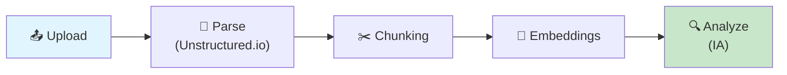
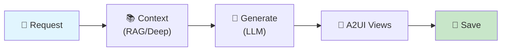
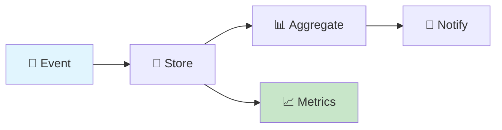

# Pipelines de Traitement

## Vue d'ensemble

Les pipelines sont des séquences de jobs orchestrés pour accomplir des tâches complexes :

1. **Document Pipeline** : Upload → Parse → Chunk → Embed → Analyze
2. **Generation Pipeline** : Context → Generate → Views → Save
3. **Session Pipeline** : Events → Aggregate → Metrics → Export

---

## Pipeline 1: Document Processing



### Étapes Détaillées

#### 1. Upload

```typescript
// API endpoint pour l'upload
// app/api/studios/[id]/sources/route.ts

export async function POST(req: NextRequest, { params }: { params: { id: string } }) {
  const formData = await req.formData();
  const file = formData.get('file') as File;

  // 1. Validation
  validateFile(file);

  // 2. Upload vers S3
  const s3Key = `studios/${params.id}/sources/${Date.now()}-${file.name}`;
  const url = await uploadToS3(s3Key, file);

  // 3. Créer enregistrement
  const source = await db.source.create({
    data: {
      studioId: params.id,
      filename: file.name,
      s3Key,
      url,
      mimeType: file.type,
      size: file.size,
      status: 'PENDING',
    },
  });

  // 4. Enqueue parsing job
  await documentQueue.add('parse', {
    type: 'parse',
    sourceId: source.id,
    userId: session.user.id,
  });

  return NextResponse.json({ source, jobStatus: 'queued' });
}
```

#### 2. Parse (Unstructured.io)

```typescript
// lib/parsing/unstructured.ts
import { UnstructuredClient } from 'unstructured-client';

const client = new UnstructuredClient({
  serverURL: process.env.UNSTRUCTURED_API_URL,
  security: {
    apiKeyAuth: process.env.UNSTRUCTURED_API_KEY,
  },
});

export interface ParsedElement {
  type: 'Title' | 'NarrativeText' | 'Table' | 'Image' | 'ListItem';
  text: string;
  metadata: {
    pageNumber?: number;
    coordinates?: { x: number; y: number };
    filename?: string;
  };
}

export async function parseWithUnstructured(
  url: string,
  mimeType: string
): Promise<ParsedElement[]> {
  // Télécharger le fichier
  const response = await fetch(url);
  const buffer = await response.arrayBuffer();

  // Parser avec Unstructured
  const result = await client.general.partition({
    files: {
      content: Buffer.from(buffer),
      fileName: 'document',
    },
    strategy: 'auto',
    languages: ['fra', 'eng'],
    extractImageBlockTypes: ['Image', 'Table'],
  });

  return result.elements.map((el) => ({
    type: el.type,
    text: el.text,
    metadata: el.metadata,
  }));
}
```

#### 3. Chunking

```typescript
// lib/parsing/chunking.ts
import { RecursiveCharacterTextSplitter } from 'langchain/text_splitter';

export interface Chunk {
  content: string;
  metadata: {
    pageNumber?: number;
    section?: string;
    tokenCount: number;
  };
  pageNumber?: number;
}

export interface ChunkingOptions {
  chunkSize: number;
  chunkOverlap: number;
  separators?: string[];
}

export function createChunks(
  elements: ParsedElement[],
  options: ChunkingOptions
): Chunk[] {
  const { chunkSize = 1000, chunkOverlap = 200 } = options;

  // Regrouper par page
  const pageGroups = groupBy(elements, (el) => el.metadata.pageNumber || 0);

  const chunks: Chunk[] = [];

  for (const [pageNumber, pageElements] of Object.entries(pageGroups)) {
    // Combiner le texte de la page
    const pageText = pageElements.map((el) => el.text).join('\n\n');

    // Splitter si nécessaire
    if (pageText.length > chunkSize) {
      const splitter = new RecursiveCharacterTextSplitter({
        chunkSize,
        chunkOverlap,
        separators: ['\n\n', '\n', '. ', ' '],
      });

      const splitTexts = await splitter.splitText(pageText);

      splitTexts.forEach((text) => {
        chunks.push({
          content: text,
          metadata: {
            pageNumber: parseInt(pageNumber),
            tokenCount: estimateTokens(text),
          },
          pageNumber: parseInt(pageNumber),
        });
      });
    } else {
      chunks.push({
        content: pageText,
        metadata: {
          pageNumber: parseInt(pageNumber),
          tokenCount: estimateTokens(pageText),
        },
        pageNumber: parseInt(pageNumber),
      });
    }
  }

  return chunks;
}

function estimateTokens(text: string): number {
  // Approximation: 1 token ≈ 4 caractères
  return Math.ceil(text.length / 4);
}
```

#### 4. Embeddings

```typescript
// lib/embeddings/index.ts
import { MistralClient } from '@mistralai/mistralai';

const mistral = new MistralClient(process.env.MISTRAL_API_KEY!);

const EMBEDDING_MODEL = 'mistral-embed';
const EMBEDDING_DIMENSION = 1024;

export async function generateEmbeddings(texts: string[]): Promise<number[][]> {
  // Batch API call
  const response = await mistral.embeddings({
    model: EMBEDDING_MODEL,
    input: texts,
  });

  return response.data.map((d) => d.embedding);
}

export async function generateEmbedding(text: string): Promise<number[]> {
  const [embedding] = await generateEmbeddings([text]);
  return embedding;
}

// Recherche par similarité
export async function searchSimilar(
  queryEmbedding: number[],
  sourceIds: string[],
  topK: number = 5
): Promise<Array<{ chunkId: string; similarity: number; content: string }>> {
  const results = await db.$queryRaw`
    SELECT
      id as "chunkId",
      content,
      1 - (embedding <=> ${queryEmbedding}::vector) as similarity
    FROM source_chunks
    WHERE source_id = ANY(${sourceIds})
      AND embedding IS NOT NULL
    ORDER BY embedding <=> ${queryEmbedding}::vector
    LIMIT ${topK}
  `;

  return results as any[];
}
```

#### 5. Analyze

```typescript
// lib/analysis/document-analyzer.ts
import { getMastraForUser } from '@qiplim/ai';
import { documentAnalyzerAgent } from '@qiplim/ai/agents';

export async function analyzeDocument(
  sourceId: string,
  userId: string
): Promise<SourceAnalysis> {
  const source = await db.source.findUnique({
    where: { id: sourceId },
    include: {
      chunks: {
        take: 15,
        orderBy: { chunkIndex: 'asc' },
      },
    },
  });

  if (!source) throw new Error('Source not found');

  const mastra = await getMastraForUser(userId);

  // Préparer le contexte
  const sampleContent = source.chunks.map((c) => c.content).join('\n\n---\n\n');

  // Analyser
  const analysis = await mastra.runAgent(documentAnalyzerAgent, {
    content: sampleContent,
    filename: source.filename,
    mimeType: source.mimeType,
  });

  return analysis;
}
```

---

## Pipeline 2: Widget Generation



### Workflow Complet

```typescript
// packages/ai/src/workflows/generate-widget.workflow.ts
import { Workflow, Step } from '@mastra/core/workflows';

// Step 1: Resolve context
const resolveContextStep = new Step({
  id: 'resolve-context',
  execute: async ({ context }) => {
    const input = context.getTriggerData();
    const { sourceIds, inputs } = input;

    // Calculer la taille totale
    const sources = await db.source.findMany({
      where: { id: { in: sourceIds } },
      select: { id: true, chunks: { select: { id: true } } },
    });

    const totalChunks = sources.reduce(
      (acc, s) => acc + s.chunks.length,
      0
    );

    // Mode deep si < 50 chunks, sinon RAG
    const useRag = totalChunks > 50;

    let contextText: string;
    if (useRag) {
      // Recherche sémantique
      const query = inputs.customInstructions || inputs.title || '';
      const embedding = await generateEmbedding(query);
      const results = await searchSimilar(embedding, sourceIds, 15);
      contextText = results.map((r) => r.content).join('\n\n');
    } else {
      // Tout le contenu
      const chunks = await db.sourceChunk.findMany({
        where: { sourceId: { in: sourceIds } },
        orderBy: [{ sourceId: 'asc' }, { chunkIndex: 'asc' }],
      });
      contextText = chunks.map((c) => c.content).join('\n\n');
    }

    return { contextText, mode: useRag ? 'rag' : 'deep', totalChunks };
  },
});

// Step 2: Generate activity spec
const generateSpecStep = new Step({
  id: 'generate-spec',
  execute: async ({ context, mastra }) => {
    const input = context.getTriggerData();
    const { contextText } = context.getStepResult('resolve-context');

    const template = await db.widgetTemplate.findUnique({
      where: { id: input.templateId },
    });

    if (!template) throw new Error('Template not found');

    // Construire le prompt
    const prompt = interpolateTemplate(template.promptTemplate, {
      context: contextText,
      ...input.inputs,
    });

    // Générer
    const response = await mastra.generate({
      model: 'mistral-large-latest',
      messages: [
        {
          role: 'system',
          content: 'Tu es un expert en création de contenu pédagogique interactif.',
        },
        { role: 'user', content: prompt },
      ],
      responseFormat: { type: 'json_object' },
      temperature: 0.5,
    });

    const activitySpec = JSON.parse(response.content);

    // Valider
    validateSchema(activitySpec, template.outputSchema);

    return { activitySpec };
  },
});

// Step 3: Generate A2UI views
const generateViewsStep = new Step({
  id: 'generate-views',
  execute: async ({ context }) => {
    const input = context.getTriggerData();
    const { activitySpec } = context.getStepResult('generate-spec');

    const template = await db.widgetTemplate.findUnique({
      where: { id: input.templateId },
    });

    const a2uiViews = {
      edit: generateView('edit', activitySpec, template!.views.edit),
      speaker: generateView('speaker', activitySpec, template!.views.speaker),
      viewer: generateView('viewer', activitySpec, template!.views.viewer),
    };

    return { a2uiViews };
  },
});

// Step 4: Save widget instance
const saveWidgetStep = new Step({
  id: 'save-widget',
  execute: async ({ context }) => {
    const input = context.getTriggerData();
    const { activitySpec } = context.getStepResult('generate-spec');
    const { a2uiViews } = context.getStepResult('generate-views');

    const widget = await db.widgetInstance.create({
      data: {
        studioId: input.studioId,
        templateId: input.templateId,
        title: activitySpec.title,
        inputs: input.inputs,
        sourceRefs: input.sourceIds,
        activitySpec,
        a2uiViews,
      },
      include: { template: true },
    });

    return { widgetId: widget.id, widget };
  },
});

export const generateWidgetWorkflow = new Workflow({
  name: 'generate-widget',
})
  .step(resolveContextStep)
  .then(generateSpecStep)
  .then(generateViewsStep)
  .then(saveWidgetStep);
```

---

## Pipeline 3: Session Events



### Event Processing

```typescript
// lib/session/event-processor.ts
import { sessionQueue } from '../queue/queues';
import { redis, redisPub } from '../redis';

export interface SessionEventInput {
  sessionId: string;
  participantId?: string;
  widgetInstanceId?: string;
  type: string;
  payload: Record<string, unknown>;
}

export async function processSessionEvent(event: SessionEventInput) {
  // 1. Store in database
  const storedEvent = await db.sessionEvent.create({
    data: {
      sessionId: event.sessionId,
      participantId: event.participantId,
      widgetInstanceId: event.widgetInstanceId,
      type: event.type,
      payload: event.payload,
      occurredAt: new Date(),
    },
  });

  // 2. Update Redis counters (real-time)
  if (event.type === 'response.submitted') {
    await redis.incr(`session:${event.sessionId}:responses`);
    if (event.widgetInstanceId) {
      await redis.incr(
        `session:${event.sessionId}:widget:${event.widgetInstanceId}:responses`
      );
    }
  }

  // 3. Publish to WebSocket channel
  await redisPub.publish(
    `session:${event.sessionId}`,
    JSON.stringify({
      type: event.type,
      payload: {
        ...event.payload,
        eventId: storedEvent.id,
        timestamp: storedEvent.occurredAt,
      },
    })
  );

  // 4. Queue aggregation job (debounced)
  if (shouldAggregate(event.type)) {
    await sessionQueue.add(
      'aggregate',
      {
        type: 'aggregate',
        sessionId: event.sessionId,
        payload: { widgetInstanceId: event.widgetInstanceId },
      },
      {
        jobId: `aggregate:${event.sessionId}:${event.widgetInstanceId}`,
        delay: 1000, // Debounce 1 second
      }
    );
  }

  return storedEvent;
}

function shouldAggregate(eventType: string): boolean {
  const aggregatableEvents = [
    'response.submitted',
    'vote.cast',
    'word.submitted',
    'postit.created',
  ];
  return aggregatableEvents.includes(eventType);
}
```

### Aggregation Worker

```typescript
// workers/session-worker.ts
import { Worker } from 'bullmq';
import { redis, redisPub } from '../lib/redis';
import { db } from '@qiplim/db';
import { SessionJobData } from '../lib/queue/queues';

const worker = new Worker<SessionJobData>(
  'session-events',
  async (job) => {
    const { type, sessionId, payload } = job.data;

    switch (type) {
      case 'aggregate':
        return await handleAggregate(sessionId, payload.widgetInstanceId);

      case 'export':
        return await handleExport(sessionId);

      default:
        throw new Error(`Unknown job type: ${type}`);
    }
  },
  { connection: redis, concurrency: 10 }
);

async function handleAggregate(sessionId: string, widgetInstanceId?: string) {
  // Calculer les agrégats
  const responses = await db.activityResponse.findMany({
    where: { sessionId, widgetInstanceId },
  });

  const widget = widgetInstanceId
    ? await db.widgetInstance.findUnique({ where: { id: widgetInstanceId } })
    : null;

  let aggregatedData: Record<string, unknown> = {};

  if (widget?.activitySpec.type === 'quiz') {
    aggregatedData = aggregateQuizResponses(responses, widget.activitySpec);
  } else if (widget?.activitySpec.type === 'poll') {
    aggregatedData = aggregatePollResponses(responses, widget.activitySpec);
  } else if (widget?.activitySpec.type === 'wordcloud') {
    aggregatedData = aggregateWordcloudResponses(responses);
  }

  // Mettre en cache
  await redis.setex(
    `session:${sessionId}:widget:${widgetInstanceId}:aggregated`,
    300, // 5 minutes
    JSON.stringify(aggregatedData)
  );

  // Notifier les clients
  await redisPub.publish(
    `session:${sessionId}`,
    JSON.stringify({
      type: 'aggregation.updated',
      payload: {
        widgetInstanceId,
        data: aggregatedData,
      },
    })
  );

  return aggregatedData;
}

function aggregateQuizResponses(responses: any[], spec: any) {
  const questionStats = spec.questions.map((q: any) => {
    const questionResponses = responses.filter(
      (r) => r.response.questionId === q.id
    );

    const optionCounts = q.options.reduce((acc: any, opt: any) => {
      acc[opt.id] = questionResponses.filter(
        (r) => r.response.selectedOptionId === opt.id
      ).length;
      return acc;
    }, {});

    return {
      questionId: q.id,
      totalResponses: questionResponses.length,
      optionCounts,
      correctRate:
        questionResponses.filter((r) => r.isCorrect).length /
        (questionResponses.length || 1),
    };
  });

  return {
    totalParticipants: new Set(responses.map((r) => r.participantId)).size,
    questionStats,
    leaderboard: calculateLeaderboard(responses),
  };
}

function aggregatePollResponses(responses: any[], spec: any) {
  const optionCounts = spec.options.reduce((acc: any, opt: any) => {
    acc[opt.id] = responses.filter((r) =>
      r.response.selectedOptionIds.includes(opt.id)
    ).length;
    return acc;
  }, {});

  return {
    totalVotes: responses.length,
    optionCounts,
    percentages: Object.entries(optionCounts).reduce(
      (acc: any, [id, count]: any) => {
        acc[id] = (count / (responses.length || 1)) * 100;
        return acc;
      },
      {}
    ),
  };
}

function aggregateWordcloudResponses(responses: any[]) {
  const wordCounts: Record<string, number> = {};

  responses.forEach((r) => {
    r.response.words.forEach((word: string) => {
      const normalized = word.toLowerCase().trim();
      wordCounts[normalized] = (wordCounts[normalized] || 0) + 1;
    });
  });

  return {
    words: Object.entries(wordCounts)
      .map(([text, count]) => ({ text, count }))
      .sort((a, b) => b.count - a.count),
    totalSubmissions: responses.length,
    uniqueWords: Object.keys(wordCounts).length,
  };
}
```
