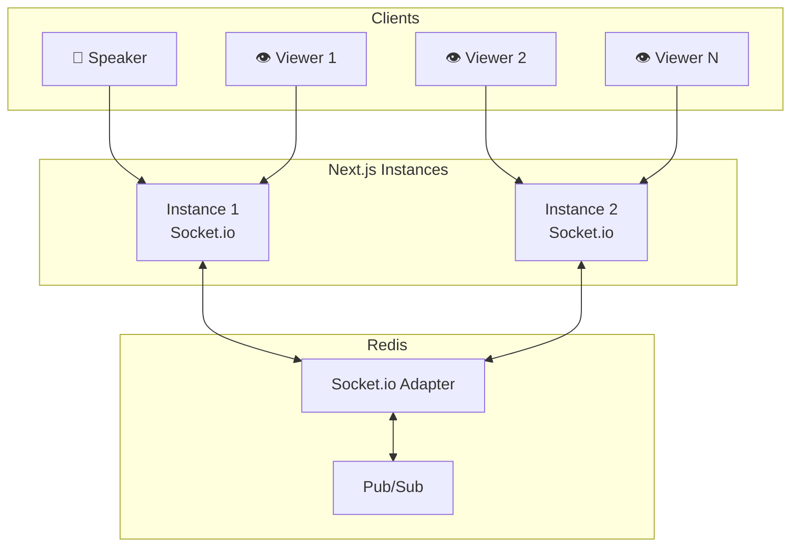

# Architecture WebSocket - Sessions Live

## Vue d'ensemble

Les sessions live utilisent **Socket.io** avec **Redis** comme adapter pour permettre le scaling horizontal.



---

## Configuration Socket.io

### Server Setup

```typescript
// lib/socket/server.ts
import { Server as HTTPServer } from 'http';
import { Server as SocketIOServer } from 'socket.io';
import { createAdapter } from '@socket.io/redis-adapter';
import { redisPub, redisSub } from '../redis';

let io: SocketIOServer | null = null;

export function initSocketServer(httpServer: HTTPServer): SocketIOServer {
  if (io) return io;

  io = new SocketIOServer(httpServer, {
    path: '/api/socket',
    cors: {
      origin: process.env.NEXT_PUBLIC_APP_URL,
      methods: ['GET', 'POST'],
      credentials: true,
    },
    transports: ['websocket', 'polling'],
    pingTimeout: 20000,
    pingInterval: 25000,
  });

  // Redis adapter pour scaling horizontal
  io.adapter(createAdapter(redisPub, redisSub));

  // Middleware d'authentification
  io.use(async (socket, next) => {
    try {
      const token = socket.handshake.auth.token;
      const sessionCode = socket.handshake.query.sessionCode as string;

      if (!sessionCode) {
        return next(new Error('Session code required'));
      }

      // Vérifier la session
      const session = await verifySession(sessionCode);
      if (!session) {
        return next(new Error('Invalid session'));
      }

      // Attacher les données au socket
      socket.data.sessionId = session.id;
      socket.data.sessionCode = sessionCode;

      // Vérifier si speaker
      if (token === session.presenterToken) {
        socket.data.role = 'speaker';
        socket.data.participantId = null;
      } else if (token) {
        // Vérifier participant
        const participant = await verifyParticipant(token, session.id);
        if (participant) {
          socket.data.role = 'viewer';
          socket.data.participantId = participant.id;
        } else {
          return next(new Error('Invalid participant token'));
        }
      } else {
        return next(new Error('Authentication required'));
      }

      next();
    } catch (err) {
      next(new Error('Authentication failed'));
    }
  });

  // Handlers
  io.on('connection', handleConnection);

  console.log('Socket.io server initialized');
  return io;
}

export function getIO(): SocketIOServer {
  if (!io) {
    throw new Error('Socket.io not initialized');
  }
  return io;
}
```

### Connection Handler

```typescript
// lib/socket/handlers.ts
import { Socket } from 'socket.io';
import { db } from '@qiplim/db';
import { processSessionEvent } from './event-processor';

export async function handleConnection(socket: Socket) {
  const { sessionId, sessionCode, role, participantId } = socket.data;

  console.log(`Connection: ${socket.id} (${role}) to session ${sessionCode}`);

  // Rejoindre la room de la session
  socket.join(`session:${sessionId}`);

  // Rejoindre la room par rôle
  socket.join(`session:${sessionId}:${role}s`);

  // Notifier l'arrivée
  if (role === 'viewer' && participantId) {
    await handleParticipantJoined(socket, sessionId, participantId);
  }

  // === Event Handlers ===

  // Speaker: Changer de widget
  socket.on('widget:activate', async (data) => {
    if (role !== 'speaker') return;

    await handleWidgetActivate(socket, sessionId, data.widgetIndex);
  });

  // Speaker: Contrôler l'activité
  socket.on('activity:start', async (data) => {
    if (role !== 'speaker') return;

    await handleActivityStart(socket, sessionId, data.widgetInstanceId);
  });

  socket.on('activity:stop', async (data) => {
    if (role !== 'speaker') return;

    await handleActivityStop(socket, sessionId, data.widgetInstanceId);
  });

  // Speaker: Révéler les résultats
  socket.on('results:reveal', async (data) => {
    if (role !== 'speaker') return;

    await handleResultsReveal(socket, sessionId, data.widgetInstanceId);
  });

  // Viewer: Soumettre une réponse
  socket.on('response:submit', async (data) => {
    if (role !== 'viewer' || !participantId) return;

    await handleResponseSubmit(socket, sessionId, participantId, data);
  });

  // Viewer: Soumettre des mots (wordcloud)
  socket.on('words:submit', async (data) => {
    if (role !== 'viewer' || !participantId) return;

    await handleWordsSubmit(socket, sessionId, participantId, data);
  });

  // Viewer: Créer un post-it
  socket.on('postit:create', async (data) => {
    if (role !== 'viewer' || !participantId) return;

    await handlePostitCreate(socket, sessionId, participantId, data);
  });

  // Viewer: Voter pour un post-it
  socket.on('postit:vote', async (data) => {
    if (role !== 'viewer' || !participantId) return;

    await handlePostitVote(socket, sessionId, participantId, data);
  });

  // Roleplay: Message
  socket.on('roleplay:message', async (data) => {
    if (role !== 'viewer' || !participantId) return;

    await handleRoleplayMessage(socket, sessionId, participantId, data);
  });

  // Déconnexion
  socket.on('disconnect', async (reason) => {
    console.log(`Disconnect: ${socket.id} (${reason})`);

    if (role === 'viewer' && participantId) {
      await handleParticipantLeft(socket, sessionId, participantId);
    }
  });
}
```

### Event Handlers Détaillés

```typescript
// lib/socket/event-handlers.ts

async function handleParticipantJoined(
  socket: Socket,
  sessionId: string,
  participantId: string
) {
  const participant = await db.participant.update({
    where: { id: participantId },
    data: { isActive: true, lastActivity: new Date() },
  });

  // Incrémenter le compteur
  const session = await db.liveSession.update({
    where: { id: sessionId },
    data: { participantCount: { increment: 1 } },
  });

  // Émettre l'event
  await processSessionEvent({
    sessionId,
    participantId,
    type: 'participant.joined',
    payload: {
      displayName: participant.displayName,
      participantCount: session.participantCount,
    },
  });

  // Envoyer l'état actuel au participant
  const currentState = await getSessionState(sessionId);
  socket.emit('session:state', currentState);
}

async function handleWidgetActivate(
  socket: Socket,
  sessionId: string,
  widgetIndex: number
) {
  // Mettre à jour la session
  await db.liveSession.update({
    where: { id: sessionId },
    data: { currentWidgetIndex: widgetIndex },
  });

  // Récupérer le widget
  const session = await db.liveSession.findUnique({
    where: { id: sessionId },
    include: {
      presentation: {
        include: {
          widgets: {
            include: { widget: { include: { template: true } } },
            orderBy: { order: 'asc' },
          },
        },
      },
    },
  });

  const presentationWidget = session?.presentation.widgets[widgetIndex];

  // Broadcast à tous
  socket.to(`session:${sessionId}`).emit('widget:activated', {
    widgetIndex,
    widget: presentationWidget?.widget,
  });

  // Émettre l'event
  await processSessionEvent({
    sessionId,
    widgetInstanceId: presentationWidget?.widgetInstanceId,
    type: 'widget.activated',
    payload: { widgetIndex },
  });
}

async function handleResponseSubmit(
  socket: Socket,
  sessionId: string,
  participantId: string,
  data: {
    widgetInstanceId: string;
    response: Record<string, unknown>;
  }
) {
  const widget = await db.widgetInstance.findUnique({
    where: { id: data.widgetInstanceId },
  });

  if (!widget) {
    socket.emit('error', { message: 'Widget not found' });
    return;
  }

  // Calculer le score si quiz
  let score: number | null = null;
  let isCorrect: boolean | null = null;

  if (widget.activitySpec.type === 'quiz') {
    const question = widget.activitySpec.questions.find(
      (q: any) => q.id === data.response.questionId
    );
    if (question) {
      const correctOption = question.options.find((o: any) => o.isCorrect);
      isCorrect = data.response.selectedOptionId === correctOption?.id;
      score = isCorrect ? question.points : 0;
    }
  }

  // Sauvegarder la réponse
  const response = await db.activityResponse.create({
    data: {
      sessionId,
      widgetInstanceId: data.widgetInstanceId,
      participantId,
      response: data.response,
      score,
      isCorrect,
    },
  });

  // Confirmer au participant
  socket.emit('response:confirmed', {
    responseId: response.id,
    isCorrect,
    score,
  });

  // Notifier le speaker (agrégé)
  await processSessionEvent({
    sessionId,
    participantId,
    widgetInstanceId: data.widgetInstanceId,
    type: 'response.submitted',
    payload: {
      responseId: response.id,
      isCorrect,
      score,
    },
  });

  // Mettre à jour l'activité du participant
  await db.participant.update({
    where: { id: participantId },
    data: { lastActivity: new Date() },
  });
}

async function handleWordsSubmit(
  socket: Socket,
  sessionId: string,
  participantId: string,
  data: { widgetInstanceId: string; words: string[] }
) {
  // Filtrer et normaliser les mots
  const normalizedWords = data.words
    .map((w) => w.trim().toLowerCase())
    .filter((w) => w.length >= 2);

  // Sauvegarder
  const response = await db.activityResponse.create({
    data: {
      sessionId,
      widgetInstanceId: data.widgetInstanceId,
      participantId,
      response: { type: 'wordcloud', words: normalizedWords },
    },
  });

  socket.emit('words:confirmed', { responseId: response.id });

  // Notifier pour mise à jour du nuage
  await processSessionEvent({
    sessionId,
    participantId,
    widgetInstanceId: data.widgetInstanceId,
    type: 'word.submitted',
    payload: { words: normalizedWords },
  });
}

async function handleRoleplayMessage(
  socket: Socket,
  sessionId: string,
  participantId: string,
  data: {
    widgetInstanceId: string;
    roleId: string;
    message: string;
    conversationId: string;
  }
) {
  const widget = await db.widgetInstance.findUnique({
    where: { id: data.widgetInstanceId },
  });

  if (!widget || widget.activitySpec.type !== 'roleplay') {
    socket.emit('error', { message: 'Invalid roleplay widget' });
    return;
  }

  // Trouver le rôle
  const role = widget.activitySpec.roles.find((r: any) => r.id === data.roleId);
  if (!role) {
    socket.emit('error', { message: 'Role not found' });
    return;
  }

  // Récupérer l'historique de conversation
  const previousResponses = await db.activityResponse.findMany({
    where: {
      participantId,
      widgetInstanceId: data.widgetInstanceId,
      response: { path: ['conversationId'], equals: data.conversationId },
    },
    orderBy: { submittedAt: 'asc' },
  });

  // Construire l'historique
  const history = previousResponses.flatMap((r) => [
    { role: 'user' as const, content: r.response.message },
    { role: 'assistant' as const, content: r.response.agentResponse },
  ]);

  // Appeler l'agent IA
  const mastra = await getMastraForUser(widget.studioId);
  const agent = createRoleplayDialogAgent(role);

  const aiResponse = await mastra.runAgent(agent, {
    message: data.message,
    conversationHistory: history,
  });

  // Sauvegarder
  await db.activityResponse.create({
    data: {
      sessionId,
      widgetInstanceId: data.widgetInstanceId,
      participantId,
      response: {
        type: 'roleplay',
        roleId: data.roleId,
        conversationId: data.conversationId,
        message: data.message,
        agentResponse: aiResponse.message,
        mood: aiResponse.mood,
      },
    },
  });

  // Répondre au participant
  socket.emit('roleplay:response', {
    message: aiResponse.message,
    mood: aiResponse.mood,
    suggestedFollowUp: aiResponse.suggestedFollowUp,
  });
}
```

---

## Client Socket.io

```typescript
// lib/socket/client.ts
import { io, Socket } from 'socket.io-client';

let socket: Socket | null = null;

export function connectToSession(
  sessionCode: string,
  token: string
): Socket {
  if (socket?.connected) {
    socket.disconnect();
  }

  socket = io(process.env.NEXT_PUBLIC_APP_URL!, {
    path: '/api/socket',
    transports: ['websocket', 'polling'],
    auth: { token },
    query: { sessionCode },
    reconnection: true,
    reconnectionAttempts: 5,
    reconnectionDelay: 1000,
    reconnectionDelayMax: 5000,
  });

  return socket;
}

export function getSocket(): Socket | null {
  return socket;
}

export function disconnectSocket(): void {
  if (socket) {
    socket.disconnect();
    socket = null;
  }
}
```

### React Hook

```typescript
// hooks/use-session-socket.ts
'use client';

import { useEffect, useState, useCallback } from 'react';
import { Socket } from 'socket.io-client';
import { connectToSession, disconnectSocket } from '@/lib/socket/client';

export function useSessionSocket(sessionCode: string, token: string) {
  const [socket, setSocket] = useState<Socket | null>(null);
  const [connected, setConnected] = useState(false);
  const [error, setError] = useState<string | null>(null);

  useEffect(() => {
    const sock = connectToSession(sessionCode, token);

    sock.on('connect', () => {
      setConnected(true);
      setError(null);
    });

    sock.on('disconnect', () => {
      setConnected(false);
    });

    sock.on('connect_error', (err) => {
      setError(err.message);
      setConnected(false);
    });

    setSocket(sock);

    return () => {
      disconnectSocket();
    };
  }, [sessionCode, token]);

  const emit = useCallback(
    (event: string, data?: unknown) => {
      if (socket?.connected) {
        socket.emit(event, data);
      }
    },
    [socket]
  );

  const on = useCallback(
    (event: string, handler: (...args: any[]) => void) => {
      socket?.on(event, handler);
      return () => socket?.off(event, handler);
    },
    [socket]
  );

  return { socket, connected, error, emit, on };
}
```
