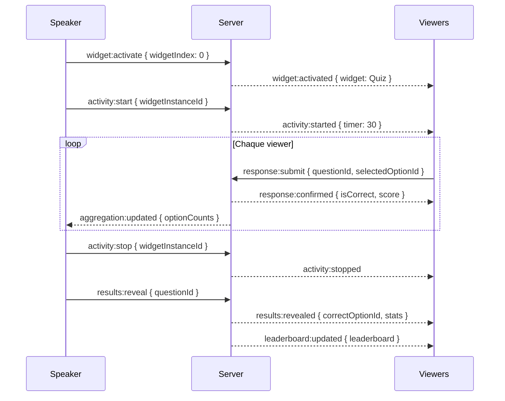
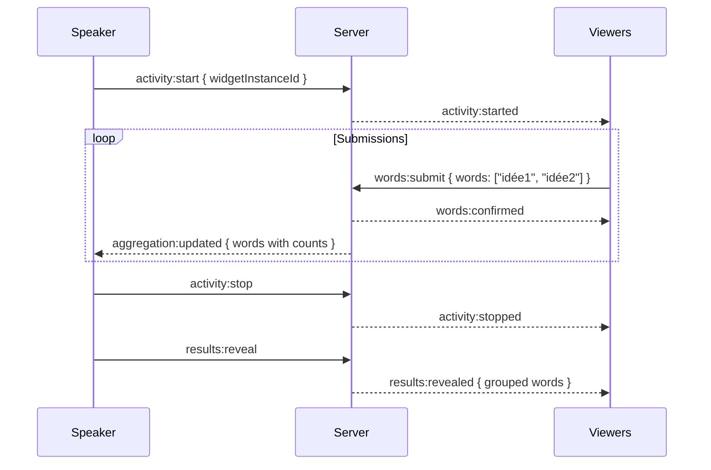
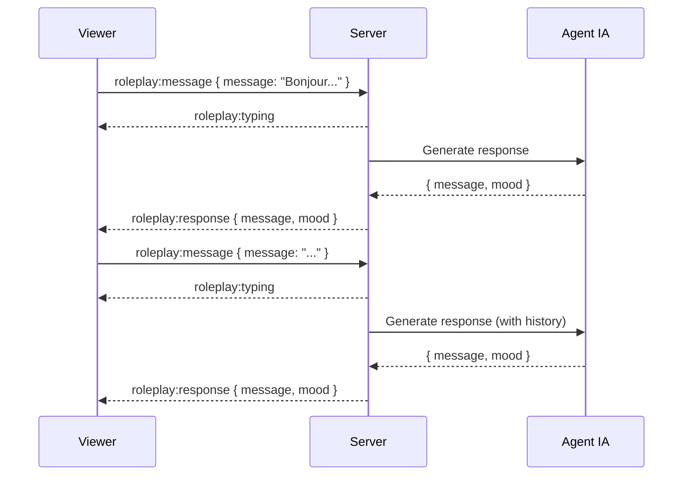

# Contrat d'Événements - Sessions Live

## Vue d'ensemble

Ce document définit le contrat des événements WebSocket entre le serveur et les clients (Speaker/Viewer).

---

## Format Standard des Événements

Tous les événements suivent ce format :

```typescript
interface SessionEvent {
  type: string;          // Type d'événement
  payload: {
    eventId?: string;    // ID unique (pour les events persistés)
    timestamp: string;   // ISO 8601
    ...data             // Données spécifiques
  };
}
```

---

## Événements Server → Client

### Session Lifecycle

| Event | Émis par | Reçu par | Description |
|-------|----------|----------|-------------|
| `session:state` | Server | Viewer | État initial de la session |
| `session:started` | Server | All | Session démarrée |
| `session:paused` | Server | All | Session mise en pause |
| `session:resumed` | Server | All | Session reprise |
| `session:ended` | Server | All | Session terminée |

#### `session:state`

```typescript
// Envoyé à la connexion d'un viewer
{
  type: 'session:state',
  payload: {
    sessionId: string;
    state: 'WAITING' | 'ACTIVE' | 'PAUSED' | 'CLOSED';
    currentWidgetIndex: number;
    currentWidget?: {
      id: string;
      templateId: string;
      activitySpec: ActivitySpec;
      a2uiView: A2UIComponent[];
    };
    participantCount: number;
  }
}
```

#### `session:ended`

```typescript
{
  type: 'session:ended',
  payload: {
    timestamp: string;
    duration: number; // secondes
    totalParticipants: number;
    stats?: SessionStats;
  }
}
```

### Participants

| Event | Émis par | Reçu par | Description |
|-------|----------|----------|-------------|
| `participant:joined` | Server | Speaker | Nouveau participant |
| `participant:left` | Server | Speaker | Participant parti |
| `participant:count` | Server | All | Mise à jour du compteur |

#### `participant:joined`

```typescript
{
  type: 'participant:joined',
  payload: {
    participantId: string;
    displayName: string;
    participantCount: number;
    timestamp: string;
  }
}
```

### Navigation

| Event | Émis par | Reçu par | Description |
|-------|----------|----------|-------------|
| `widget:activated` | Server | Viewers | Widget activé |
| `widget:deactivated` | Server | Viewers | Widget désactivé |

#### `widget:activated`

```typescript
{
  type: 'widget:activated',
  payload: {
    widgetIndex: number;
    widget: {
      id: string;
      templateId: string;
      category: WidgetCategory;
      title: string;
      a2uiView: A2UIComponent[]; // Vue viewer
    };
    timestamp: string;
  }
}
```

### Activités

| Event | Émis par | Reçu par | Description |
|-------|----------|----------|-------------|
| `activity:started` | Server | Viewers | Activité démarrée |
| `activity:stopped` | Server | Viewers | Activité arrêtée |
| `activity:timer` | Server | All | Timer mis à jour |

#### `activity:started`

```typescript
{
  type: 'activity:started',
  payload: {
    widgetInstanceId: string;
    activityType: string;
    config: {
      timer?: number; // secondes, si applicable
      allowMultiple?: boolean;
    };
    timestamp: string;
  }
}
```

### Résultats et Agrégats

| Event | Émis par | Reçu par | Description |
|-------|----------|----------|-------------|
| `results:revealed` | Server | All | Résultats affichés |
| `aggregation:updated` | Server | Speaker | Données agrégées mises à jour |
| `leaderboard:updated` | Server | All | Leaderboard mis à jour |

#### `results:revealed`

```typescript
{
  type: 'results:revealed',
  payload: {
    widgetInstanceId: string;
    results: QuizResults | PollResults | WordcloudResults;
    timestamp: string;
  }
}

// Quiz Results
interface QuizResults {
  type: 'quiz';
  questionId: string;
  correctOptionId: string;
  optionCounts: Record<string, number>;
  correctRate: number;
}

// Poll Results
interface PollResults {
  type: 'poll';
  optionCounts: Record<string, number>;
  percentages: Record<string, number>;
  totalVotes: number;
}

// Wordcloud Results
interface WordcloudResults {
  type: 'wordcloud';
  words: Array<{ text: string; count: number }>;
  totalSubmissions: number;
}
```

#### `leaderboard:updated`

```typescript
{
  type: 'leaderboard:updated',
  payload: {
    leaderboard: Array<{
      rank: number;
      participantId: string;
      displayName: string;
      score: number;
      delta?: number; // Changement depuis dernier update
    }>;
    timestamp: string;
  }
}
```

### Confirmations (Viewer uniquement)

| Event | Émis par | Reçu par | Description |
|-------|----------|----------|-------------|
| `response:confirmed` | Server | Viewer | Réponse confirmée |
| `words:confirmed` | Server | Viewer | Mots confirmés |
| `postit:confirmed` | Server | Viewer | Post-it confirmé |
| `vote:confirmed` | Server | Viewer | Vote confirmé |

#### `response:confirmed`

```typescript
{
  type: 'response:confirmed',
  payload: {
    responseId: string;
    isCorrect?: boolean; // Quiz uniquement
    score?: number;
    timestamp: string;
  }
}
```

### Roleplay

| Event | Émis par | Reçu par | Description |
|-------|----------|----------|-------------|
| `roleplay:response` | Server | Viewer | Réponse de l'agent IA |
| `roleplay:typing` | Server | Viewer | Agent en train d'écrire |

#### `roleplay:response`

```typescript
{
  type: 'roleplay:response',
  payload: {
    message: string;
    mood: 'neutral' | 'encouraging' | 'challenging' | 'thoughtful';
    suggestedFollowUp?: string;
    conversationId: string;
    timestamp: string;
  }
}
```

### Erreurs

```typescript
{
  type: 'error',
  payload: {
    code: string;
    message: string;
    details?: Record<string, unknown>;
  }
}
```

Codes d'erreur :
- `SESSION_NOT_FOUND`
- `SESSION_CLOSED`
- `UNAUTHORIZED`
- `INVALID_RESPONSE`
- `RATE_LIMITED`
- `INTERNAL_ERROR`

---

## Événements Client → Server

### Speaker Events

| Event | Payload | Description |
|-------|---------|-------------|
| `session:start` | `{}` | Démarrer la session |
| `session:pause` | `{}` | Mettre en pause |
| `session:resume` | `{}` | Reprendre |
| `session:end` | `{}` | Terminer |
| `widget:activate` | `{ widgetIndex: number }` | Activer un widget |
| `activity:start` | `{ widgetInstanceId: string }` | Démarrer une activité |
| `activity:stop` | `{ widgetInstanceId: string }` | Arrêter une activité |
| `results:reveal` | `{ widgetInstanceId: string, questionId?: string }` | Révéler les résultats |
| `broadcast:message` | `{ message: string }` | Message à tous |

### Viewer Events

| Event | Payload | Description |
|-------|---------|-------------|
| `response:submit` | `{ widgetInstanceId, response }` | Soumettre réponse |
| `words:submit` | `{ widgetInstanceId, words: string[] }` | Soumettre mots |
| `postit:create` | `{ widgetInstanceId, content, color }` | Créer post-it |
| `postit:vote` | `{ widgetInstanceId, postitId }` | Voter post-it |
| `roleplay:message` | `{ widgetInstanceId, roleId, message, conversationId }` | Message roleplay |

---

## Schémas de Validation (Zod)

```typescript
// packages/shared/src/schemas/socket-events.ts
import { z } from 'zod';

// === Server → Client ===

export const sessionStateSchema = z.object({
  type: z.literal('session:state'),
  payload: z.object({
    sessionId: z.string(),
    state: z.enum(['WAITING', 'ACTIVE', 'PAUSED', 'CLOSED']),
    currentWidgetIndex: z.number(),
    currentWidget: z.object({
      id: z.string(),
      templateId: z.string(),
      activitySpec: z.record(z.unknown()),
      a2uiView: z.array(z.record(z.unknown())),
    }).optional(),
    participantCount: z.number(),
  }),
});

export const widgetActivatedSchema = z.object({
  type: z.literal('widget:activated'),
  payload: z.object({
    widgetIndex: z.number(),
    widget: z.object({
      id: z.string(),
      templateId: z.string(),
      category: z.enum(['QUIZ', 'POLL', 'WORDCLOUD', 'POSTIT', 'ROLEPLAY']),
      title: z.string(),
      a2uiView: z.array(z.record(z.unknown())),
    }),
    timestamp: z.string(),
  }),
});

// === Client → Server ===

export const submitResponseSchema = z.object({
  widgetInstanceId: z.string(),
  response: z.union([
    // Quiz response
    z.object({
      type: z.literal('quiz'),
      questionId: z.string(),
      selectedOptionId: z.string(),
      timeSpentMs: z.number().optional(),
    }),
    // Poll response
    z.object({
      type: z.literal('poll'),
      selectedOptionIds: z.array(z.string()),
    }),
  ]),
});

export const submitWordsSchema = z.object({
  widgetInstanceId: z.string(),
  words: z.array(z.string().min(2).max(50)).min(1).max(10),
});

export const createPostitSchema = z.object({
  widgetInstanceId: z.string(),
  content: z.string().min(1).max(500),
  color: z.enum(['yellow', 'pink', 'blue', 'green', 'orange']).optional(),
});

export const roleplayMessageSchema = z.object({
  widgetInstanceId: z.string(),
  roleId: z.string(),
  message: z.string().min(1).max(1000),
  conversationId: z.string(),
});
```

---

## Exemples de Flux

### Flux Quiz Complet



### Flux Wordcloud



### Flux Roleplay


