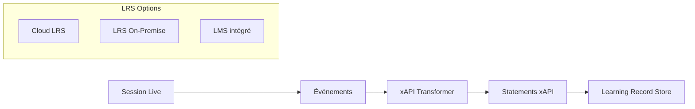

# Export xAPI

## Vue d'ensemble

**xAPI** (Experience API, aussi appelé Tin Can API) est un standard pour tracer les expériences d'apprentissage. Qiplim Studio génère des statements xAPI pour chaque interaction significative.



---

## Configuration

### Variables d'environnement

```env
# LRS Configuration
XAPI_LRS_ENDPOINT=https://lrs.example.com/xapi
XAPI_LRS_AUTH_TYPE=basic  # basic | oauth2
XAPI_LRS_USERNAME=your_username
XAPI_LRS_PASSWORD=your_password

# OAuth2 (si XAPI_LRS_AUTH_TYPE=oauth2)
XAPI_OAUTH_CLIENT_ID=your_client_id
XAPI_OAUTH_CLIENT_SECRET=your_client_secret
XAPI_OAUTH_TOKEN_URL=https://lrs.example.com/oauth/token

# Optionnel
XAPI_VERSION=1.0.3
XAPI_BATCH_SIZE=50
XAPI_RETRY_ATTEMPTS=3
```

### Configuration par Studio

```typescript
// Schéma Prisma
model Studio {
  id            String  @id @default(cuid())
  // ...
  xapiEnabled   Boolean @default(false)
  xapiConfig    Json?   // LRSConfig
}

interface LRSConfig {
  endpoint: string;
  authType: 'basic' | 'oauth2';
  credentials: {
    username?: string;
    password?: string;
    clientId?: string;
    clientSecret?: string;
  };
  actorIdentifier: 'email' | 'account';
  activityIdPrefix: string; // ex: "https://qiplim.com/activities/"
}
```

---

## Structure des Statements xAPI

### Format de Base

```typescript
interface XAPIStatement {
  id?: string;           // UUID généré
  actor: Actor;          // Qui a fait l'action
  verb: Verb;            // L'action effectuée
  object: ActivityObject; // Sur quoi
  result?: Result;       // Résultat (optionnel)
  context?: Context;     // Contexte additionnel
  timestamp: string;     // ISO 8601
}
```

### Actor (Participant)

```typescript
interface Actor {
  objectType: 'Agent';
  name: string;
  mbox?: string;         // mailto:email@example.com
  account?: {
    homePage: string;    // https://qiplim.com
    name: string;        // ID participant
  };
}

// Exemple
{
  "objectType": "Agent",
  "name": "Marie Dupont",
  "mbox": "mailto:marie.dupont@example.com"
}

// Ou avec account
{
  "objectType": "Agent",
  "name": "Marie Dupont",
  "account": {
    "homePage": "https://qiplim.com",
    "name": "participant_abc123"
  }
}
```

### Verbs Utilisés

| Verb IRI | Label FR | Description |
|----------|----------|-------------|
| `http://adlnet.gov/expapi/verbs/initialized` | Initialisé | Session démarrée |
| `http://adlnet.gov/expapi/verbs/attended` | Participé | Rejoint une session |
| `http://adlnet.gov/expapi/verbs/answered` | Répondu | Réponse soumise (quiz/poll) |
| `http://adlnet.gov/expapi/verbs/completed` | Terminé | Activité/session terminée |
| `http://adlnet.gov/expapi/verbs/passed` | Réussi | Quiz réussi (score >= seuil) |
| `http://adlnet.gov/expapi/verbs/failed` | Échoué | Quiz échoué |
| `http://adlnet.gov/expapi/verbs/interacted` | Interagi | Interaction générique |
| `http://adlnet.gov/expapi/verbs/commented` | Commenté | Post-it créé |
| `http://adlnet.gov/expapi/verbs/rated` | Évalué | Vote sur post-it |

```typescript
// lib/xapi/verbs.ts
export const XAPI_VERBS = {
  initialized: {
    id: 'http://adlnet.gov/expapi/verbs/initialized',
    display: { 'fr-FR': 'a initialisé', 'en-US': 'initialized' },
  },
  attended: {
    id: 'http://adlnet.gov/expapi/verbs/attended',
    display: { 'fr-FR': 'a participé à', 'en-US': 'attended' },
  },
  answered: {
    id: 'http://adlnet.gov/expapi/verbs/answered',
    display: { 'fr-FR': 'a répondu à', 'en-US': 'answered' },
  },
  completed: {
    id: 'http://adlnet.gov/expapi/verbs/completed',
    display: { 'fr-FR': 'a terminé', 'en-US': 'completed' },
  },
  passed: {
    id: 'http://adlnet.gov/expapi/verbs/passed',
    display: { 'fr-FR': 'a réussi', 'en-US': 'passed' },
  },
  failed: {
    id: 'http://adlnet.gov/expapi/verbs/failed',
    display: { 'fr-FR': 'a échoué', 'en-US': 'failed' },
  },
  interacted: {
    id: 'http://adlnet.gov/expapi/verbs/interacted',
    display: { 'fr-FR': 'a interagi avec', 'en-US': 'interacted with' },
  },
  commented: {
    id: 'http://adlnet.gov/expapi/verbs/commented',
    display: { 'fr-FR': 'a commenté', 'en-US': 'commented' },
  },
  rated: {
    id: 'http://adlnet.gov/expapi/verbs/rated',
    display: { 'fr-FR': 'a évalué', 'en-US': 'rated' },
  },
} as const;
```

### Activity Object

```typescript
interface ActivityObject {
  objectType: 'Activity';
  id: string;              // IRI unique
  definition: {
    type: string;          // Type d'activité
    name: LanguageMap;
    description?: LanguageMap;
    interactionType?: string; // Pour quiz
    correctResponsesPattern?: string[];
    choices?: InteractionComponent[];
    extensions?: Record<string, unknown>;
  };
}

// Types d'activités
const ACTIVITY_TYPES = {
  session: 'http://adlnet.gov/expapi/activities/meeting',
  quiz: 'http://adlnet.gov/expapi/activities/assessment',
  poll: 'http://adlnet.gov/expapi/activities/survey',
  wordcloud: 'https://qiplim.com/activities/wordcloud',
  postit: 'https://qiplim.com/activities/brainstorm',
  roleplay: 'https://qiplim.com/activities/simulation',
};
```

### Result

```typescript
interface Result {
  score?: {
    scaled?: number;    // 0-1
    raw?: number;       // Points bruts
    min?: number;
    max?: number;
  };
  success?: boolean;    // Réussite/échec
  completion?: boolean; // Complétion
  response?: string;    // Réponse donnée
  duration?: string;    // Format ISO 8601 duration
  extensions?: Record<string, unknown>;
}
```

### Context

```typescript
interface Context {
  registration?: string;  // UUID de la tentative
  instructor?: Actor;     // Le speaker
  team?: Group;
  contextActivities?: {
    parent?: ActivityObject[];   // Session parente
    grouping?: ActivityObject[]; // Studio parent
    category?: ActivityObject[]; // Tags de catégorisation
  };
  revision?: string;
  platform?: string;       // "Qiplim Studio"
  language?: string;       // "fr-FR"
  extensions?: Record<string, unknown>;
}
```

---

## Statements par Type d'Activité

### Session Started

```json
{
  "actor": {
    "objectType": "Agent",
    "name": "Jean Formateur",
    "mbox": "mailto:jean@company.com"
  },
  "verb": {
    "id": "http://adlnet.gov/expapi/verbs/initialized",
    "display": { "fr-FR": "a initialisé" }
  },
  "object": {
    "objectType": "Activity",
    "id": "https://qiplim.com/sessions/sess_abc123",
    "definition": {
      "type": "http://adlnet.gov/expapi/activities/meeting",
      "name": { "fr-FR": "Formation Sécurité 2024" },
      "description": { "fr-FR": "Session de formation sur les règles de sécurité" }
    }
  },
  "context": {
    "platform": "Qiplim Studio",
    "language": "fr-FR",
    "extensions": {
      "https://qiplim.com/extensions/session-code": "ABC123",
      "https://qiplim.com/extensions/studio-id": "studio_xyz"
    }
  },
  "timestamp": "2024-03-15T10:00:00.000Z"
}
```

### Participant Joined

```json
{
  "actor": {
    "objectType": "Agent",
    "name": "Marie Participante",
    "account": {
      "homePage": "https://qiplim.com",
      "name": "part_def456"
    }
  },
  "verb": {
    "id": "http://adlnet.gov/expapi/verbs/attended",
    "display": { "fr-FR": "a participé à" }
  },
  "object": {
    "objectType": "Activity",
    "id": "https://qiplim.com/sessions/sess_abc123",
    "definition": {
      "type": "http://adlnet.gov/expapi/activities/meeting",
      "name": { "fr-FR": "Formation Sécurité 2024" }
    }
  },
  "context": {
    "registration": "550e8400-e29b-41d4-a716-446655440000",
    "instructor": {
      "objectType": "Agent",
      "name": "Jean Formateur",
      "mbox": "mailto:jean@company.com"
    }
  },
  "timestamp": "2024-03-15T10:05:23.000Z"
}
```

### Quiz Answer

```json
{
  "actor": {
    "objectType": "Agent",
    "name": "Marie Participante",
    "account": {
      "homePage": "https://qiplim.com",
      "name": "part_def456"
    }
  },
  "verb": {
    "id": "http://adlnet.gov/expapi/verbs/answered",
    "display": { "fr-FR": "a répondu à" }
  },
  "object": {
    "objectType": "Activity",
    "id": "https://qiplim.com/widgets/quiz_ghi789/questions/q1",
    "definition": {
      "type": "http://adlnet.gov/expapi/activities/cmi.interaction",
      "name": { "fr-FR": "Quelle est la procédure d'évacuation ?" },
      "interactionType": "choice",
      "correctResponsesPattern": ["opt_b"],
      "choices": [
        { "id": "opt_a", "description": { "fr-FR": "Prendre l'ascenseur" } },
        { "id": "opt_b", "description": { "fr-FR": "Utiliser les escaliers" } },
        { "id": "opt_c", "description": { "fr-FR": "Attendre les instructions" } }
      ]
    }
  },
  "result": {
    "success": true,
    "score": {
      "scaled": 1,
      "raw": 10,
      "max": 10
    },
    "response": "opt_b",
    "duration": "PT12S"
  },
  "context": {
    "registration": "550e8400-e29b-41d4-a716-446655440000",
    "contextActivities": {
      "parent": [{
        "id": "https://qiplim.com/sessions/sess_abc123",
        "objectType": "Activity"
      }]
    }
  },
  "timestamp": "2024-03-15T10:15:45.000Z"
}
```

### Poll Response

```json
{
  "actor": {
    "objectType": "Agent",
    "name": "Marie Participante",
    "account": {
      "homePage": "https://qiplim.com",
      "name": "part_def456"
    }
  },
  "verb": {
    "id": "http://adlnet.gov/expapi/verbs/answered",
    "display": { "fr-FR": "a répondu à" }
  },
  "object": {
    "objectType": "Activity",
    "id": "https://qiplim.com/widgets/poll_jkl012",
    "definition": {
      "type": "http://adlnet.gov/expapi/activities/survey",
      "name": { "fr-FR": "Satisfaction de la formation" },
      "interactionType": "likert",
      "scale": [
        { "id": "1", "description": { "fr-FR": "Pas du tout satisfait" } },
        { "id": "2", "description": { "fr-FR": "Peu satisfait" } },
        { "id": "3", "description": { "fr-FR": "Neutre" } },
        { "id": "4", "description": { "fr-FR": "Satisfait" } },
        { "id": "5", "description": { "fr-FR": "Très satisfait" } }
      ]
    }
  },
  "result": {
    "response": "4"
  },
  "timestamp": "2024-03-15T11:30:00.000Z"
}
```

### Wordcloud Submission

```json
{
  "actor": {
    "objectType": "Agent",
    "name": "Marie Participante",
    "account": {
      "homePage": "https://qiplim.com",
      "name": "part_def456"
    }
  },
  "verb": {
    "id": "http://adlnet.gov/expapi/verbs/interacted",
    "display": { "fr-FR": "a interagi avec" }
  },
  "object": {
    "objectType": "Activity",
    "id": "https://qiplim.com/widgets/wordcloud_mno345",
    "definition": {
      "type": "https://qiplim.com/activities/wordcloud",
      "name": { "fr-FR": "Mots clés de la sécurité" },
      "description": { "fr-FR": "Nuage de mots collaboratif" }
    }
  },
  "result": {
    "response": "vigilance, prévention, équipement",
    "extensions": {
      "https://qiplim.com/extensions/word-count": 3
    }
  },
  "timestamp": "2024-03-15T10:45:00.000Z"
}
```

### Post-it Created

```json
{
  "actor": {
    "objectType": "Agent",
    "name": "Marie Participante",
    "account": {
      "homePage": "https://qiplim.com",
      "name": "part_def456"
    }
  },
  "verb": {
    "id": "http://adlnet.gov/expapi/verbs/commented",
    "display": { "fr-FR": "a commenté" }
  },
  "object": {
    "objectType": "Activity",
    "id": "https://qiplim.com/widgets/postit_pqr678",
    "definition": {
      "type": "https://qiplim.com/activities/brainstorm",
      "name": { "fr-FR": "Idées d'amélioration" }
    }
  },
  "result": {
    "response": "Mettre en place des exercices d'évacuation mensuels",
    "extensions": {
      "https://qiplim.com/extensions/postit-id": "postit_123",
      "https://qiplim.com/extensions/postit-color": "yellow"
    }
  },
  "timestamp": "2024-03-15T11:00:00.000Z"
}
```

### Session Completed

```json
{
  "actor": {
    "objectType": "Agent",
    "name": "Marie Participante",
    "account": {
      "homePage": "https://qiplim.com",
      "name": "part_def456"
    }
  },
  "verb": {
    "id": "http://adlnet.gov/expapi/verbs/completed",
    "display": { "fr-FR": "a terminé" }
  },
  "object": {
    "objectType": "Activity",
    "id": "https://qiplim.com/sessions/sess_abc123",
    "definition": {
      "type": "http://adlnet.gov/expapi/activities/meeting",
      "name": { "fr-FR": "Formation Sécurité 2024" }
    }
  },
  "result": {
    "completion": true,
    "score": {
      "scaled": 0.85,
      "raw": 85,
      "max": 100
    },
    "duration": "PT1H30M"
  },
  "timestamp": "2024-03-15T11:30:00.000Z"
}
```

---

## Implémentation

### Service xAPI

```typescript
// lib/xapi/client.ts
import { XAPIStatement } from './types';

interface LRSClient {
  sendStatement(statement: XAPIStatement): Promise<string>;
  sendStatements(statements: XAPIStatement[]): Promise<string[]>;
  getStatements(query: StatementQuery): Promise<XAPIStatement[]>;
}

export class XAPIClient implements LRSClient {
  private endpoint: string;
  private headers: Headers;

  constructor(config: LRSConfig) {
    this.endpoint = config.endpoint;
    this.headers = this.buildHeaders(config);
  }

  private buildHeaders(config: LRSConfig): Headers {
    const headers = new Headers({
      'Content-Type': 'application/json',
      'X-Experience-API-Version': '1.0.3',
    });

    if (config.authType === 'basic') {
      const auth = btoa(`${config.credentials.username}:${config.credentials.password}`);
      headers.set('Authorization', `Basic ${auth}`);
    }

    return headers;
  }

  async sendStatement(statement: XAPIStatement): Promise<string> {
    const response = await fetch(`${this.endpoint}/statements`, {
      method: 'POST',
      headers: this.headers,
      body: JSON.stringify(statement),
    });

    if (!response.ok) {
      throw new Error(`LRS error: ${response.status}`);
    }

    const [id] = await response.json();
    return id;
  }

  async sendStatements(statements: XAPIStatement[]): Promise<string[]> {
    const response = await fetch(`${this.endpoint}/statements`, {
      method: 'POST',
      headers: this.headers,
      body: JSON.stringify(statements),
    });

    if (!response.ok) {
      throw new Error(`LRS error: ${response.status}`);
    }

    return response.json();
  }

  async getStatements(query: StatementQuery): Promise<XAPIStatement[]> {
    const params = new URLSearchParams();
    if (query.agent) params.set('agent', JSON.stringify(query.agent));
    if (query.verb) params.set('verb', query.verb);
    if (query.activity) params.set('activity', query.activity);
    if (query.since) params.set('since', query.since);
    if (query.until) params.set('until', query.until);
    if (query.limit) params.set('limit', query.limit.toString());

    const response = await fetch(`${this.endpoint}/statements?${params}`, {
      method: 'GET',
      headers: this.headers,
    });

    if (!response.ok) {
      throw new Error(`LRS error: ${response.status}`);
    }

    const result = await response.json();
    return result.statements;
  }
}
```

### Transformer d'événements

```typescript
// lib/xapi/transformer.ts
import { SessionEvent } from '@qiplim/db';
import { XAPIStatement } from './types';
import { XAPI_VERBS, ACTIVITY_TYPES } from './constants';

export class XAPITransformer {
  private activityIdPrefix: string;

  constructor(config: { activityIdPrefix: string }) {
    this.activityIdPrefix = config.activityIdPrefix;
  }

  transform(event: SessionEvent): XAPIStatement | null {
    switch (event.type) {
      case 'session.started':
        return this.transformSessionStarted(event);
      case 'participant.joined':
        return this.transformParticipantJoined(event);
      case 'response.submitted':
        return this.transformResponseSubmitted(event);
      case 'word.submitted':
        return this.transformWordSubmitted(event);
      case 'postit.created':
        return this.transformPostitCreated(event);
      case 'session.ended':
        return this.transformSessionEnded(event);
      default:
        return null;
    }
  }

  private transformSessionStarted(event: SessionEvent): XAPIStatement {
    return {
      actor: this.buildActor(event.speaker),
      verb: XAPI_VERBS.initialized,
      object: {
        objectType: 'Activity',
        id: `${this.activityIdPrefix}sessions/${event.sessionId}`,
        definition: {
          type: ACTIVITY_TYPES.session,
          name: { 'fr-FR': event.payload.sessionName },
        },
      },
      context: this.buildContext(event),
      timestamp: event.timestamp,
    };
  }

  private transformResponseSubmitted(event: SessionEvent): XAPIStatement {
    const { response, widget } = event.payload;

    return {
      actor: this.buildActor(event.participant),
      verb: XAPI_VERBS.answered,
      object: {
        objectType: 'Activity',
        id: `${this.activityIdPrefix}widgets/${widget.id}`,
        definition: this.buildActivityDefinition(widget),
      },
      result: this.buildResult(response, widget),
      context: {
        ...this.buildContext(event),
        contextActivities: {
          parent: [{
            id: `${this.activityIdPrefix}sessions/${event.sessionId}`,
            objectType: 'Activity',
          }],
        },
      },
      timestamp: event.timestamp,
    };
  }

  private buildActor(user: { id: string; name: string; email?: string }) {
    return {
      objectType: 'Agent' as const,
      name: user.name,
      ...(user.email
        ? { mbox: `mailto:${user.email}` }
        : { account: { homePage: 'https://qiplim.com', name: user.id } }
      ),
    };
  }

  private buildContext(event: SessionEvent) {
    return {
      platform: 'Qiplim Studio',
      language: 'fr-FR',
      extensions: {
        'https://qiplim.com/extensions/session-id': event.sessionId,
      },
    };
  }

  private buildActivityDefinition(widget: any) {
    const typeMap: Record<string, string> = {
      quiz: ACTIVITY_TYPES.quiz,
      poll: ACTIVITY_TYPES.poll,
      wordcloud: ACTIVITY_TYPES.wordcloud,
      postit: ACTIVITY_TYPES.postit,
      roleplay: ACTIVITY_TYPES.roleplay,
    };

    return {
      type: typeMap[widget.type] || 'http://adlnet.gov/expapi/activities/interaction',
      name: { 'fr-FR': widget.title },
      ...(widget.type === 'quiz' && {
        interactionType: 'choice',
        correctResponsesPattern: widget.correctOptionIds,
        choices: widget.options.map((o: any) => ({
          id: o.id,
          description: { 'fr-FR': o.text },
        })),
      }),
    };
  }

  private buildResult(response: any, widget: any) {
    if (widget.type === 'quiz') {
      return {
        success: response.isCorrect,
        score: {
          scaled: response.score / widget.maxScore,
          raw: response.score,
          max: widget.maxScore,
        },
        response: response.selectedOptionId,
        duration: response.duration ? `PT${response.duration}S` : undefined,
      };
    }

    return {
      response: JSON.stringify(response.value),
    };
  }
}
```

### Worker d'export

```typescript
// workers/xapi-worker.ts
import { Worker, Job } from 'bullmq';
import { redis } from '../lib/redis';
import { db } from '@qiplim/db';
import { XAPIClient } from '../lib/xapi/client';
import { XAPITransformer } from '../lib/xapi/transformer';

interface XAPIJobData {
  sessionId: string;
  events: string[]; // IDs des événements
}

const worker = new Worker<XAPIJobData>(
  'xapi-export',
  async (job: Job<XAPIJobData>) => {
    const { sessionId, events } = job.data;

    // Récupérer la configuration xAPI du studio
    const session = await db.liveSession.findUnique({
      where: { id: sessionId },
      include: {
        presentation: {
          include: { studio: true },
        },
      },
    });

    if (!session?.presentation.studio.xapiEnabled) {
      return { skipped: true, reason: 'xAPI not enabled' };
    }

    const config = session.presentation.studio.xapiConfig as LRSConfig;
    const client = new XAPIClient(config);
    const transformer = new XAPITransformer({
      activityIdPrefix: config.activityIdPrefix,
    });

    // Récupérer et transformer les événements
    const sessionEvents = await db.sessionEvent.findMany({
      where: { id: { in: events } },
      include: { participant: true },
    });

    const statements = sessionEvents
      .map((e) => transformer.transform(e))
      .filter((s): s is XAPIStatement => s !== null);

    // Envoyer par batch
    const batchSize = parseInt(process.env.XAPI_BATCH_SIZE || '50');
    const results: string[] = [];

    for (let i = 0; i < statements.length; i += batchSize) {
      const batch = statements.slice(i, i + batchSize);
      const ids = await client.sendStatements(batch);
      results.push(...ids);

      await job.updateProgress(Math.round(((i + batchSize) / statements.length) * 100));
    }

    return { sent: results.length, statementIds: results };
  },
  {
    connection: redis,
    concurrency: 2,
  }
);

export { worker as xapiWorker };
```

---

## API d'Export

### Export Manuel

```typescript
// app/api/sessions/[sessionId]/export/xapi/route.ts
import { NextRequest, NextResponse } from 'next/server';
import { auth } from '@/lib/auth';
import { db } from '@qiplim/db';
import { xapiQueue } from '@/lib/queue/queues';

export async function POST(
  req: NextRequest,
  { params }: { params: { sessionId: string } }
) {
  const session = await auth.api.getSession({ headers: req.headers });

  if (!session?.user) {
    return NextResponse.json({ error: 'Unauthorized' }, { status: 401 });
  }

  // Vérifier la session et les droits
  const liveSession = await db.liveSession.findFirst({
    where: {
      id: params.sessionId,
      presentation: {
        studio: { userId: session.user.id },
      },
    },
  });

  if (!liveSession) {
    return NextResponse.json({ error: 'Session not found' }, { status: 404 });
  }

  // Récupérer les événements non exportés
  const events = await db.sessionEvent.findMany({
    where: {
      sessionId: params.sessionId,
      xapiExported: false,
    },
    select: { id: true },
  });

  if (events.length === 0) {
    return NextResponse.json({ message: 'No events to export' });
  }

  // Créer le job d'export
  const job = await xapiQueue.add('export', {
    sessionId: params.sessionId,
    events: events.map((e) => e.id),
  });

  return NextResponse.json({
    jobId: job.id,
    eventsCount: events.length,
  });
}
```

### Configuration LRS

```typescript
// app/api/studios/[studioId]/xapi/route.ts
import { NextRequest, NextResponse } from 'next/server';
import { auth } from '@/lib/auth';
import { db } from '@qiplim/db';
import { z } from 'zod';

const lrsConfigSchema = z.object({
  endpoint: z.string().url(),
  authType: z.enum(['basic', 'oauth2']),
  credentials: z.object({
    username: z.string().optional(),
    password: z.string().optional(),
    clientId: z.string().optional(),
    clientSecret: z.string().optional(),
  }),
  actorIdentifier: z.enum(['email', 'account']).default('account'),
  activityIdPrefix: z.string().url().default('https://qiplim.com/activities/'),
});

export async function PUT(
  req: NextRequest,
  { params }: { params: { studioId: string } }
) {
  const session = await auth.api.getSession({ headers: req.headers });

  if (!session?.user) {
    return NextResponse.json({ error: 'Unauthorized' }, { status: 401 });
  }

  const body = await req.json();
  const config = lrsConfigSchema.parse(body);

  await db.studio.update({
    where: { id: params.studioId, userId: session.user.id },
    data: {
      xapiEnabled: true,
      xapiConfig: config,
    },
  });

  return NextResponse.json({ success: true });
}
```

---

## Dashboard Analytics

Les statements xAPI peuvent être requêtés pour générer des analytics :

```typescript
// lib/xapi/analytics.ts
export async function getSessionAnalytics(
  client: XAPIClient,
  sessionId: string
): Promise<SessionAnalytics> {
  const [
    participationStatements,
    responseStatements,
    completionStatements,
  ] = await Promise.all([
    client.getStatements({
      activity: `https://qiplim.com/sessions/${sessionId}`,
      verb: XAPI_VERBS.attended.id,
    }),
    client.getStatements({
      verb: XAPI_VERBS.answered.id,
      related_activities: true,
    }),
    client.getStatements({
      activity: `https://qiplim.com/sessions/${sessionId}`,
      verb: XAPI_VERBS.completed.id,
    }),
  ]);

  return {
    totalParticipants: new Set(
      participationStatements.map((s) => s.actor.account?.name || s.actor.mbox)
    ).size,
    totalResponses: responseStatements.length,
    averageScore: calculateAverageScore(completionStatements),
    completionRate: calculateCompletionRate(
      participationStatements,
      completionStatements
    ),
  };
}
```
