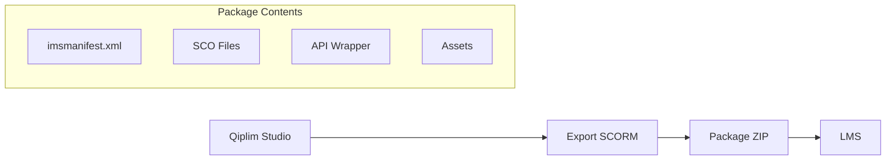

# Packages SCORM

## Vue d'ensemble

Qiplim Studio permet d'exporter des présentations et widgets en packages **SCORM 1.2** et **SCORM 2004** pour déploiement sur des LMS traditionnels.



---

## Types d'Export

### 1. Widget Standalone

Export d'un widget unique comme SCO autonome.

```typescript
interface WidgetSCORMExport {
  type: 'widget';
  widgetId: string;
  version: '1.2' | '2004';
  options: {
    trackCompletion: boolean;
    trackScore: boolean;
    passingScore?: number; // 0-100
    timeLimitAction?: 'exit' | 'continue';
  };
}
```

### 2. Presentation Bundle

Export d'une présentation complète avec navigation.

```typescript
interface PresentationSCORMExport {
  type: 'presentation';
  presentationId: string;
  version: '1.2' | '2004';
  options: {
    sequencing: 'free' | 'linear'; // Navigation libre ou séquentielle
    aggregateScores: boolean;
    trackEachWidget: boolean; // Un objectif par widget
  };
}
```

### 3. Session Replay

Export d'une session enregistrée (lecture seule, pas d'interaction).

```typescript
interface SessionReplaySCORMExport {
  type: 'replay';
  sessionId: string;
  version: '1.2' | '2004';
  options: {
    includeResults: boolean;
    includeParticipantData: boolean; // Anonymisé
  };
}
```

---

## Structure du Package SCORM

### SCORM 1.2

```
package.zip/
├── imsmanifest.xml
├── adl_cp_rootv1p2.xsd
├── ims_xml.xsd
├── imscp_rootv1p1.xsd
├── imsmd_rootv1p2p1.xsd
├── index.html              # Point d'entrée
├── api/
│   └── scorm12-wrapper.js  # API SCORM 1.2
├── assets/
│   ├── styles.css
│   └── images/
└── content/
    ├── widget-1.html
    ├── widget-2.html
    └── data.json
```

### SCORM 2004 (4th Edition)

```
package.zip/
├── imsmanifest.xml
├── adlcp_v1p3.xsd
├── adlnav_v1p3.xsd
├── adlseq_v1p3.xsd
├── imscp_v1p1.xsd
├── imsss_v1p0.xsd
├── index.html
├── api/
│   └── scorm2004-wrapper.js
├── assets/
│   └── ...
├── content/
│   └── ...
└── sequencing/
    └── sequencing.xml      # Règles de séquencement
```

---

## Manifeste SCORM

### SCORM 1.2 Manifest

```xml
<?xml version="1.0" encoding="UTF-8"?>
<manifest identifier="qiplim_quiz_abc123" version="1.0"
  xmlns="http://www.imsproject.org/xsd/imscp_rootv1p1p2"
  xmlns:adlcp="http://www.adlnet.org/xsd/adlcp_rootv1p2"
  xmlns:xsi="http://www.w3.org/2001/XMLSchema-instance"
  xsi:schemaLocation="http://www.imsproject.org/xsd/imscp_rootv1p1p2 imscp_rootv1p1p2.xsd
    http://www.adlnet.org/xsd/adlcp_rootv1p2 adlcp_rootv1p2.xsd">

  <metadata>
    <schema>ADL SCORM</schema>
    <schemaversion>1.2</schemaversion>
  </metadata>

  <organizations default="qiplim_org">
    <organization identifier="qiplim_org">
      <title>Quiz Sécurité au Travail</title>

      <item identifier="item_1" identifierref="resource_quiz">
        <title>Quiz - Règles de Sécurité</title>
        <adlcp:masteryscore>80</adlcp:masteryscore>
      </item>
    </organization>
  </organizations>

  <resources>
    <resource identifier="resource_quiz" type="webcontent"
      adlcp:scormtype="sco" href="index.html">
      <file href="index.html"/>
      <file href="api/scorm12-wrapper.js"/>
      <file href="content/quiz.html"/>
      <file href="content/data.json"/>
      <file href="assets/styles.css"/>
    </resource>
  </resources>
</manifest>
```

### SCORM 2004 Manifest avec Séquencement

```xml
<?xml version="1.0" encoding="UTF-8"?>
<manifest identifier="qiplim_presentation_xyz789"
  xmlns="http://www.imsglobal.org/xsd/imscp_v1p1"
  xmlns:adlcp="http://www.adlnet.org/xsd/adlcp_v1p3"
  xmlns:adlseq="http://www.adlnet.org/xsd/adlseq_v1p3"
  xmlns:adlnav="http://www.adlnet.org/xsd/adlnav_v1p3"
  xmlns:imsss="http://www.imsglobal.org/xsd/imsss">

  <metadata>
    <schema>ADL SCORM</schema>
    <schemaversion>2004 4th Edition</schemaversion>
  </metadata>

  <organizations default="qiplim_org">
    <organization identifier="qiplim_org" structure="hierarchical">
      <title>Formation Complète Sécurité</title>

      <!-- Règles de séquencement globales -->
      <imsss:sequencing>
        <imsss:controlMode choice="true" flow="true"/>
      </imsss:sequencing>

      <item identifier="module_1">
        <title>Module 1 - Introduction</title>

        <item identifier="widget_slide_1" identifierref="res_slide_1">
          <title>Présentation des règles</title>
        </item>

        <item identifier="widget_quiz_1" identifierref="res_quiz_1">
          <title>Quiz de validation</title>
          <imsss:sequencing>
            <imsss:objectives>
              <imsss:primaryObjective objectiveID="quiz1_obj"
                satisfiedByMeasure="true">
                <imsss:minNormalizedMeasure>0.8</imsss:minNormalizedMeasure>
              </imsss:primaryObjective>
            </imsss:objectives>
          </imsss:sequencing>
        </item>

        <!-- Rollup: Module complété si tous les enfants complétés -->
        <imsss:sequencing>
          <imsss:rollupRules>
            <imsss:rollupRule childActivitySet="all">
              <imsss:rollupConditions>
                <imsss:rollupCondition condition="completed"/>
              </imsss:rollupConditions>
              <imsss:rollupAction action="completed"/>
            </imsss:rollupRule>
          </imsss:rollupRules>
        </imsss:sequencing>
      </item>

      <item identifier="module_2">
        <title>Module 2 - Évacuation</title>
        <!-- ... -->
      </item>
    </organization>
  </organizations>

  <resources>
    <resource identifier="res_slide_1" type="webcontent"
      adlcp:scormType="sco" href="content/slide_1.html">
      <file href="content/slide_1.html"/>
      <!-- ... -->
    </resource>

    <resource identifier="res_quiz_1" type="webcontent"
      adlcp:scormType="sco" href="content/quiz_1.html">
      <file href="content/quiz_1.html"/>
      <!-- ... -->
    </resource>
  </resources>
</manifest>
```

---

## API Wrapper SCORM

### SCORM 1.2 Wrapper

```typescript
// api/scorm12-wrapper.ts

declare global {
  interface Window {
    API: SCORM12API | null;
  }
}

interface SCORM12API {
  LMSInitialize(param: string): string;
  LMSFinish(param: string): string;
  LMSGetValue(element: string): string;
  LMSSetValue(element: string, value: string): string;
  LMSCommit(param: string): string;
  LMSGetLastError(): string;
  LMSGetErrorString(errorCode: string): string;
  LMSGetDiagnostic(errorCode: string): string;
}

class SCORM12Wrapper {
  private api: SCORM12API | null = null;
  private initialized = false;

  constructor() {
    this.api = this.findAPI(window);
  }

  private findAPI(win: Window): SCORM12API | null {
    let attempts = 0;
    let currentWindow: Window | null = win;

    while (currentWindow && attempts < 500) {
      if (currentWindow.API) {
        return currentWindow.API;
      }

      if (currentWindow.opener) {
        currentWindow = currentWindow.opener as Window;
      } else if (currentWindow.parent !== currentWindow) {
        currentWindow = currentWindow.parent;
      } else {
        currentWindow = null;
      }

      attempts++;
    }

    return null;
  }

  initialize(): boolean {
    if (!this.api) {
      console.warn('SCORM API not found');
      return false;
    }

    const result = this.api.LMSInitialize('');
    this.initialized = result === 'true';

    if (this.initialized) {
      // Définir le statut initial
      this.setValue('cmi.core.lesson_status', 'incomplete');
    }

    return this.initialized;
  }

  finish(): boolean {
    if (!this.api || !this.initialized) return false;

    const result = this.api.LMSFinish('');
    this.initialized = false;
    return result === 'true';
  }

  getValue(element: string): string {
    if (!this.api || !this.initialized) return '';
    return this.api.LMSGetValue(element);
  }

  setValue(element: string, value: string): boolean {
    if (!this.api || !this.initialized) return false;
    return this.api.LMSSetValue(element, value) === 'true';
  }

  commit(): boolean {
    if (!this.api || !this.initialized) return false;
    return this.api.LMSCommit('') === 'true';
  }

  // === Méthodes de haut niveau ===

  setScore(score: number, max: number = 100, min: number = 0): void {
    this.setValue('cmi.core.score.raw', score.toString());
    this.setValue('cmi.core.score.max', max.toString());
    this.setValue('cmi.core.score.min', min.toString());
  }

  setStatus(status: 'passed' | 'failed' | 'completed' | 'incomplete'): void {
    this.setValue('cmi.core.lesson_status', status);
  }

  setLocation(location: string): void {
    this.setValue('cmi.core.lesson_location', location);
  }

  getLocation(): string {
    return this.getValue('cmi.core.lesson_location');
  }

  setSuspendData(data: object): void {
    this.setValue('cmi.suspend_data', JSON.stringify(data));
  }

  getSuspendData<T>(): T | null {
    const data = this.getValue('cmi.suspend_data');
    if (!data) return null;
    try {
      return JSON.parse(data) as T;
    } catch {
      return null;
    }
  }

  setSessionTime(seconds: number): void {
    const hours = Math.floor(seconds / 3600);
    const minutes = Math.floor((seconds % 3600) / 60);
    const secs = seconds % 60;
    const time = `${hours.toString().padStart(4, '0')}:${minutes.toString().padStart(2, '0')}:${secs.toString().padStart(2, '0')}`;
    this.setValue('cmi.core.session_time', time);
  }

  complete(score?: number, passingScore: number = 80): void {
    if (score !== undefined) {
      this.setScore(score);
      this.setStatus(score >= passingScore ? 'passed' : 'failed');
    } else {
      this.setStatus('completed');
    }
    this.commit();
    this.finish();
  }
}

export const scorm = new SCORM12Wrapper();
```

### SCORM 2004 Wrapper

```typescript
// api/scorm2004-wrapper.ts

interface SCORM2004API {
  Initialize(param: string): string;
  Terminate(param: string): string;
  GetValue(element: string): string;
  SetValue(element: string, value: string): string;
  Commit(param: string): string;
  GetLastError(): string;
  GetErrorString(errorCode: string): string;
  GetDiagnostic(errorCode: string): string;
}

class SCORM2004Wrapper {
  private api: SCORM2004API | null = null;
  private initialized = false;

  constructor() {
    this.api = this.findAPI(window);
  }

  private findAPI(win: Window): SCORM2004API | null {
    let attempts = 0;
    let currentWindow: Window | null = win;

    while (currentWindow && attempts < 500) {
      if ((currentWindow as any).API_1484_11) {
        return (currentWindow as any).API_1484_11;
      }

      if (currentWindow.opener) {
        currentWindow = currentWindow.opener as Window;
      } else if (currentWindow.parent !== currentWindow) {
        currentWindow = currentWindow.parent;
      } else {
        currentWindow = null;
      }

      attempts++;
    }

    return null;
  }

  initialize(): boolean {
    if (!this.api) {
      console.warn('SCORM 2004 API not found');
      return false;
    }

    const result = this.api.Initialize('');
    this.initialized = result === 'true';

    if (this.initialized) {
      this.setValue('cmi.completion_status', 'incomplete');
      this.setValue('cmi.success_status', 'unknown');
    }

    return this.initialized;
  }

  terminate(): boolean {
    if (!this.api || !this.initialized) return false;

    const result = this.api.Terminate('');
    this.initialized = false;
    return result === 'true';
  }

  getValue(element: string): string {
    if (!this.api || !this.initialized) return '';
    return this.api.GetValue(element);
  }

  setValue(element: string, value: string): boolean {
    if (!this.api || !this.initialized) return false;
    return this.api.SetValue(element, value) === 'true';
  }

  commit(): boolean {
    if (!this.api || !this.initialized) return false;
    return this.api.Commit('') === 'true';
  }

  // === Méthodes de haut niveau ===

  setScore(scaled: number, raw?: number, max?: number, min?: number): void {
    this.setValue('cmi.score.scaled', scaled.toString());
    if (raw !== undefined) this.setValue('cmi.score.raw', raw.toString());
    if (max !== undefined) this.setValue('cmi.score.max', max.toString());
    if (min !== undefined) this.setValue('cmi.score.min', min.toString());
  }

  setCompletionStatus(status: 'completed' | 'incomplete' | 'not attempted' | 'unknown'): void {
    this.setValue('cmi.completion_status', status);
  }

  setSuccessStatus(status: 'passed' | 'failed' | 'unknown'): void {
    this.setValue('cmi.success_status', status);
  }

  setLocation(location: string): void {
    this.setValue('cmi.location', location);
  }

  getLocation(): string {
    return this.getValue('cmi.location');
  }

  setSuspendData(data: object): void {
    this.setValue('cmi.suspend_data', JSON.stringify(data));
  }

  getSuspendData<T>(): T | null {
    const data = this.getValue('cmi.suspend_data');
    if (!data) return null;
    try {
      return JSON.parse(data) as T;
    } catch {
      return null;
    }
  }

  setSessionTime(seconds: number): void {
    // Format ISO 8601 duration: PT1H30M45S
    const hours = Math.floor(seconds / 3600);
    const minutes = Math.floor((seconds % 3600) / 60);
    const secs = seconds % 60;

    let duration = 'PT';
    if (hours > 0) duration += `${hours}H`;
    if (minutes > 0) duration += `${minutes}M`;
    if (secs > 0 || duration === 'PT') duration += `${secs}S`;

    this.setValue('cmi.session_time', duration);
  }

  // Objectifs
  setObjectiveScore(index: number, id: string, scaled: number, status: string): void {
    this.setValue(`cmi.objectives.${index}.id`, id);
    this.setValue(`cmi.objectives.${index}.score.scaled`, scaled.toString());
    this.setValue(`cmi.objectives.${index}.success_status`, status);
    this.setValue(`cmi.objectives.${index}.completion_status`, 'completed');
  }

  // Interactions (pour le tracking détaillé)
  recordInteraction(
    index: number,
    id: string,
    type: string,
    response: string,
    correct: boolean,
    latency: number
  ): void {
    this.setValue(`cmi.interactions.${index}.id`, id);
    this.setValue(`cmi.interactions.${index}.type`, type);
    this.setValue(`cmi.interactions.${index}.learner_response`, response);
    this.setValue(`cmi.interactions.${index}.result`, correct ? 'correct' : 'incorrect');
    this.setValue(`cmi.interactions.${index}.latency`, `PT${latency}S`);
    this.setValue(`cmi.interactions.${index}.timestamp`, new Date().toISOString());
  }

  complete(score?: number, passingScore: number = 0.8): void {
    this.setCompletionStatus('completed');

    if (score !== undefined) {
      this.setScore(score);
      this.setSuccessStatus(score >= passingScore ? 'passed' : 'failed');
    }

    this.commit();
    this.terminate();
  }
}

export const scorm = new SCORM2004Wrapper();
```

---

## Générateur de Package

### Service de Génération

```typescript
// lib/scorm/generator.ts
import JSZip from 'jszip';
import { db } from '@qiplim/db';
import { generateManifest12, generateManifest2004 } from './manifests';
import { generateWidgetHTML } from './html-generator';
import { SCORM12_WRAPPER, SCORM2004_WRAPPER } from './wrappers';
import { SCORM_SCHEMAS } from './schemas';

interface SCORMGeneratorOptions {
  version: '1.2' | '2004';
  presentationId: string;
  options: {
    sequencing?: 'free' | 'linear';
    passingScore?: number;
    trackEachWidget?: boolean;
  };
}

export async function generateSCORMPackage(
  options: SCORMGeneratorOptions
): Promise<Buffer> {
  const zip = new JSZip();

  // Récupérer la présentation
  const presentation = await db.presentation.findUnique({
    where: { id: options.presentationId },
    include: {
      widgets: {
        include: { widget: { include: { template: true } } },
        orderBy: { order: 'asc' },
      },
      studio: true,
    },
  });

  if (!presentation) {
    throw new Error('Presentation not found');
  }

  // Générer le manifeste
  const manifest = options.version === '1.2'
    ? generateManifest12(presentation, options.options)
    : generateManifest2004(presentation, options.options);

  zip.file('imsmanifest.xml', manifest);

  // Ajouter les schémas XSD
  const schemas = SCORM_SCHEMAS[options.version];
  for (const [filename, content] of Object.entries(schemas)) {
    zip.file(filename, content);
  }

  // Ajouter le wrapper API
  const wrapper = options.version === '1.2' ? SCORM12_WRAPPER : SCORM2004_WRAPPER;
  zip.folder('api')!.file(`scorm${options.version.replace('.', '')}-wrapper.js`, wrapper);

  // Générer le contenu HTML pour chaque widget
  const contentFolder = zip.folder('content')!;
  const assetsFolder = zip.folder('assets')!;

  for (const pw of presentation.widgets) {
    const html = await generateWidgetHTML(pw.widget, options.version);
    contentFolder.file(`widget_${pw.widget.id}.html`, html);
  }

  // Ajouter les assets communs
  assetsFolder.file('styles.css', generateStyles());
  assetsFolder.file('qiplim-runtime.js', generateRuntime(options.version));

  // Page d'index (point d'entrée)
  zip.file('index.html', generateIndexHTML(presentation, options.version));

  // Données JSON
  contentFolder.file('data.json', JSON.stringify({
    presentationId: presentation.id,
    title: presentation.title,
    widgets: presentation.widgets.map((pw) => ({
      id: pw.widget.id,
      type: pw.widget.template.category,
      title: pw.widget.title,
      config: pw.widget.config,
    })),
  }));

  // Générer le ZIP
  const buffer = await zip.generateAsync({
    type: 'nodebuffer',
    compression: 'DEFLATE',
    compressionOptions: { level: 9 },
  });

  return buffer;
}

function generateIndexHTML(presentation: any, version: string): string {
  return `
<!DOCTYPE html>
<html lang="fr">
<head>
  <meta charset="UTF-8">
  <meta name="viewport" content="width=device-width, initial-scale=1.0">
  <title>${presentation.title}</title>
  <link rel="stylesheet" href="assets/styles.css">
</head>
<body>
  <div id="qiplim-root"></div>
  <script src="api/scorm${version.replace('.', '')}-wrapper.js"></script>
  <script src="assets/qiplim-runtime.js"></script>
  <script>
    // Initialisation
    window.addEventListener('DOMContentLoaded', function() {
      window.QiplimRuntime.init({
        containerId: 'qiplim-root',
        dataUrl: 'content/data.json',
        scormVersion: '${version}'
      });
    });
  </script>
</body>
</html>
  `.trim();
}

function generateStyles(): string {
  return `
/* Qiplim SCORM Package Styles */
* {
  box-sizing: border-box;
  margin: 0;
  padding: 0;
}

body {
  font-family: -apple-system, BlinkMacSystemFont, 'Segoe UI', Roboto, Oxygen, Ubuntu, sans-serif;
  line-height: 1.5;
  color: #1a1a1a;
  background: #f5f5f5;
}

#qiplim-root {
  max-width: 800px;
  margin: 0 auto;
  padding: 20px;
}

.widget-card {
  background: white;
  border-radius: 12px;
  padding: 24px;
  margin-bottom: 20px;
  box-shadow: 0 2px 8px rgba(0,0,0,0.08);
}

.widget-title {
  font-size: 1.5rem;
  font-weight: 600;
  margin-bottom: 16px;
}

.option-grid {
  display: grid;
  grid-template-columns: repeat(2, 1fr);
  gap: 12px;
}

.option-card {
  padding: 16px;
  border: 2px solid #e0e0e0;
  border-radius: 8px;
  cursor: pointer;
  transition: all 0.2s;
}

.option-card:hover {
  border-color: #3b82f6;
  background: #eff6ff;
}

.option-card.selected {
  border-color: #3b82f6;
  background: #3b82f6;
  color: white;
}

.option-card.correct {
  border-color: #22c55e;
  background: #dcfce7;
}

.option-card.incorrect {
  border-color: #ef4444;
  background: #fee2e2;
}

.btn {
  padding: 12px 24px;
  border: none;
  border-radius: 8px;
  font-size: 1rem;
  font-weight: 500;
  cursor: pointer;
  transition: all 0.2s;
}

.btn-primary {
  background: #3b82f6;
  color: white;
}

.btn-primary:hover {
  background: #2563eb;
}

.btn-primary:disabled {
  background: #93c5fd;
  cursor: not-allowed;
}

.progress-bar {
  height: 8px;
  background: #e0e0e0;
  border-radius: 4px;
  overflow: hidden;
}

.progress-bar-fill {
  height: 100%;
  background: #3b82f6;
  transition: width 0.3s;
}

.timer {
  font-size: 1.25rem;
  font-weight: 600;
  color: #3b82f6;
}

.timer.warning {
  color: #f59e0b;
}

.timer.danger {
  color: #ef4444;
}
  `.trim();
}

function generateRuntime(version: string): string {
  // Runtime JavaScript minifié pour exécuter les widgets
  return `
(function(window) {
  'use strict';

  var QiplimRuntime = {
    scorm: null,
    data: null,
    currentWidget: 0,
    responses: {},
    startTime: Date.now(),

    init: function(options) {
      this.container = document.getElementById(options.containerId);
      this.scormVersion = options.scormVersion;

      // Initialiser SCORM
      this.scorm = window.scorm;
      this.scorm.initialize();

      // Restaurer la progression
      var savedData = this.scorm.getSuspendData();
      if (savedData) {
        this.currentWidget = savedData.currentWidget || 0;
        this.responses = savedData.responses || {};
      }

      // Charger les données
      this.loadData(options.dataUrl);
    },

    loadData: function(url) {
      var self = this;
      fetch(url)
        .then(function(r) { return r.json(); })
        .then(function(data) {
          self.data = data;
          self.render();
        });
    },

    render: function() {
      var widget = this.data.widgets[this.currentWidget];
      if (!widget) {
        this.complete();
        return;
      }

      this.renderWidget(widget);
    },

    renderWidget: function(widget) {
      // Rendu basé sur le type de widget
      var html = '';

      switch(widget.type) {
        case 'QUIZ':
          html = this.renderQuiz(widget);
          break;
        case 'POLL':
          html = this.renderPoll(widget);
          break;
        default:
          html = this.renderGeneric(widget);
      }

      this.container.innerHTML = html;
      this.attachEventListeners(widget);
    },

    renderQuiz: function(widget) {
      var config = widget.config;
      var question = config.questions[0];

      return '<div class="widget-card">' +
        '<h2 class="widget-title">' + question.text + '</h2>' +
        '<div class="option-grid">' +
          question.options.map(function(opt) {
            return '<div class="option-card" data-id="' + opt.id + '">' +
              opt.text + '</div>';
          }).join('') +
        '</div>' +
        '<div style="margin-top: 20px;">' +
          '<button class="btn btn-primary" id="submit-btn" disabled>Valider</button>' +
        '</div>' +
      '</div>';
    },

    renderPoll: function(widget) {
      // Similar to quiz but without correct answer
      return this.renderQuiz(widget);
    },

    renderGeneric: function(widget) {
      return '<div class="widget-card">' +
        '<h2 class="widget-title">' + widget.title + '</h2>' +
        '<p>Contenu du widget</p>' +
        '<button class="btn btn-primary" id="next-btn">Suivant</button>' +
      '</div>';
    },

    attachEventListeners: function(widget) {
      var self = this;

      // Option cards
      var cards = this.container.querySelectorAll('.option-card');
      cards.forEach(function(card) {
        card.addEventListener('click', function() {
          cards.forEach(function(c) { c.classList.remove('selected'); });
          card.classList.add('selected');
          document.getElementById('submit-btn').disabled = false;
        });
      });

      // Submit button
      var submitBtn = document.getElementById('submit-btn');
      if (submitBtn) {
        submitBtn.addEventListener('click', function() {
          var selected = self.container.querySelector('.option-card.selected');
          if (selected) {
            self.submitResponse(widget, selected.dataset.id);
          }
        });
      }

      // Next button
      var nextBtn = document.getElementById('next-btn');
      if (nextBtn) {
        nextBtn.addEventListener('click', function() {
          self.nextWidget();
        });
      }
    },

    submitResponse: function(widget, optionId) {
      var config = widget.config;
      var question = config.questions[0];
      var correct = question.options.find(function(o) { return o.isCorrect; });
      var isCorrect = optionId === correct.id;

      // Store response
      this.responses[widget.id] = {
        optionId: optionId,
        correct: isCorrect,
        timestamp: new Date().toISOString()
      };

      // Show result
      var cards = this.container.querySelectorAll('.option-card');
      cards.forEach(function(card) {
        card.classList.add(card.dataset.id === correct.id ? 'correct' : 'incorrect');
      });

      // Track interaction
      var interactionIndex = Object.keys(this.responses).length - 1;
      this.scorm.recordInteraction(
        interactionIndex,
        widget.id,
        'choice',
        optionId,
        isCorrect,
        Math.floor((Date.now() - this.startTime) / 1000)
      );

      // Save progress
      this.saveProgress();

      // Next after delay
      var self = this;
      setTimeout(function() { self.nextWidget(); }, 1500);
    },

    nextWidget: function() {
      this.currentWidget++;
      this.saveProgress();
      this.render();
    },

    saveProgress: function() {
      this.scorm.setLocation(this.currentWidget.toString());
      this.scorm.setSuspendData({
        currentWidget: this.currentWidget,
        responses: this.responses
      });
      this.scorm.commit();
    },

    complete: function() {
      // Calculate score
      var total = this.data.widgets.filter(function(w) {
        return w.type === 'QUIZ';
      }).length;

      var correct = Object.values(this.responses).filter(function(r) {
        return r.correct;
      }).length;

      var score = total > 0 ? correct / total : 1;
      var elapsed = Math.floor((Date.now() - this.startTime) / 1000);

      this.scorm.setSessionTime(elapsed);
      this.scorm.complete(score);

      // Show completion message
      this.container.innerHTML = '<div class="widget-card">' +
        '<h2 class="widget-title">Félicitations !</h2>' +
        '<p>Vous avez terminé cette formation.</p>' +
        '<p>Score: ' + Math.round(score * 100) + '%</p>' +
      '</div>';
    }
  };

  window.QiplimRuntime = QiplimRuntime;
})(window);
  `.trim();
}
```

---

## API d'Export

```typescript
// app/api/presentations/[id]/export/scorm/route.ts
import { NextRequest, NextResponse } from 'next/server';
import { auth } from '@/lib/auth';
import { db } from '@qiplim/db';
import { generateSCORMPackage } from '@/lib/scorm/generator';
import { z } from 'zod';

const exportSchema = z.object({
  version: z.enum(['1.2', '2004']),
  options: z.object({
    sequencing: z.enum(['free', 'linear']).optional(),
    passingScore: z.number().min(0).max(100).optional(),
    trackEachWidget: z.boolean().optional(),
  }).optional(),
});

export async function POST(
  req: NextRequest,
  { params }: { params: { id: string } }
) {
  const session = await auth.api.getSession({ headers: req.headers });

  if (!session?.user) {
    return NextResponse.json({ error: 'Unauthorized' }, { status: 401 });
  }

  const body = await req.json();
  const { version, options } = exportSchema.parse(body);

  // Vérifier les droits
  const presentation = await db.presentation.findFirst({
    where: {
      id: params.id,
      studio: { userId: session.user.id },
    },
  });

  if (!presentation) {
    return NextResponse.json({ error: 'Presentation not found' }, { status: 404 });
  }

  // Générer le package
  const buffer = await generateSCORMPackage({
    version,
    presentationId: params.id,
    options: options || {},
  });

  // Retourner le ZIP
  const filename = `${presentation.title.replace(/[^a-z0-9]/gi, '_')}_scorm${version}.zip`;

  return new NextResponse(buffer, {
    headers: {
      'Content-Type': 'application/zip',
      'Content-Disposition': `attachment; filename="${filename}"`,
    },
  });
}
```

---

## Compatibilité LMS

### LMS Testés

| LMS | SCORM 1.2 | SCORM 2004 | Notes |
|-----|-----------|------------|-------|
| Moodle | ✅ | ✅ | Testé v4.x |
| Blackboard | ✅ | ✅ | Testé Learn |
| Canvas | ✅ | ✅ | - |
| Cornerstone | ✅ | ✅ | - |
| SAP SuccessFactors | ✅ | ⚠️ | Séquencement limité |
| Docebo | ✅ | ✅ | - |
| TalentLMS | ✅ | ✅ | - |
| 360Learning | ✅ | ✅ | - |
| Rise Up | ✅ | ✅ | - |

### Recommandations

- **Formation simple** : SCORM 1.2 (meilleure compatibilité)
- **Parcours complexe** : SCORM 2004 (séquencement avancé)
- **Tracking détaillé** : SCORM 2004 (interactions, objectifs)
