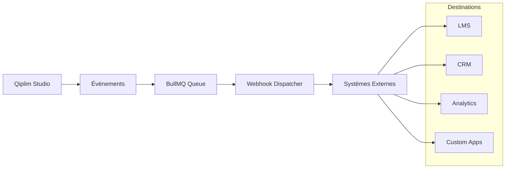

# Système de Webhooks

## Vue d'ensemble

Qiplim Studio expose un système de webhooks pour notifier des systèmes externes des événements importants (sessions, résultats, etc.).



---

## Configuration

### Modèle de Données

```prisma
// schema.prisma

model Webhook {
  id          String         @id @default(cuid())
  studioId    String
  studio      Studio         @relation(fields: [studioId], references: [id], onDelete: Cascade)

  name        String         // Nom descriptif
  url         String         // URL de destination
  secret      String         // Secret pour signature HMAC

  events      String[]       // Types d'événements souscrits
  active      Boolean        @default(true)

  headers     Json?          // Headers personnalisés
  retryPolicy Json?          // Politique de retry

  createdAt   DateTime       @default(now())
  updatedAt   DateTime       @updatedAt

  deliveries  WebhookDelivery[]

  @@index([studioId])
}

model WebhookDelivery {
  id          String   @id @default(cuid())
  webhookId   String
  webhook     Webhook  @relation(fields: [webhookId], references: [id], onDelete: Cascade)

  eventType   String
  payload     Json

  status      WebhookDeliveryStatus @default(PENDING)
  statusCode  Int?
  response    String?
  error       String?

  attempts    Int      @default(0)
  nextRetryAt DateTime?

  createdAt   DateTime @default(now())
  deliveredAt DateTime?

  @@index([webhookId])
  @@index([status, nextRetryAt])
}

enum WebhookDeliveryStatus {
  PENDING
  DELIVERED
  FAILED
  RETRYING
}
```

---

## Types d'Événements

### Session Events

| Event | Description | Payload |
|-------|-------------|---------|
| `session.created` | Nouvelle session créée | Session info |
| `session.started` | Session démarrée | Session info, speaker |
| `session.ended` | Session terminée | Session info, stats |
| `session.cancelled` | Session annulée | Session info, reason |

### Participant Events

| Event | Description | Payload |
|-------|-------------|---------|
| `participant.joined` | Participant a rejoint | Participant info |
| `participant.left` | Participant a quitté | Participant info, duration |
| `participant.completed` | Participant a terminé | Participant info, score |

### Activity Events

| Event | Description | Payload |
|-------|-------------|---------|
| `activity.started` | Activité démarrée | Widget info |
| `activity.completed` | Activité terminée | Widget info, results |
| `response.submitted` | Réponse soumise | Response data |

### Widget Events

| Event | Description | Payload |
|-------|-------------|---------|
| `widget.created` | Widget généré | Widget info |
| `widget.updated` | Widget modifié | Widget info, changes |
| `widget.deleted` | Widget supprimé | Widget id |

### Studio Events

| Event | Description | Payload |
|-------|-------------|---------|
| `source.processed` | Source traitée | Source info, analysis |
| `presentation.published` | Présentation publiée | Presentation info |

---

## Format des Payloads

### Structure Standard

```typescript
interface WebhookPayload {
  id: string;           // ID unique de la delivery
  type: string;         // Type d'événement
  timestamp: string;    // ISO 8601
  version: string;      // Version de l'API (v1)
  data: {
    // Données spécifiques à l'événement
    [key: string]: unknown;
  };
  metadata: {
    studioId: string;
    webhookId: string;
    attempt: number;
  };
}
```

### Exemples de Payloads

#### `session.started`

```json
{
  "id": "whd_abc123def456",
  "type": "session.started",
  "timestamp": "2024-03-15T10:00:00.000Z",
  "version": "v1",
  "data": {
    "session": {
      "id": "sess_xyz789",
      "accessCode": "ABC123",
      "presentationId": "pres_qrs456",
      "presentationTitle": "Formation Sécurité 2024",
      "state": "ACTIVE",
      "startedAt": "2024-03-15T10:00:00.000Z"
    },
    "speaker": {
      "id": "user_lmn012",
      "name": "Jean Formateur",
      "email": "jean@company.com"
    },
    "settings": {
      "maxParticipants": 100,
      "requireEmail": false
    }
  },
  "metadata": {
    "studioId": "studio_def789",
    "webhookId": "wh_ghi012",
    "attempt": 1
  }
}
```

#### `participant.completed`

```json
{
  "id": "whd_jkl345mno678",
  "type": "participant.completed",
  "timestamp": "2024-03-15T11:30:00.000Z",
  "version": "v1",
  "data": {
    "participant": {
      "id": "part_pqr901",
      "displayName": "Marie Dupont",
      "email": "marie@example.com",
      "joinedAt": "2024-03-15T10:05:00.000Z",
      "completedAt": "2024-03-15T11:30:00.000Z",
      "duration": 5100
    },
    "session": {
      "id": "sess_xyz789",
      "accessCode": "ABC123",
      "presentationTitle": "Formation Sécurité 2024"
    },
    "results": {
      "totalScore": 85,
      "maxScore": 100,
      "scorePercentage": 85,
      "passed": true,
      "activitiesCompleted": 5,
      "totalActivities": 5,
      "breakdown": [
        {
          "widgetId": "widget_aaa",
          "type": "QUIZ",
          "title": "Quiz 1",
          "score": 30,
          "maxScore": 30
        },
        {
          "widgetId": "widget_bbb",
          "type": "QUIZ",
          "title": "Quiz 2",
          "score": 25,
          "maxScore": 30
        }
      ]
    }
  },
  "metadata": {
    "studioId": "studio_def789",
    "webhookId": "wh_ghi012",
    "attempt": 1
  }
}
```

#### `session.ended`

```json
{
  "id": "whd_stu234vwx567",
  "type": "session.ended",
  "timestamp": "2024-03-15T12:00:00.000Z",
  "version": "v1",
  "data": {
    "session": {
      "id": "sess_xyz789",
      "accessCode": "ABC123",
      "presentationTitle": "Formation Sécurité 2024",
      "startedAt": "2024-03-15T10:00:00.000Z",
      "endedAt": "2024-03-15T12:00:00.000Z",
      "duration": 7200
    },
    "statistics": {
      "totalParticipants": 45,
      "activeParticipants": 42,
      "completedParticipants": 40,
      "averageScore": 82.5,
      "passRate": 0.875,
      "averageTimeSpent": 5400,
      "responseRate": 0.95
    },
    "activities": [
      {
        "widgetId": "widget_aaa",
        "type": "QUIZ",
        "title": "Quiz 1",
        "totalResponses": 42,
        "averageScore": 85,
        "correctRate": 0.78
      },
      {
        "widgetId": "widget_bbb",
        "type": "POLL",
        "title": "Satisfaction",
        "totalResponses": 40,
        "results": {
          "1": 2,
          "2": 3,
          "3": 5,
          "4": 15,
          "5": 15
        }
      }
    ]
  },
  "metadata": {
    "studioId": "studio_def789",
    "webhookId": "wh_ghi012",
    "attempt": 1
  }
}
```

---

## Sécurité

### Signature HMAC

Chaque requête webhook est signée avec HMAC-SHA256 pour vérification.

```typescript
// Headers envoyés
{
  "Content-Type": "application/json",
  "X-Qiplim-Signature": "sha256=abc123...",
  "X-Qiplim-Timestamp": "1710500400",
  "X-Qiplim-Delivery-ID": "whd_abc123def456"
}
```

### Vérification de la Signature

```typescript
// Exemple de vérification côté serveur
import crypto from 'crypto';

function verifyWebhookSignature(
  payload: string,
  signature: string,
  timestamp: string,
  secret: string
): boolean {
  // Vérifier que le timestamp n'est pas trop ancien (5 minutes)
  const timestampNum = parseInt(timestamp, 10);
  const now = Math.floor(Date.now() / 1000);

  if (Math.abs(now - timestampNum) > 300) {
    return false; // Replay attack protection
  }

  // Calculer la signature attendue
  const signedPayload = `${timestamp}.${payload}`;
  const expectedSignature = crypto
    .createHmac('sha256', secret)
    .update(signedPayload)
    .digest('hex');

  // Comparaison sécurisée (timing-safe)
  const expectedBuffer = Buffer.from(`sha256=${expectedSignature}`);
  const receivedBuffer = Buffer.from(signature);

  return crypto.timingSafeEqual(expectedBuffer, receivedBuffer);
}

// Utilisation dans un handler Express/Next.js
app.post('/webhooks/qiplim', express.raw({ type: 'application/json' }), (req, res) => {
  const payload = req.body.toString();
  const signature = req.headers['x-qiplim-signature'] as string;
  const timestamp = req.headers['x-qiplim-timestamp'] as string;

  if (!verifyWebhookSignature(payload, signature, timestamp, process.env.QIPLIM_WEBHOOK_SECRET!)) {
    return res.status(401).json({ error: 'Invalid signature' });
  }

  const event = JSON.parse(payload);
  // Traiter l'événement...

  res.status(200).json({ received: true });
});
```

---

## Implémentation

### Service de Dispatch

```typescript
// lib/webhooks/dispatcher.ts
import crypto from 'crypto';
import { db } from '@qiplim/db';
import { webhookQueue } from '../queue/queues';

interface DispatchOptions {
  studioId: string;
  eventType: string;
  data: Record<string, unknown>;
}

export async function dispatchWebhooks(options: DispatchOptions): Promise<void> {
  const { studioId, eventType, data } = options;

  // Trouver les webhooks actifs souscrits à cet événement
  const webhooks = await db.webhook.findMany({
    where: {
      studioId,
      active: true,
      events: { has: eventType },
    },
  });

  if (webhooks.length === 0) return;

  // Créer les deliveries et les jobs
  for (const webhook of webhooks) {
    const delivery = await db.webhookDelivery.create({
      data: {
        webhookId: webhook.id,
        eventType,
        payload: data,
        status: 'PENDING',
      },
    });

    await webhookQueue.add(
      'deliver',
      {
        deliveryId: delivery.id,
        webhookId: webhook.id,
      },
      {
        attempts: 5,
        backoff: {
          type: 'exponential',
          delay: 1000,
        },
      }
    );
  }
}
```

### Worker de Livraison

```typescript
// workers/webhook-worker.ts
import { Worker, Job } from 'bullmq';
import crypto from 'crypto';
import { redis } from '../lib/redis';
import { db } from '@qiplim/db';

interface WebhookJobData {
  deliveryId: string;
  webhookId: string;
}

const worker = new Worker<WebhookJobData>(
  'webhooks',
  async (job: Job<WebhookJobData>) => {
    const { deliveryId, webhookId } = job.data;

    // Récupérer le webhook et la delivery
    const [webhook, delivery] = await Promise.all([
      db.webhook.findUnique({ where: { id: webhookId } }),
      db.webhookDelivery.findUnique({ where: { id: deliveryId } }),
    ]);

    if (!webhook || !delivery) {
      throw new Error('Webhook or delivery not found');
    }

    // Construire le payload
    const payload: WebhookPayload = {
      id: delivery.id,
      type: delivery.eventType,
      timestamp: new Date().toISOString(),
      version: 'v1',
      data: delivery.payload as Record<string, unknown>,
      metadata: {
        studioId: webhook.studioId,
        webhookId: webhook.id,
        attempt: job.attemptsMade + 1,
      },
    };

    const payloadString = JSON.stringify(payload);
    const timestamp = Math.floor(Date.now() / 1000).toString();

    // Calculer la signature
    const signedPayload = `${timestamp}.${payloadString}`;
    const signature = crypto
      .createHmac('sha256', webhook.secret)
      .update(signedPayload)
      .digest('hex');

    // Préparer les headers
    const headers: Record<string, string> = {
      'Content-Type': 'application/json',
      'X-Qiplim-Signature': `sha256=${signature}`,
      'X-Qiplim-Timestamp': timestamp,
      'X-Qiplim-Delivery-ID': delivery.id,
      'User-Agent': 'Qiplim-Webhook/1.0',
      ...(webhook.headers as Record<string, string> || {}),
    };

    // Mettre à jour le statut
    await db.webhookDelivery.update({
      where: { id: deliveryId },
      data: {
        status: 'RETRYING',
        attempts: job.attemptsMade + 1,
      },
    });

    // Envoyer la requête
    const controller = new AbortController();
    const timeout = setTimeout(() => controller.abort(), 30000); // 30s timeout

    try {
      const response = await fetch(webhook.url, {
        method: 'POST',
        headers,
        body: payloadString,
        signal: controller.signal,
      });

      clearTimeout(timeout);

      const responseText = await response.text();

      if (!response.ok) {
        // Mettre à jour avec l'erreur
        await db.webhookDelivery.update({
          where: { id: deliveryId },
          data: {
            status: 'FAILED',
            statusCode: response.status,
            response: responseText.substring(0, 1000),
            error: `HTTP ${response.status}`,
          },
        });

        throw new Error(`Webhook failed with status ${response.status}`);
      }

      // Succès
      await db.webhookDelivery.update({
        where: { id: deliveryId },
        data: {
          status: 'DELIVERED',
          statusCode: response.status,
          response: responseText.substring(0, 1000),
          deliveredAt: new Date(),
        },
      });

      return { success: true, statusCode: response.status };

    } catch (error) {
      clearTimeout(timeout);

      const errorMessage = error instanceof Error ? error.message : 'Unknown error';

      await db.webhookDelivery.update({
        where: { id: deliveryId },
        data: {
          status: job.attemptsMade + 1 >= 5 ? 'FAILED' : 'RETRYING',
          error: errorMessage,
          nextRetryAt: job.attemptsMade + 1 < 5
            ? new Date(Date.now() + Math.pow(2, job.attemptsMade + 1) * 1000)
            : null,
        },
      });

      throw error;
    }
  },
  {
    connection: redis,
    concurrency: 10,
  }
);

worker.on('failed', (job, err) => {
  console.error(`Webhook delivery ${job?.data.deliveryId} failed:`, err.message);
});

export { worker as webhookWorker };
```

### Intégration avec les Événements

```typescript
// lib/events/session-events.ts
import { dispatchWebhooks } from '../webhooks/dispatcher';

export async function onSessionStarted(session: LiveSession, speaker: User) {
  // ... logique interne ...

  // Dispatcher les webhooks
  await dispatchWebhooks({
    studioId: session.presentation.studioId,
    eventType: 'session.started',
    data: {
      session: {
        id: session.id,
        accessCode: session.accessCode,
        presentationId: session.presentationId,
        presentationTitle: session.presentation.title,
        state: session.state,
        startedAt: session.startedAt,
      },
      speaker: {
        id: speaker.id,
        name: speaker.name,
        email: speaker.email,
      },
    },
  });
}

export async function onParticipantCompleted(
  participant: Participant,
  session: LiveSession,
  results: ParticipantResults
) {
  await dispatchWebhooks({
    studioId: session.presentation.studioId,
    eventType: 'participant.completed',
    data: {
      participant: {
        id: participant.id,
        displayName: participant.displayName,
        email: participant.email,
        joinedAt: participant.joinedAt,
        completedAt: new Date(),
        duration: Math.floor(
          (Date.now() - participant.joinedAt.getTime()) / 1000
        ),
      },
      session: {
        id: session.id,
        accessCode: session.accessCode,
        presentationTitle: session.presentation.title,
      },
      results,
    },
  });
}
```

---

## API de Gestion

### CRUD Webhooks

```typescript
// app/api/studios/[studioId]/webhooks/route.ts
import { NextRequest, NextResponse } from 'next/server';
import { auth } from '@/lib/auth';
import { db } from '@qiplim/db';
import { z } from 'zod';
import { nanoid } from 'nanoid';

const createWebhookSchema = z.object({
  name: z.string().min(1).max(100),
  url: z.string().url(),
  events: z.array(z.string()).min(1),
  headers: z.record(z.string()).optional(),
});

export async function GET(
  req: NextRequest,
  { params }: { params: { studioId: string } }
) {
  const session = await auth.api.getSession({ headers: req.headers });
  if (!session?.user) {
    return NextResponse.json({ error: 'Unauthorized' }, { status: 401 });
  }

  const webhooks = await db.webhook.findMany({
    where: {
      studioId: params.studioId,
      studio: { userId: session.user.id },
    },
    select: {
      id: true,
      name: true,
      url: true,
      events: true,
      active: true,
      createdAt: true,
      _count: {
        select: { deliveries: true },
      },
    },
  });

  return NextResponse.json({ webhooks });
}

export async function POST(
  req: NextRequest,
  { params }: { params: { studioId: string } }
) {
  const session = await auth.api.getSession({ headers: req.headers });
  if (!session?.user) {
    return NextResponse.json({ error: 'Unauthorized' }, { status: 401 });
  }

  // Vérifier l'accès au studio
  const studio = await db.studio.findFirst({
    where: { id: params.studioId, userId: session.user.id },
  });

  if (!studio) {
    return NextResponse.json({ error: 'Studio not found' }, { status: 404 });
  }

  const body = await req.json();
  const data = createWebhookSchema.parse(body);

  // Générer un secret
  const secret = `whsec_${nanoid(32)}`;

  const webhook = await db.webhook.create({
    data: {
      studioId: params.studioId,
      name: data.name,
      url: data.url,
      secret,
      events: data.events,
      headers: data.headers,
      active: true,
    },
  });

  return NextResponse.json({
    webhook: {
      id: webhook.id,
      name: webhook.name,
      url: webhook.url,
      secret, // Montré une seule fois
      events: webhook.events,
      active: webhook.active,
    },
  }, { status: 201 });
}
```

### Test Webhook

```typescript
// app/api/webhooks/[webhookId]/test/route.ts
import { NextRequest, NextResponse } from 'next/server';
import { auth } from '@/lib/auth';
import { db } from '@qiplim/db';
import { webhookQueue } from '@/lib/queue/queues';

export async function POST(
  req: NextRequest,
  { params }: { params: { webhookId: string } }
) {
  const session = await auth.api.getSession({ headers: req.headers });
  if (!session?.user) {
    return NextResponse.json({ error: 'Unauthorized' }, { status: 401 });
  }

  const webhook = await db.webhook.findFirst({
    where: {
      id: params.webhookId,
      studio: { userId: session.user.id },
    },
  });

  if (!webhook) {
    return NextResponse.json({ error: 'Webhook not found' }, { status: 404 });
  }

  // Créer un événement de test
  const testPayload = {
    test: true,
    message: 'This is a test webhook delivery',
    timestamp: new Date().toISOString(),
  };

  const delivery = await db.webhookDelivery.create({
    data: {
      webhookId: webhook.id,
      eventType: 'webhook.test',
      payload: testPayload,
      status: 'PENDING',
    },
  });

  // Lancer immédiatement
  await webhookQueue.add(
    'deliver',
    {
      deliveryId: delivery.id,
      webhookId: webhook.id,
    },
    { priority: 1 }
  );

  return NextResponse.json({
    deliveryId: delivery.id,
    message: 'Test webhook queued',
  });
}
```

### Historique des Livraisons

```typescript
// app/api/webhooks/[webhookId]/deliveries/route.ts
import { NextRequest, NextResponse } from 'next/server';
import { auth } from '@/lib/auth';
import { db } from '@qiplim/db';

export async function GET(
  req: NextRequest,
  { params }: { params: { webhookId: string } }
) {
  const session = await auth.api.getSession({ headers: req.headers });
  if (!session?.user) {
    return NextResponse.json({ error: 'Unauthorized' }, { status: 401 });
  }

  const { searchParams } = new URL(req.url);
  const page = parseInt(searchParams.get('page') || '1');
  const pageSize = parseInt(searchParams.get('pageSize') || '20');

  const [deliveries, total] = await Promise.all([
    db.webhookDelivery.findMany({
      where: {
        webhookId: params.webhookId,
        webhook: { studio: { userId: session.user.id } },
      },
      orderBy: { createdAt: 'desc' },
      skip: (page - 1) * pageSize,
      take: pageSize,
      select: {
        id: true,
        eventType: true,
        status: true,
        statusCode: true,
        attempts: true,
        error: true,
        createdAt: true,
        deliveredAt: true,
      },
    }),
    db.webhookDelivery.count({
      where: {
        webhookId: params.webhookId,
        webhook: { studio: { userId: session.user.id } },
      },
    }),
  ]);

  return NextResponse.json({
    deliveries,
    pagination: {
      page,
      pageSize,
      totalCount: total,
      totalPages: Math.ceil(total / pageSize),
    },
  });
}
```

---

## Dashboard UI

### Composant de Gestion

```typescript
// components/webhooks/webhook-list.tsx
'use client';

import { useState } from 'react';
import { useQuery, useMutation } from '@tanstack/react-query';
import { Badge } from '@/components/ui/badge';
import { Button } from '@/components/ui/button';
import { Switch } from '@/components/ui/switch';

interface Webhook {
  id: string;
  name: string;
  url: string;
  events: string[];
  active: boolean;
  _count: { deliveries: number };
}

export function WebhookList({ studioId }: { studioId: string }) {
  const { data, refetch } = useQuery({
    queryKey: ['webhooks', studioId],
    queryFn: () => fetch(`/api/studios/${studioId}/webhooks`).then(r => r.json()),
  });

  const toggleMutation = useMutation({
    mutationFn: async ({ id, active }: { id: string; active: boolean }) => {
      await fetch(`/api/webhooks/${id}`, {
        method: 'PATCH',
        body: JSON.stringify({ active }),
      });
    },
    onSuccess: () => refetch(),
  });

  const testMutation = useMutation({
    mutationFn: async (webhookId: string) => {
      const res = await fetch(`/api/webhooks/${webhookId}/test`, {
        method: 'POST',
      });
      return res.json();
    },
  });

  return (
    <div className="space-y-4">
      {data?.webhooks.map((webhook: Webhook) => (
        <div
          key={webhook.id}
          className="flex items-center justify-between p-4 border rounded-lg"
        >
          <div>
            <div className="flex items-center gap-2">
              <h3 className="font-medium">{webhook.name}</h3>
              <Badge variant={webhook.active ? 'default' : 'secondary'}>
                {webhook.active ? 'Actif' : 'Inactif'}
              </Badge>
            </div>
            <p className="text-sm text-muted-foreground">{webhook.url}</p>
            <div className="flex gap-1 mt-1">
              {webhook.events.map((event) => (
                <Badge key={event} variant="outline" className="text-xs">
                  {event}
                </Badge>
              ))}
            </div>
          </div>

          <div className="flex items-center gap-4">
            <span className="text-sm text-muted-foreground">
              {webhook._count.deliveries} deliveries
            </span>

            <Switch
              checked={webhook.active}
              onCheckedChange={(active) =>
                toggleMutation.mutate({ id: webhook.id, active })
              }
            />

            <Button
              variant="outline"
              size="sm"
              onClick={() => testMutation.mutate(webhook.id)}
              disabled={testMutation.isPending}
            >
              Tester
            </Button>
          </div>
        </div>
      ))}
    </div>
  );
}
```

---

## Retry Policy

### Configuration par Défaut

```typescript
const DEFAULT_RETRY_POLICY = {
  maxAttempts: 5,
  initialDelay: 1000,      // 1 seconde
  maxDelay: 300000,        // 5 minutes
  backoffMultiplier: 2,    // Exponentiel
  retryableStatusCodes: [408, 429, 500, 502, 503, 504],
};
```

### Calcul du Délai

```
Attempt 1: Immédiat
Attempt 2: 1s * 2^1 = 2s
Attempt 3: 1s * 2^2 = 4s
Attempt 4: 1s * 2^3 = 8s
Attempt 5: 1s * 2^4 = 16s
```

### Monitoring

```typescript
// Métriques exposées
interface WebhookMetrics {
  totalDeliveries: number;
  successRate: number;
  averageLatency: number;
  failedDeliveries: number;
  pendingDeliveries: number;
  retriesInProgress: number;
}
```
