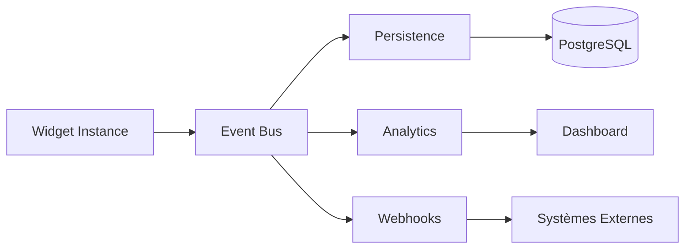

# Système d'Events

## Vue d'ensemble

Le système d'events permet de tracker les interactions des participants avec les widgets pendant les sessions live. Chaque type de widget dispose d'events prédéfinis pour garantir l'interopérabilité et la cohérence des analytics.



---

## Events Standard (Lifecycle)

Ces events sont émis par tous les widgets, quelle que soit leur catégorie.

```typescript
// packages/shared/src/types/widget-events.ts

export const LIFECYCLE_EVENTS = {
  'widget:loaded': {
    description: 'Widget chargé dans le DOM',
    payload: { instanceId: string }
  },
  'widget:ready': {
    description: 'Widget prêt à recevoir des interactions',
    payload: { instanceId: string }
  },
  'widget:error': {
    description: 'Erreur dans le widget',
    payload: { instanceId: string; error: string; code?: string }
  },
  'widget:completed': {
    description: 'Widget terminé (activité finie)',
    payload: { instanceId: string; completedAt: string }
  },
} as const;
```

---

## Events par Type de Widget

### QUIZ Events

```typescript
export const QUIZ_EVENTS = {
  'quiz:started': {
    description: 'Quiz démarré par le speaker',
    payload: {
      questionIndex: number;
      totalQuestions: number;
    }
  },
  'quiz:answer:submitted': {
    description: 'Réponse soumise par un participant',
    payload: {
      questionId: string;
      answerId: string;
      timeSpent: number;    // millisecondes
      isCorrect?: boolean;  // rempli après révélation
    }
  },
  'quiz:answer:revealed': {
    description: 'Réponse correcte révélée',
    payload: {
      questionId: string;
      correctAnswerId: string;
      stats: {
        totalResponses: number;
        distribution: Record<string, number>;
      }
    }
  },
  'quiz:question:next': {
    description: 'Passage à la question suivante',
    payload: {
      fromIndex: number;
      toIndex: number;
    }
  },
  'quiz:completed': {
    description: 'Quiz terminé',
    payload: {
      score: number;
      maxScore: number;
      correctAnswers: number;
      totalQuestions: number;
      rank?: number;
      timeTotal: number;
    }
  },
} as const;
```

### POLL Events

```typescript
export const POLL_EVENTS = {
  'poll:started': {
    description: 'Sondage ouvert aux votes',
    payload: {
      pollId: string;
      options: Array<{ id: string; text: string }>;
    }
  },
  'poll:vote:submitted': {
    description: 'Vote soumis',
    payload: {
      optionId: string;
      optionIds?: string[];  // Si multiple choice
    }
  },
  'poll:vote:changed': {
    description: 'Vote modifié (si autorisé)',
    payload: {
      fromOptionId: string;
      toOptionId: string;
    }
  },
  'poll:results:updated': {
    description: 'Résultats mis à jour en temps réel',
    payload: {
      results: Record<string, number>;
      totalVotes: number;
    }
  },
  'poll:closed': {
    description: 'Sondage fermé',
    payload: {
      finalResults: Record<string, number>;
      totalVotes: number;
    }
  },
} as const;
```

### WORDCLOUD Events

```typescript
export const WORDCLOUD_EVENTS = {
  'wordcloud:started': {
    description: 'Wordcloud ouvert aux contributions',
    payload: {
      question: string;
      maxWordsPerParticipant: number;
    }
  },
  'wordcloud:word:submitted': {
    description: 'Mot soumis',
    payload: {
      word: string;
      normalizedWord: string;  // lowercase, trimmed
    }
  },
  'wordcloud:words:submitted': {
    description: 'Plusieurs mots soumis (batch)',
    payload: {
      words: string[];
    }
  },
  'wordcloud:updated': {
    description: 'Nuage mis à jour',
    payload: {
      words: Array<{
        text: string;
        count: number;
        group?: string;  // Si groupement similaire activé
      }>;
      totalSubmissions: number;
    }
  },
  'wordcloud:closed': {
    description: 'Wordcloud fermé',
    payload: {
      finalWords: Array<{ text: string; count: number }>;
      uniqueContributors: number;
    }
  },
} as const;
```

### POSTIT Events

```typescript
export const POSTIT_EVENTS = {
  'postit:started': {
    description: 'Board post-it ouvert',
    payload: {
      prompt: string;
      categories?: string[];
    }
  },
  'postit:created': {
    description: 'Post-it créé',
    payload: {
      id: string;
      content: string;
      color: string;
      anonymous: boolean;
    }
  },
  'postit:updated': {
    description: 'Post-it modifié',
    payload: {
      id: string;
      content: string;
    }
  },
  'postit:deleted': {
    description: 'Post-it supprimé',
    payload: {
      id: string;
    }
  },
  'postit:voted': {
    description: 'Vote sur un post-it',
    payload: {
      postitId: string;
      voteCount: number;
      action: 'upvote' | 'downvote' | 'remove';
    }
  },
  'postit:categorized': {
    description: 'Post-it catégorisé',
    payload: {
      postitId: string;
      category: string;
      previousCategory?: string;
    }
  },
  'postit:matrix:updated': {
    description: 'Position sur matrice mise à jour',
    payload: {
      postitId: string;
      position: { x: number; y: number };  // 0-1 normalized
      axes: { x: string; y: string };      // Labels des axes
    }
  },
  'postit:board:snapshot': {
    description: 'Snapshot du board',
    payload: {
      postits: Array<{
        id: string;
        content: string;
        votes: number;
        category?: string;
      }>;
      totalPostits: number;
    }
  },
} as const;
```

### ROLEPLAY Events

```typescript
export const ROLEPLAY_EVENTS = {
  'roleplay:started': {
    description: 'Session de roleplay démarrée',
    payload: {
      roleId: string;
      roleName: string;
      scenario: string;
    }
  },
  'roleplay:message:sent': {
    description: 'Message envoyé par le participant',
    payload: {
      content: string;
      messageIndex: number;
    }
  },
  'roleplay:message:received': {
    description: 'Réponse reçue de l\'IA',
    payload: {
      content: string;
      mood?: 'neutral' | 'encouraging' | 'challenging' | 'thoughtful';
      messageIndex: number;
      latency: number;  // millisecondes
    }
  },
  'roleplay:hint:requested': {
    description: 'Indice demandé',
    payload: {
      hint: string;
    }
  },
  'roleplay:ended': {
    description: 'Roleplay terminé',
    payload: {
      conversationLength: number;
      duration: number;  // secondes
      completedObjectives: string[];
    }
  },
  'roleplay:debriefing:generated': {
    description: 'Debriefing généré',
    payload: {
      summary: string;
      strengths: string[];
      improvements: string[];
      score?: number;
    }
  },
} as const;
```

### SLIDES Events (Pedagogical Content)

```typescript
export const SLIDES_EVENTS = {
  'slides:started': {
    description: 'Présentation démarrée',
    payload: {
      totalSlides: number;
    }
  },
  'slides:slide:changed': {
    description: 'Changement de slide',
    payload: {
      fromIndex: number;
      toIndex: number;
      direction: 'forward' | 'backward';
    }
  },
  'slides:slide:viewed': {
    description: 'Slide vue pendant un temps minimum',
    payload: {
      slideIndex: number;
      viewDuration: number;
    }
  },
  'slides:completed': {
    description: 'Toutes les slides vues',
    payload: {
      viewedSlides: number;
      totalSlides: number;
      totalDuration: number;
    }
  },
} as const;
```

### FLASHCARD Events

```typescript
export const FLASHCARD_EVENTS = {
  'flashcard:session:started': {
    description: 'Session de révision démarrée',
    payload: {
      totalCards: number;
      mode: 'all' | 'unknown_only';
    }
  },
  'flashcard:flipped': {
    description: 'Carte retournée',
    payload: {
      cardId: string;
      side: 'front' | 'back';
      timeToFlip: number;
    }
  },
  'flashcard:marked': {
    description: 'Carte marquée connue/inconnue',
    payload: {
      cardId: string;
      status: 'known' | 'unknown';
    }
  },
  'flashcard:session:completed': {
    description: 'Session de révision terminée',
    payload: {
      known: number;
      unknown: number;
      totalCards: number;
      duration: number;
    }
  },
} as const;
```

### TIMELINE Events

```typescript
export const TIMELINE_EVENTS = {
  'timeline:loaded': {
    description: 'Timeline chargée',
    payload: {
      eventCount: number;
    }
  },
  'timeline:event:clicked': {
    description: 'Événement cliqué',
    payload: {
      eventId: string;
      eventDate: string;
    }
  },
  'timeline:event:expanded': {
    description: 'Détails d\'un événement ouverts',
    payload: {
      eventId: string;
      viewDuration?: number;
    }
  },
  'timeline:reordered': {
    description: 'Événement réordonné (si interactif)',
    payload: {
      eventId: string;
      fromIndex: number;
      newIndex: number;
      isCorrect?: boolean;  // Si exercice de classement
    }
  },
  'timeline:completed': {
    description: 'Timeline parcourue entièrement',
    payload: {
      viewedEvents: number;
      totalEvents: number;
    }
  },
} as const;
```

---

## Type Unifié

```typescript
// packages/shared/src/types/widget-events.ts

export const WIDGET_EVENTS = {
  // Lifecycle (tous widgets)
  ...LIFECYCLE_EVENTS,

  // Activities
  QUIZ: QUIZ_EVENTS,
  POLL: POLL_EVENTS,
  WORDCLOUD: WORDCLOUD_EVENTS,
  POSTIT: POSTIT_EVENTS,
  ROLEPLAY: ROLEPLAY_EVENTS,

  // Pedagogical Content
  SLIDES: SLIDES_EVENTS,
  FLASHCARD: FLASHCARD_EVENTS,
  TIMELINE: TIMELINE_EVENTS,
} as const;

export type WidgetEventName =
  | keyof typeof LIFECYCLE_EVENTS
  | `quiz:${string}`
  | `poll:${string}`
  | `wordcloud:${string}`
  | `postit:${string}`
  | `roleplay:${string}`
  | `slides:${string}`
  | `flashcard:${string}`
  | `timeline:${string}`;
```

---

## Event Bus Architecture

### Interface

```typescript
// packages/shared/src/types/event-bus.ts

interface WidgetEventBus {
  // Émission depuis le widget
  emit(event: WidgetEventName, payload: unknown): void;

  // Écoute côté session
  on(event: WidgetEventName, handler: (payload: unknown) => void): () => void;

  // Écoute avec pattern matching
  onPattern(pattern: RegExp, handler: (event: string, payload: unknown) => void): () => void;

  // Persistence pour analytics
  persist(event: WidgetEvent): Promise<void>;

  // Batch persistence
  flush(): Promise<void>;
}
```

### Implémentation Runtime

```typescript
// packages/runtime/src/event-bus.ts

class WidgetEventBusImpl implements WidgetEventBus {
  private listeners = new Map<string, Set<Function>>();
  private buffer: WidgetEvent[] = [];
  private flushInterval: NodeJS.Timer;

  constructor(
    private sessionId: string,
    private instanceId: string,
    private participantId: string | null
  ) {
    // Flush toutes les 5 secondes
    this.flushInterval = setInterval(() => this.flush(), 5000);
  }

  emit(eventName: WidgetEventName, payload: unknown): void {
    const event: WidgetEvent = {
      id: generateId(),
      sessionId: this.sessionId,
      instanceId: this.instanceId,
      participantId: this.participantId,
      eventName,
      payload: payload as Record<string, unknown>,
      timestamp: new Date(),
    };

    // Notify listeners
    const handlers = this.listeners.get(eventName);
    handlers?.forEach(handler => handler(payload));

    // Add to buffer
    this.buffer.push(event);

    // Flush immediately for important events
    if (this.isImportantEvent(eventName)) {
      this.flush();
    }
  }

  async flush(): Promise<void> {
    if (this.buffer.length === 0) return;

    const events = [...this.buffer];
    this.buffer = [];

    await fetch('/api/events/batch', {
      method: 'POST',
      body: JSON.stringify({ events }),
    });
  }

  private isImportantEvent(name: string): boolean {
    return name.includes(':completed') ||
           name.includes(':submitted') ||
           name.includes(':ended');
  }
}
```

---

## Stockage des Events

### Schema Prisma

```prisma
model WidgetEvent {
  id              String    @id @default(cuid())
  sessionId       String
  instanceId      String
  participantId   String?
  eventName       String
  payload         Json
  timestamp       DateTime  @default(now())

  session         LiveSession @relation(fields: [sessionId], references: [id])
  instance        WidgetInstance @relation(fields: [instanceId], references: [id])

  @@index([sessionId, timestamp])
  @@index([instanceId, eventName])
  @@index([participantId, timestamp])
  @@map("widget_events")
}
```

### Requêtes Typiques

```typescript
// Tous les events d'une session
const events = await db.widgetEvent.findMany({
  where: { sessionId },
  orderBy: { timestamp: 'asc' },
});

// Events d'un participant
const participantEvents = await db.widgetEvent.findMany({
  where: { sessionId, participantId },
});

// Comptage par type d'event
const stats = await db.widgetEvent.groupBy({
  by: ['eventName'],
  where: { instanceId },
  _count: true,
});

// Timeline d'un quiz
const quizTimeline = await db.widgetEvent.findMany({
  where: {
    instanceId,
    eventName: { startsWith: 'quiz:' },
  },
  orderBy: { timestamp: 'asc' },
});
```

---

## Custom Events (Templates)

Les templates peuvent définir des events personnalisés :

```json
{
  "events": {
    "standard": ["widget:loaded", "widget:completed"],
    "custom": [
      {
        "name": "timeline:event:reordered",
        "description": "Événement réordonné par drag & drop",
        "payload": {
          "eventId": { "type": "string", "description": "ID de l'événement" },
          "newIndex": { "type": "number", "description": "Nouvelle position" },
          "isCorrect": { "type": "boolean", "description": "Position correcte" }
        }
      },
      {
        "name": "timeline:hint:used",
        "description": "Indice utilisé",
        "payload": {
          "eventId": { "type": "string" },
          "hintType": { "type": "string", "enum": ["date", "context"] }
        }
      }
    ]
  }
}
```

### Validation des Custom Events

```typescript
function validateCustomEvent(
  eventName: string,
  payload: unknown,
  template: WidgetTemplate
): boolean {
  const customEvent = template.events?.custom?.find(e => e.name === eventName);

  if (!customEvent) {
    return false; // Event non déclaré
  }

  // Valider le payload contre le schema
  return validatePayload(payload, customEvent.payload);
}
```

---

## Webhooks Integration

Les events peuvent être forwardés vers des systèmes externes :

```typescript
// Configuration webhook dans Studio
interface WebhookConfig {
  url: string;
  events: WidgetEventName[];  // Events à forward
  headers?: Record<string, string>;
  secret?: string;  // Pour signature HMAC
}

// Payload envoyé
interface WebhookPayload {
  event: string;
  sessionId: string;
  instanceId: string;
  participantId?: string;
  payload: Record<string, unknown>;
  timestamp: string;
  signature?: string;
}
```

---

## Analytics Dashboard

### Métriques Clés par Type

| Widget | Métriques |
|--------|-----------|
| **Quiz** | Score moyen, temps moyen, distribution des réponses |
| **Poll** | Taux de participation, distribution des votes |
| **Wordcloud** | Mots uniques, fréquences, clusters |
| **Postit** | Nombre d'idées, votes, catégorisation |
| **Roleplay** | Durée moyenne, objectifs atteints, sentiment |
| **Slides** | Temps par slide, completion rate |
| **Flashcard** | Taux de réussite, progression |

### Export xAPI

Les events sont convertibles en statements xAPI pour export vers un LRS :

```typescript
function toXAPIStatement(event: WidgetEvent): XAPIStatement {
  return {
    actor: {
      account: { name: event.participantId || 'anonymous' }
    },
    verb: mapEventToVerb(event.eventName),
    object: {
      id: `https://qiplim.com/widgets/${event.instanceId}`,
      definition: { type: 'Activity' }
    },
    result: extractResult(event.payload),
    timestamp: event.timestamp.toISOString(),
  };
}
```
