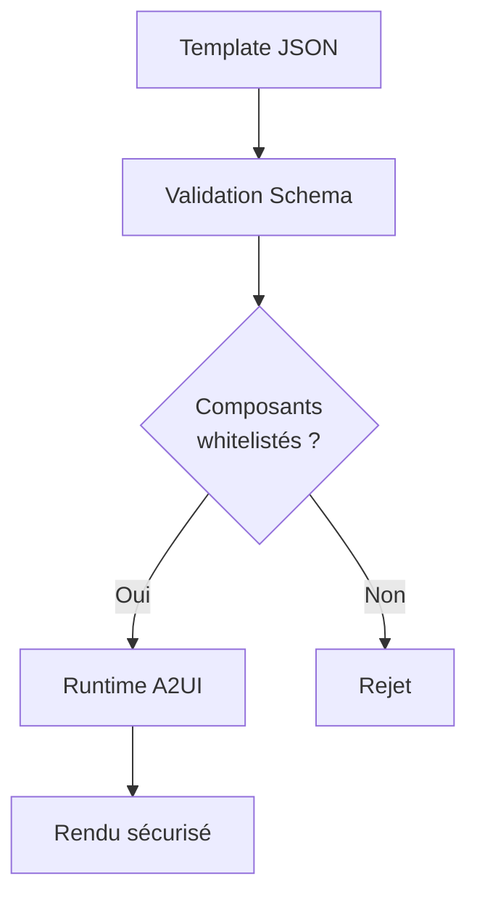

# Sécurité et Whitelist A2UI

## Vue d'ensemble

La sécurité du marketplace repose sur un principe fondamental : **aucun code exécutable** ne peut être introduit via les templates JSON. Seuls les composants A2UI approuvés et whitelistés peuvent être utilisés.



---

## Architecture de Sécurité

### Couches de Protection

| Couche | Protection |
|--------|------------|
| **Schéma JSON** | Validation structurelle stricte |
| **Whitelist composants** | Seuls les composants approuvés |
| **Validation runtime** | Vérification avant rendu |
| **Sanitization** | Nettoyage des contenus |
| **CSP** | Content Security Policy restrictive |

---

## Whitelist des Composants A2UI

```typescript
// packages/shared/src/a2ui/whitelist.ts

export const A2UI_WHITELIST = {
  // === Layout Components ===
  'Container': {
    maxDepth: 10,                    // Profondeur max d'imbrication
    maxChildren: 50,                  // Enfants max
  },
  'Card': {
    maxDepth: 5,
  },
  'Grid': {
    maxColumns: 12,
    maxChildren: 24,
  },

  // === Typography Components ===
  'Heading': {
    allowedLevels: ['1', '2', '3', '4', '5', '6'],
    maxLength: 500,
  },
  'Text': {
    maxLength: 10000,
    allowedVariants: ['body', 'caption', 'label'],
  },

  // === Form Components ===
  'Button': {
    allowedActions: [
      'submit', 'next', 'previous', 'reveal',
      'vote', 'send', 'flip', 'skip', 'cancel'
    ],
    noExternalUrls: true,            // Pas de navigation externe
    noJavaScript: true,              // Pas de onclick JS
  },
  'Input': {
    allowedTypes: ['text', 'email', 'number', 'tel'],
    noAutocomplete: true,            // Sécurité formulaires
    maxLength: 1000,
  },
  'Textarea': {
    maxLength: 10000,
    maxRows: 20,
  },
  'Select': {
    maxOptions: 100,
  },
  'Checkbox': {},
  'RadioGroup': {
    maxOptions: 20,
  },

  // === Activity Components ===
  'OptionCard': {
    maxOptions: 10,
  },
  'OptionGrid': {
    maxOptions: 20,
  },
  'Timer': {
    maxDuration: 3600,               // 1 heure max
    noAutoSubmit: false,             // Peut auto-submit
  },
  'ProgressBar': {},
  'ScoreDisplay': {
    maxScore: 1000000,
  },
  'Leaderboard': {
    maxEntries: 100,
  },

  // === Wordcloud Components ===
  'WordInput': {
    maxWords: 20,
    maxWordLength: 100,
  },
  'WordCloud': {
    maxWords: 1000,
  },

  // === Postit Components ===
  'Postit': {
    maxContentLength: 1000,
  },
  'PostitBoard': {
    maxPostits: 500,
    maxColumns: 6,
  },
  'PostitInput': {
    maxLength: 500,
  },

  // === Chat/Roleplay Components ===
  'ChatMessage': {
    maxLength: 5000,
    allowedRoles: ['user', 'assistant'],
  },
  'ChatContainer': {
    maxMessages: 200,
  },
  'ChatInput': {
    maxLength: 2000,
    maxSuggestions: 5,
  },

  // === Media Components (Restricted) ===
  'Image': {
    allowedDomains: [
      'qiplim.com',
      'cdn.qiplim.com',
      'images.unsplash.com',
      'upload.wikimedia.org',
    ],
    maxSize: '5MB',
    allowedFormats: ['jpg', 'jpeg', 'png', 'gif', 'webp', 'svg'],
  },
  'Icon': {
    allowedSets: ['lucide'],         // Seulement Lucide icons
  },

  // === Utility Components ===
  'Divider': {},
  'Spacer': {
    maxSize: 'xl',
  },
  'Badge': {
    maxLength: 50,
  },
  'Alert': {
    maxLength: 500,
    allowedVariants: ['info', 'success', 'warning', 'error'],
  },
} as const;

export type WhitelistedComponent = keyof typeof A2UI_WHITELIST;
```

---

## Validation Runtime

### Fonction de Validation

```typescript
// packages/shared/src/a2ui/validator.ts

export interface ValidationResult {
  valid: boolean;
  errors: ValidationError[];
  warnings: ValidationWarning[];
}

export interface ValidationError {
  path: string;
  message: string;
  code: string;
}

export function validateA2UIDocument(
  doc: unknown,
  options: ValidationOptions = {}
): ValidationResult {
  const errors: ValidationError[] = [];
  const warnings: ValidationWarning[] = [];

  if (!Array.isArray(doc)) {
    errors.push({
      path: '$',
      message: 'Document must be an array',
      code: 'INVALID_ROOT',
    });
    return { valid: false, errors, warnings };
  }

  // Validate each component recursively
  for (let i = 0; i < doc.length; i++) {
    validateComponent(doc[i], `$[${i}]`, errors, warnings, 0);
  }

  return {
    valid: errors.length === 0,
    errors,
    warnings,
  };
}

function validateComponent(
  component: unknown,
  path: string,
  errors: ValidationError[],
  warnings: ValidationWarning[],
  depth: number
): void {
  // Check depth limit
  if (depth > 15) {
    errors.push({
      path,
      message: 'Maximum nesting depth exceeded (15)',
      code: 'MAX_DEPTH',
    });
    return;
  }

  // Check component structure
  if (!isObject(component)) {
    errors.push({
      path,
      message: 'Component must be an object',
      code: 'INVALID_COMPONENT',
    });
    return;
  }

  const { type, props, children } = component as Record<string, unknown>;

  // Check type exists and is whitelisted
  if (typeof type !== 'string') {
    errors.push({
      path,
      message: 'Component must have a type property',
      code: 'MISSING_TYPE',
    });
    return;
  }

  if (!(type in A2UI_WHITELIST)) {
    errors.push({
      path,
      message: `Component type "${type}" is not whitelisted`,
      code: 'NOT_WHITELISTED',
    });
    return;
  }

  // Get whitelist rules for this component
  const rules = A2UI_WHITELIST[type as WhitelistedComponent];

  // Validate against component-specific rules
  validateComponentRules(type, props, path, rules, errors, warnings);

  // Validate children recursively
  if (Array.isArray(children)) {
    const maxChildren = (rules as any).maxChildren ?? 100;
    if (children.length > maxChildren) {
      errors.push({
        path,
        message: `Too many children (${children.length} > ${maxChildren})`,
        code: 'MAX_CHILDREN',
      });
    }

    for (let i = 0; i < children.length; i++) {
      validateComponent(children[i], `${path}.children[${i}]`, errors, warnings, depth + 1);
    }
  }
}

function validateComponentRules(
  type: string,
  props: unknown,
  path: string,
  rules: Record<string, unknown>,
  errors: ValidationError[],
  warnings: ValidationWarning[]
): void {
  if (!isObject(props)) return;

  const p = props as Record<string, unknown>;

  // Check text length limits
  if ('maxLength' in rules && typeof p.text === 'string') {
    if (p.text.length > (rules.maxLength as number)) {
      errors.push({
        path: `${path}.props.text`,
        message: `Text exceeds maximum length (${rules.maxLength})`,
        code: 'MAX_LENGTH',
      });
    }
  }

  // Check allowed values
  if ('allowedActions' in rules && typeof p.action === 'string') {
    if (!(rules.allowedActions as string[]).includes(p.action)) {
      errors.push({
        path: `${path}.props.action`,
        message: `Action "${p.action}" is not allowed`,
        code: 'INVALID_ACTION',
      });
    }
  }

  // Check no external URLs
  if (rules.noExternalUrls && typeof p.href === 'string') {
    if (!isInternalUrl(p.href)) {
      errors.push({
        path: `${path}.props.href`,
        message: 'External URLs are not allowed',
        code: 'EXTERNAL_URL',
      });
    }
  }

  // Check image domains
  if (type === 'Image' && typeof p.src === 'string') {
    const allowedDomains = (rules as any).allowedDomains as string[];
    if (!isAllowedImageDomain(p.src, allowedDomains)) {
      errors.push({
        path: `${path}.props.src`,
        message: 'Image domain is not allowed',
        code: 'INVALID_IMAGE_DOMAIN',
      });
    }
  }
}
```

---

## Content Security

### Sanitization des Contenus

```typescript
// packages/shared/src/a2ui/sanitizer.ts

export function sanitizeA2UIDocument(doc: A2UIDocument): A2UIDocument {
  return doc.map(component => sanitizeComponent(component));
}

function sanitizeComponent(component: A2UIComponent): A2UIComponent {
  const sanitized = { ...component };

  if (sanitized.props) {
    sanitized.props = sanitizeProps(sanitized.props, component.type);
  }

  if (sanitized.children) {
    sanitized.children = sanitized.children.map(child =>
      sanitizeComponent(child)
    );
  }

  return sanitized;
}

function sanitizeProps(
  props: Record<string, unknown>,
  componentType: string
): Record<string, unknown> {
  const sanitized = { ...props };

  // Sanitize text content (prevent XSS)
  for (const [key, value] of Object.entries(sanitized)) {
    if (typeof value === 'string') {
      sanitized[key] = sanitizeString(value);
    }
  }

  return sanitized;
}

function sanitizeString(str: string): string {
  return str
    // Remove script tags
    .replace(/<script\b[^<]*(?:(?!<\/script>)<[^<]*)*<\/script>/gi, '')
    // Remove event handlers
    .replace(/\s*on\w+\s*=\s*["'][^"']*["']/gi, '')
    // Remove javascript: URLs
    .replace(/javascript:/gi, '')
    // Escape HTML entities
    .replace(/</g, '&lt;')
    .replace(/>/g, '&gt;');
}
```

### Content Security Policy

```typescript
// next.config.ts - CSP pour le rendu A2UI

const cspHeader = `
  default-src 'self';
  script-src 'self' 'unsafe-eval';
  style-src 'self' 'unsafe-inline';
  img-src 'self' https://cdn.qiplim.com https://images.unsplash.com data:;
  font-src 'self';
  frame-src 'none';
  connect-src 'self' https://api.qiplim.com;
  object-src 'none';
  base-uri 'self';
  form-action 'self';
`;
```

---

## Règles de Sécurité par Composant

### Button

```typescript
const BUTTON_SECURITY_RULES = {
  // Actions autorisées uniquement
  allowedActions: [
    'submit',      // Soumettre un formulaire
    'next',        // Question/slide suivante
    'previous',    // Question/slide précédente
    'reveal',      // Révéler la réponse
    'vote',        // Voter
    'send',        // Envoyer un message
    'flip',        // Retourner une carte
    'skip',        // Passer
    'cancel',      // Annuler
    'start',       // Démarrer
    'end',         // Terminer
  ],

  // Pas de navigation externe
  noHref: true,

  // Pas de JavaScript inline
  noOnClick: true,

  // Pas de target="_blank"
  noTargetBlank: true,
};
```

### Image

```typescript
const IMAGE_SECURITY_RULES = {
  // Domaines autorisés
  allowedDomains: [
    'qiplim.com',
    'cdn.qiplim.com',
    'images.unsplash.com',
    'upload.wikimedia.org',
    // Les images data: sont autorisées pour les previews
  ],

  // Taille max
  maxSize: 5 * 1024 * 1024, // 5MB

  // Formats autorisés
  allowedFormats: ['jpg', 'jpeg', 'png', 'gif', 'webp', 'svg'],

  // Pas de SVG avec scripts
  sanitizeSvg: true,

  // Validation URL
  validateUrl: (url: string) => {
    try {
      const parsed = new URL(url);
      return IMAGE_SECURITY_RULES.allowedDomains.some(
        domain => parsed.hostname.endsWith(domain)
      );
    } catch {
      // data: URLs
      return url.startsWith('data:image/');
    }
  },
};
```

### Input/Textarea

```typescript
const INPUT_SECURITY_RULES = {
  // Types autorisés
  allowedTypes: ['text', 'email', 'number', 'tel', 'url'],

  // Pas de type password (jamais de credentials)
  noPassword: true,

  // Pas d'autocomplete pour données sensibles
  noAutocomplete: true,

  // Longueur max
  maxLength: {
    Input: 1000,
    Textarea: 10000,
  },

  // Pas de name qui pourrait cibler des champs sensibles
  forbiddenNames: [
    'password', 'pwd', 'secret', 'token', 'api_key',
    'credit_card', 'card_number', 'cvv', 'ssn',
  ],
};
```

---

## Validation des Templates

### Pre-submission Check

```typescript
// packages/ai/src/templates/validator.ts

export async function validateTemplate(
  template: WidgetTemplateV2
): Promise<TemplateValidationResult> {
  const errors: string[] = [];
  const warnings: string[] = [];

  // 1. Validate JSON Schema
  const schemaValid = await validateAgainstSchema(template);
  if (!schemaValid.valid) {
    errors.push(...schemaValid.errors);
  }

  // 2. Validate all views
  for (const [viewName, view] of Object.entries(template.views)) {
    const viewResult = validateA2UIDocument(view.template);
    if (!viewResult.valid) {
      errors.push(...viewResult.errors.map(e =>
        `views.${viewName}: ${e.message}`
      ));
    }
  }

  // 3. Check for suspicious patterns
  const suspiciousPatterns = checkSuspiciousPatterns(template);
  warnings.push(...suspiciousPatterns);

  // 4. Validate prompt template
  const promptIssues = validatePromptTemplate(template.generation.promptTemplate);
  warnings.push(...promptIssues);

  // 5. Check event declarations
  const eventIssues = validateEventDeclarations(template.events);
  errors.push(...eventIssues);

  return {
    valid: errors.length === 0,
    errors,
    warnings,
  };
}

function checkSuspiciousPatterns(template: WidgetTemplateV2): string[] {
  const warnings: string[] = [];
  const json = JSON.stringify(template);

  // Check for suspicious strings
  const patterns = [
    { pattern: /eval\s*\(/i, message: 'Possible eval() usage' },
    { pattern: /new\s+Function/i, message: 'Possible dynamic function creation' },
    { pattern: /document\./i, message: 'Possible DOM manipulation' },
    { pattern: /window\./i, message: 'Possible window access' },
    { pattern: /localStorage/i, message: 'Possible localStorage access' },
    { pattern: /fetch\s*\(/i, message: 'Possible fetch usage' },
    { pattern: /XMLHttpRequest/i, message: 'Possible XHR usage' },
  ];

  for (const { pattern, message } of patterns) {
    if (pattern.test(json)) {
      warnings.push(message);
    }
  }

  return warnings;
}
```

---

## Review Process

### Automatic Checks

```typescript
// Checks automatiques avant publication

interface AutomaticReviewResult {
  passed: boolean;
  checks: {
    schemaValid: boolean;
    allComponentsWhitelisted: boolean;
    noSecurityIssues: boolean;
    promptSafe: boolean;
    sizeLimits: boolean;
  };
  details: string[];
}

export async function runAutomaticReview(
  template: WidgetTemplateV2
): Promise<AutomaticReviewResult> {
  const checks = {
    schemaValid: false,
    allComponentsWhitelisted: false,
    noSecurityIssues: false,
    promptSafe: false,
    sizeLimits: false,
  };
  const details: string[] = [];

  // 1. Schema validation
  const schemaResult = validateAgainstSchema(template);
  checks.schemaValid = schemaResult.valid;
  if (!schemaResult.valid) {
    details.push(`Schema errors: ${schemaResult.errors.join(', ')}`);
  }

  // 2. Component whitelist
  const whitelistResult = checkAllComponentsWhitelisted(template);
  checks.allComponentsWhitelisted = whitelistResult.valid;
  if (!whitelistResult.valid) {
    details.push(`Non-whitelisted components: ${whitelistResult.components.join(', ')}`);
  }

  // 3. Security issues
  const securityResult = checkSecurityIssues(template);
  checks.noSecurityIssues = securityResult.issues.length === 0;
  if (securityResult.issues.length > 0) {
    details.push(`Security issues: ${securityResult.issues.join(', ')}`);
  }

  // 4. Prompt safety
  checks.promptSafe = !containsPromptInjection(template.generation.promptTemplate);

  // 5. Size limits
  const size = JSON.stringify(template).length;
  checks.sizeLimits = size < 500000; // 500KB max
  if (!checks.sizeLimits) {
    details.push(`Template too large: ${size} bytes (max 500KB)`);
  }

  return {
    passed: Object.values(checks).every(Boolean),
    checks,
    details,
  };
}
```

### Manual Review (Community Templates)

Les templates communautaires passent par une review manuelle si :
- Premier template de l'auteur
- Utilisation de composants "restricted" (Image, etc.)
- Score de sécurité automatique < 90%
- Signalement par la communauté

---

## Reporting & Monitoring

### Security Metrics

```typescript
interface SecurityMetrics {
  // Templates
  totalTemplates: number;
  templatesWithSecurityWarnings: number;
  rejectedTemplates: number;

  // Runtime
  blockedRenders: number;
  sanitizedContents: number;
  cspViolations: number;

  // Abuse
  reportedTemplates: number;
  bannedAuthors: number;
}
```

### Alert System

```typescript
// Alertes en temps réel

const SECURITY_ALERTS = {
  // Template avec pattern suspect
  SUSPICIOUS_TEMPLATE: {
    severity: 'high',
    notify: ['security@qiplim.com'],
  },

  // Tentative de composant non whitelisté
  WHITELIST_BYPASS_ATTEMPT: {
    severity: 'critical',
    notify: ['security@qiplim.com', 'on-call'],
  },

  // CSP violation en production
  CSP_VIOLATION: {
    severity: 'high',
    notify: ['security@qiplim.com'],
  },

  // Pic de signalements sur un template
  REPORT_SPIKE: {
    severity: 'medium',
    notify: ['moderation@qiplim.com'],
  },
};
```
