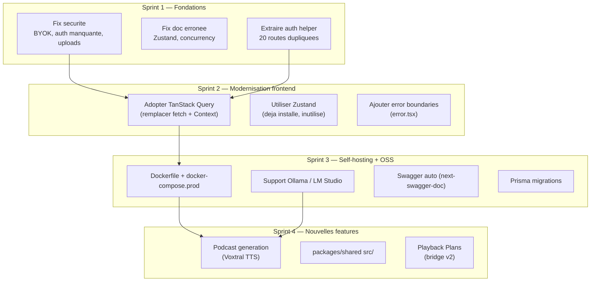
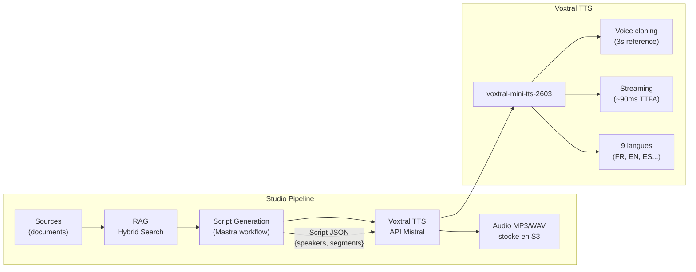

# Studio - Recommendations

> Synthese des enseignements de l'audit architectural, de l'analyse critique, et du benchmark Open Notebook.

---

## Vue d'ensemble des actions



---

## 1. Securite (Sprint 1 — Critique)

### 1.1 Remplacer l'encryption BYOK

**Fichier** : `apps/studio/lib/ai/byok.ts`
**Probleme** : XOR avec cle repetee = pas de chiffrement reel.

```typescript
// Remplacer par :
import { createCipheriv, createDecipheriv, randomBytes } from 'crypto';

const ALGORITHM = 'aes-256-gcm';
const KEY = Buffer.from(process.env.BYOK_ENCRYPTION_KEY!, 'hex'); // 32 bytes

function encrypt(text: string): string {
  const iv = randomBytes(16);
  const cipher = createCipheriv(ALGORITHM, KEY, iv);
  const encrypted = Buffer.concat([cipher.update(text, 'utf8'), cipher.final()]);
  const tag = cipher.getAuthTag();
  return Buffer.concat([iv, tag, encrypted]).toString('base64');
}

function decrypt(data: string): string {
  const buf = Buffer.from(data, 'base64');
  const iv = buf.subarray(0, 16);
  const tag = buf.subarray(16, 32);
  const encrypted = buf.subarray(32);
  const decipher = createDecipheriv(ALGORITHM, KEY, iv);
  decipher.setAuthTag(tag);
  return decipher.update(encrypted) + decipher.final('utf8');
}
```

Migration : re-chiffrer les cles existantes (decrypter avec XOR, re-chiffrer avec AES-GCM).

### 1.2 Ajouter auth sur les routes non protegees

| Route | Action |
|-------|--------|
| `GET /api/queue/jobs/[jobId]` | Ajouter auth check (session ou anonymous) |
| `GET /api/presentations/[id]` | Ajouter verification ownership via studioId |

### 1.3 Valider les uploads avec magic bytes

```typescript
// En plus du MIME type, verifier la signature du fichier
const MAGIC_BYTES: Record<string, Buffer> = {
  'application/pdf': Buffer.from([0x25, 0x50, 0x44, 0x46]),
  'image/png': Buffer.from([0x89, 0x50, 0x4E, 0x47]),
  // ...
};
```

### 1.4 Extraire l'auth en helper partage

Le meme bloc de 15 lignes est copie-colle dans 20 routes. Extraire en `lib/api-auth.ts` :

```typescript
// lib/api-auth.ts
export async function requireStudioAccess(studioId: string): Promise<{
  studio: Studio;
  userId?: string;
  anonymousSessionId?: string;
} | NextResponse> { ... }
```

---

## 2. Corriger la documentation (Sprint 1)

| Erreur | Fichier | Correction |
|--------|---------|------------|
| "No Zustand" | `04-react-patterns.md`, `00-index.md` | Zustand `^5.0.3` est dans package.json. Soit le retirer, soit documenter pourquoi il est la |
| Concurrency "2 pour toutes les queues" | `08-background-jobs.md` | slide-image worker a concurrency **5** |
| Mistral "default provider" | `00-overview.md`, `07-ai-rag-pipeline.md` | Clarifier : Mistral est le premier dans la chain de fallback, pas un default explicite |

---

## 3. Moderniser le frontend (Sprint 2)

### 3.1 Adopter TanStack Query

**Inspire de** : Open Notebook utilise TanStack Query + Zustand. Engage l'utilise deja.

Remplacer le pattern actuel (fetch + useState + useEffect + polling manuel) par TanStack Query :

```typescript
// Avant (StudioContext.tsx — 100+ lignes de fetch/poll)
const [studio, setStudio] = useState(null);
const [isLoading, setIsLoading] = useState(true);
useEffect(() => { fetchStudio(); }, []);
useEffect(() => { /* polling 2s */ }, [runs]);

// Apres
const { data: studio, isLoading } = useQuery({
  queryKey: ['studio', studioId],
  queryFn: () => fetch(`/api/studios/${studioId}`).then(r => r.json()),
});

// Le polling devient un refetchInterval conditionnel
const { data: runs } = useQuery({
  queryKey: ['generations', studioId],
  queryFn: fetchGenerations,
  refetchInterval: (query) =>
    query.state.data?.some(r => r.status === 'RUNNING') ? 2000 : false,
});
```

**Impact** : Elimination de ~200 lignes de boilerplate dans StudioContext, cache automatique, deduplication des requetes, devtools.

### 3.2 Utiliser Zustand (deja installe)

Zustand `^5.0.3` est dans `package.json` mais jamais utilise. Migrer l'etat UI du Context vers Zustand :

```typescript
// stores/ui-store.ts
export const useUIStore = create<UIState>()((set) => ({
  isSourcesPanelCollapsed: false,
  isRightPanelCollapsed: false,
  toggleSourcesPanel: () => set((s) => ({ isSourcesPanelCollapsed: !s.isSourcesPanelCollapsed })),
  toggleRightPanel: () => set((s) => ({ isRightPanelCollapsed: !s.isRightPanelCollapsed })),
}));
```

**Pattern cible** (aligne avec Open Notebook et Engage) :
- **TanStack Query** = donnees serveur (studios, widgets, sources, generations)
- **Zustand** = etat UI (panels, selections, modals)
- **Context** = seulement pour le provider scope (studioId)

### 3.3 Ajouter error boundaries

Creer des fichiers `error.tsx` Next.js :
- `app/(dashboard)/error.tsx` — erreur globale dashboard
- `app/(dashboard)/studios/[id]/error.tsx` — erreur studio specifique

---

## 4. Self-hosting (Sprint 3)

### 4.1 Dockerfile

**Inspire de** : Open Notebook — Docker Compose single-command deploy en 2 minutes.

```dockerfile
# apps/studio/Dockerfile
FROM node:20-slim AS base
RUN npm install -g pnpm@9.12.0

FROM base AS deps
WORKDIR /app
COPY pnpm-lock.yaml pnpm-workspace.yaml package.json ./
COPY packages/db-studio/package.json packages/db-studio/
COPY packages/shared/package.json packages/shared/
COPY apps/studio/package.json apps/studio/
RUN pnpm install --frozen-lockfile

FROM base AS builder
WORKDIR /app
COPY --from=deps /app/node_modules ./node_modules
COPY . .
RUN pnpm db:generate && pnpm build:studio

FROM base AS runner
WORKDIR /app
ENV NODE_ENV=production
COPY --from=builder /app/apps/studio/.next/standalone ./
COPY --from=builder /app/apps/studio/.next/static ./apps/studio/.next/static
COPY --from=builder /app/apps/studio/public ./apps/studio/public
EXPOSE 3001
CMD ["node", "apps/studio/server.js"]
```

### 4.2 docker-compose.prod.yml

```yaml
services:
  studio:
    build:
      context: .
      dockerfile: apps/studio/Dockerfile
    ports: ["3001:3001"]
    env_file: .env.studio
    depends_on: [postgres-studio, redis]

  postgres-studio:
    image: pgvector/pgvector:pg16
    environment:
      POSTGRES_DB: qiplim_studio
      POSTGRES_USER: qiplim
      POSTGRES_PASSWORD: ${DB_PASSWORD}
    volumes: [pgdata:/var/lib/postgresql/data]
    ports: ["5433:5432"]

  redis:
    image: redis:7-alpine
    ports: ["6379:6379"]
    volumes: [redisdata:/data]

volumes:
  pgdata:
  redisdata:
```

### 4.3 Support Ollama / LM Studio

Ajouter un provider `openai-compatible` dans `lib/ai/providers.ts` :

```typescript
// Nouveau provider : endpoints custom OpenAI-compatible
case 'openai-compatible': {
  return createOpenAI({
    baseURL: process.env.CUSTOM_LLM_BASE_URL || 'http://localhost:11434/v1',
    apiKey: 'ollama', // Ollama n'a pas besoin de cle
  })(model);
}
```

Open Notebook supporte Ollama nativement — c'est un prerequis pour le self-hosting credible.

### 4.4 Swagger auto

Ajouter `next-swagger-doc` pour generer la doc API automatiquement :

```bash
pnpm --filter @qiplim/studio add next-swagger-doc swagger-ui-react
```

Route `/api/docs` avec UI Swagger. Open Notebook utilise FastAPI qui le fait nativement — on peut reproduire avec Next.js.

---

## 5. Podcast Generation avec Voxtral TTS (Sprint 4)

### Architecture proposee



### Pipeline en 3 etapes (inspire de Podcastfy + Open Notebook)

**Etape 1 : Script Generation** (Mastra workflow)
```typescript
// lib/mastra/workflows/generate-podcast.workflow.ts
// Input: sourceIds, style (conversation, interview, monologue), speakers count
// Step 1: RAG retrieval over selected sources
// Step 2: Generate structured podcast script
// Output: { title, segments: [{ speaker, text, emotion?, pace? }] }
```

**Etape 2 : TTS via Voxtral**
```typescript
// lib/ai/podcast.ts
import { Mistral } from '@mistralai/mistralai';

async function generateSegmentAudio(
  text: string,
  voiceId: string,
  format: 'mp3' | 'wav' = 'mp3'
): Promise<Buffer> {
  const client = new Mistral({ apiKey: getProviderKey('mistral') });
  const response = await client.audio.speech.complete({
    model: 'voxtral-mini-tts-2603',
    input: text,
    voiceId,
    responseFormat: format,
  });
  return Buffer.from(response.audioData, 'base64');
}
```

**Etape 3 : Assemblage + Storage**
- Concatener les segments audio
- Upload en S3
- Creer un record `Podcast` ou `Widget` type `PODCAST`

### Nouveau WidgetType

```prisma
enum WidgetType {
  // ... existing types
  PODCAST    // Nouveau
}
```

### Voxtral vs alternatives

| Provider | Modele | Prix | Latence | Voice cloning | Self-host |
|----------|--------|------|---------|:-------------:|:---------:|
| **Mistral (Voxtral)** | voxtral-mini-tts-2603 | $16/M chars | ~90ms TTFA | Oui (3s ref) | Oui (vLLM) |
| ElevenLabs | Flash v2.5 | $30/M chars | ~100ms | Oui | Non |
| OpenAI | tts-1-hd | $30/M chars | ~200ms | Non | Non |
| Google | Cloud TTS | $16/M chars | ~150ms | Non | Non |

**Recommandation** : Voxtral en priorite (meme provider que le LLM par defaut, prix competitif, self-hostable, voice cloning, 9 langues dont FR). Fallback vers ElevenLabs ou OpenAI TTS.

---

## 6. Autres recommandations

### 6.1 Tests (priorite haute)

Commencer par les fonctions pures sans dependances externes :

```
1. composition-validation.ts  — isCompatible, validateSlotCardinality, detectCycle
2. flatten-widgets.ts         — flattenWidgetsForDeploy
3. byok.ts                    — encrypt/decrypt round-trip (apres fix AES)
4. types.ts                   — type guards (isQuizData, isCompositeWidget)
```

### 6.2 Structured logging

Remplacer les 56 `console.log/error` par un logger structure :

```typescript
// lib/logger.ts
import pino from 'pino';
export const logger = pino({
  level: process.env.LOG_LEVEL || 'info',
  transport: process.env.NODE_ENV === 'development'
    ? { target: 'pino-pretty' }
    : undefined,
});
```

### 6.3 Zod validation partout

Standardiser : toutes les routes POST/PUT/PATCH doivent utiliser Zod `.safeParse()`. Les validations inline manuelles doivent etre migrees.

### 6.4 Supprimer le dead code WPS++

Les types d'orchestration (state-machine, conditional, data pipelines) n'ont aucun consumer. Options :
- **Option A** : Les garder comme spec future mais les marquer `@experimental` dans les commentaires
- **Option B** : Les supprimer et les reimplementer quand il y aura un consumer reel
- **Recommande** : Option A — les types ne coutent rien, mais ne pas investir dans du runtime tant qu'il n'y a pas de demande

### 6.5 i18n

Open Notebook a des translation keys des le debut. Ajouter `next-intl` ou `next-i18next` avant que la base de code grandisse trop.

---

## Matrice de priorite

| Action | Effort | Impact | Sprint |
|--------|--------|--------|--------|
| Fix BYOK encryption | S | Critique (securite) | 1 |
| Auth sur routes non protegees | S | Critique (securite) | 1 |
| Extraire auth helper | S | Haute (maintenabilite) | 1 |
| Corriger docs erronees | S | Moyenne (confiance) | 1 |
| TanStack Query | M | Haute (DX + perf) | 2 |
| Zustand pour UI state | S | Moyenne (coherence) | 2 |
| Error boundaries | S | Moyenne (UX) | 2 |
| Dockerfile + compose prod | M | Haute (OSS prerequis) | 3 |
| Support Ollama | S | Haute (self-hosting) | 3 |
| Swagger auto | S | Moyenne (DX) | 3 |
| Prisma migrations | M | Haute (production safety) | 3 |
| Tests unitaires (4 fichiers) | M | Haute (confiance) | 3 |
| Podcast / Voxtral TTS | L | Moyenne (feature) | 4 |
| packages/shared src/ | M | Haute (archi) | 4 |
| Playback Plans bridge | L | Haute (archi) | 4 |
| Structured logging | S | Moyenne (ops) | 3 |
| i18n | M | Moyenne (marche) | 4 |

Sources:
- [Voxtral TTS - Mistral Docs](https://docs.mistral.ai/capabilities/audio/text_to_speech)
- [Voxtral TTS Speech API](https://docs.mistral.ai/capabilities/audio/text_to_speech/speech)
- [Open Notebook GitHub](https://github.com/lfnovo/open-notebook)
