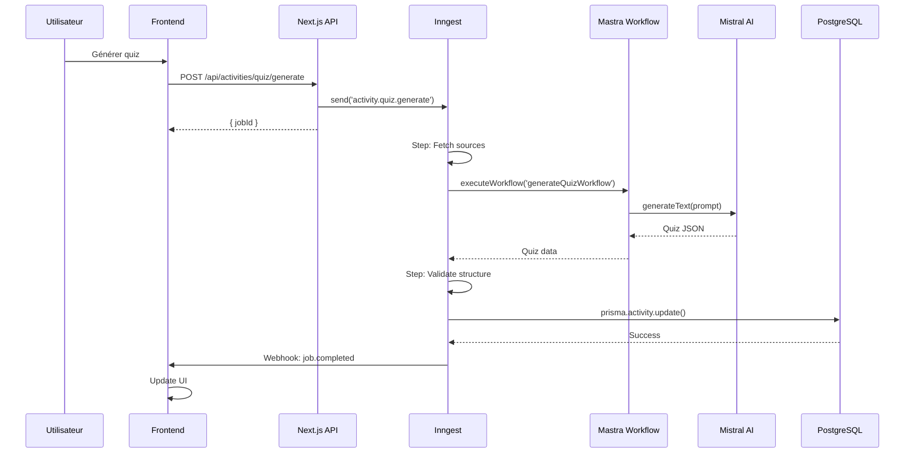
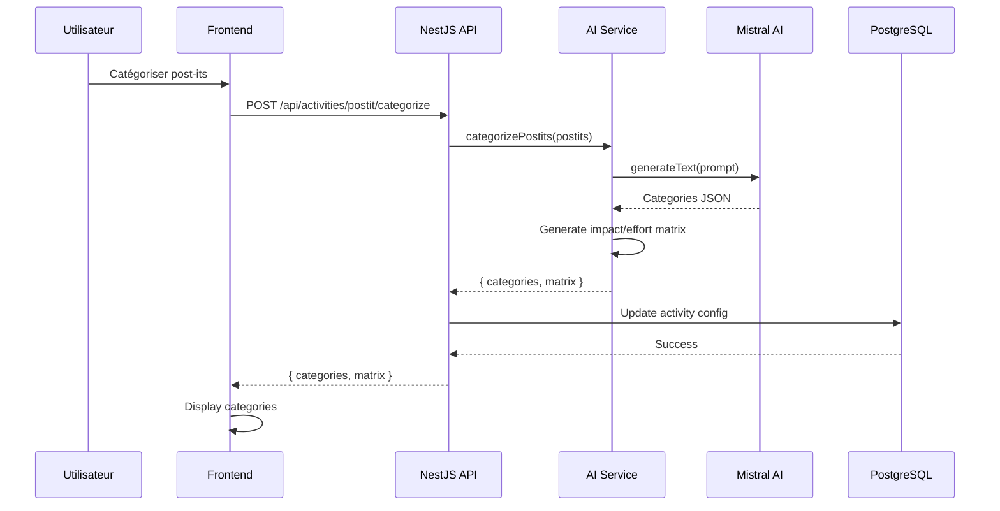
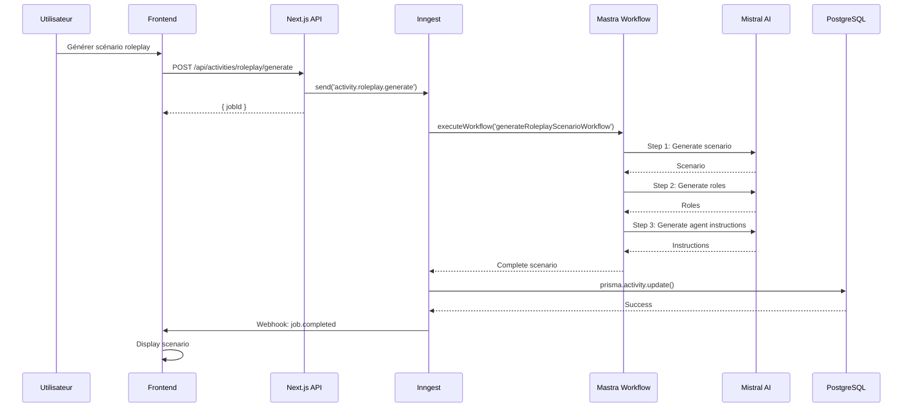
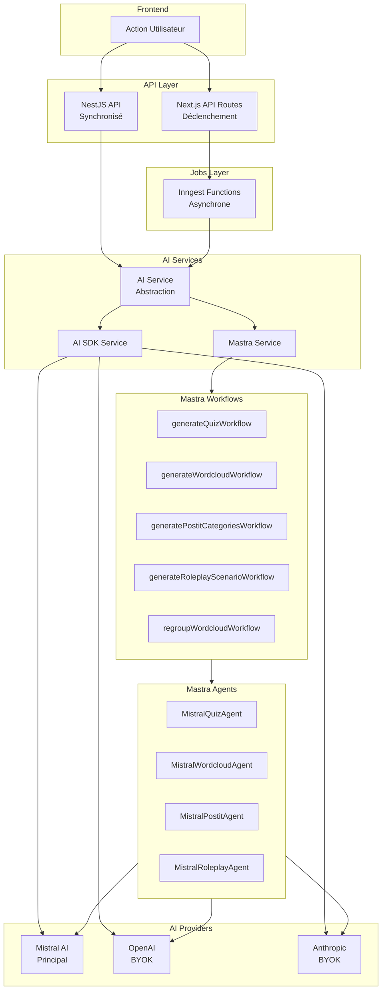

# Migration Services IA - Qiplim Engage

**Version** : 1.0  
**Date** : Janvier 2026  
**Statut** : Spécifications Techniques  
**Objectif** : Détails de migration des services de génération IA Netlify vers NestJS/Inngest avec Mastra et AI SDK

---

## Table des Matières

1. [Architecture IA Actuelle](#1-architecture-ia-actuelle)
2. [Architecture IA Cible](#2-architecture-ia-cible)
3. [Migration Mastra](#3-migration-mastra)
4. [Migration AI SDK](#4-migration-ai-sdk)
5. [Migration Netlify Functions](#5-migration-netlify-functions)
6. [Workflows Mastra pour Qiplim Engage](#6-workflows-mastra-pour-qiplim-engage)
7. [Schémas Workflows IA](#7-schémas-workflows-ia)

---

## 1. Architecture IA Actuelle

### 1.1 Mastra Configuration

**Fichier** : `src/mastra/index.ts`

```typescript
export const mastra = new Mastra({
  workflows: {
    summarizerWorkflow,
    plannerWorkflow,
    multiplePlansWorkflow,
    parserWorkflow,
    contentWorkflow,
    generateQuizWorkflow,
    generateWorkshopWorkflow,
    generateWordcloudWorkflow,
    generateModuleWorkflow,
    generatePartWorkflow,
    generateSlidesWorkflow,
    createSlideWorkflow,
  },
  agents: {
    AnthropicSummarizerAgent,
    OpenAISummarizerAgent,
    AnthropicParserAgent,
    OpenAIParserAgent,
    GenerateSlideAgent,
    AnthropicQuizAgent,
    OpenAIQuizAgent,
    AnthropicWorkshopAgent,
    OpenAIWorkshopAgent,
  },
  telemetry: {
    serviceName: 'ai',
    enabled: true,
    export: {
      type: 'custom',
      exporter: new LangfuseExporter({
        publicKey: process.env.LANGFUSE_PUBLIC_KEY,
        secretKey: process.env.LANGFUSE_SECRET_KEY,
        baseUrl: 'https://cloud.langfuse.com',
      }),
    },
  },
})
```

### 1.2 Utilisation dans Netlify Functions

**Pattern actuel** :
- Certaines functions utilisent Mastra workflows
- D'autres utilisent appels API directs (OpenAI/Anthropic)
- Pas de standardisation

**Exemple avec Mastra** :
```typescript
// backend/program-materials/generators/quiz-generator.ts
const quizWorkflow = mastra.getWorkflow('generateQuizWorkflow')
const { start } = quizWorkflow.createRun()
const response = await start({ triggerData: { ... } })
```

**Exemple sans Mastra** :
```typescript
// netlify/functions/generate-studio-quiz-background/index.ts
const response = await fetch('https://api.openai.com/v1/chat/completions', {
  method: 'POST',
  headers: { 'Authorization': `Bearer ${apiKey}` },
  body: JSON.stringify({ model: 'gpt-4o', messages: [...] })
})
```

### 1.3 Générateurs Backend

**Structure** : `backend/program-materials/generators/`

- `quiz-generator.ts` : Utilise Mastra `generateQuizWorkflow`
- `wordcloud-generator.ts` : Utilise Mastra `generateWordcloudWorkflow`
- `workshop-generator.ts` : Utilise Mastra `generateWorkshopWorkflow`
- `text-generator.ts` : Utilise Mastra `contentWorkflow`
- `module-generator.ts` : Utilise Mastra `generateModuleWorkflow`
- `part-generator.ts` : Utilise Mastra `generatePartWorkflow`

**Pattern commun** :
```typescript
export const generateXWidget = async (context: GenerationContext) => {
  const workflow = mastra.getWorkflow('generateXWorkflow')
  const { start } = workflow.createRun()
  const response = await start({ triggerData: { ...context } })
  // Traitement réponse
  return { success: true, data: response.results }
}
```

---

## 2. Architecture IA Cible

### 2.1 Architecture Hybride

**Principe** : Utiliser NestJS API pour services synchrones rapides, Inngest pour jobs asynchrones longs.

```mermaid
graph TB
    subgraph Frontend["Frontend"]
        UserAction[Action Utilisateur]
    end
    
    subgraph Decision{"Latence < 10s ?"}
        Sync[API NestJS<br/>Synchronisé]
        Async[Inngest<br/>Asynchrone]
    end
    
    subgraph AIServices["Services IA"]
        MastraService[Mastra Service]
        AISDKService[AI SDK Service]
    end
    
    subgraph Workflows["Mastra Workflows"]
        QuizWF[generateQuizWorkflow]
        WordcloudWF[generateWordcloudWorkflow]
        PostitWF[generatePostitCategoriesWorkflow]
        RoleplayWF[generateRoleplayScenarioWorkflow]
    end
    
    subgraph Providers["AI Providers"]
        Mistral[Mistral AI<br/>Principal]
        OpenAI[OpenAI<br/>BYOK]
        Anthropic[Anthropic<br/>BYOK]
    end
    
    UserAction --> Decision
    Decision -->|Oui| Sync
    Decision -->|Non| Async
    Sync --> MastraService
    Sync --> AISDKService
    Async --> MastraService
    MastraService --> Workflows
    AISDKService --> Providers
    Workflows --> Mistral
    Workflows --> OpenAI
    Workflows --> Anthropic
```

### 2.2 Structure Services IA

**NestJS API** (`api/src/ai/`) :
```
ai/
├── ai.module.ts
├── ai.service.ts              # Service principal abstrait
├── mastra.service.ts          # Wrapper Mastra
├── ai-sdk.service.ts          # Wrapper AI SDK
└── providers/
    ├── mistral.provider.ts    # Provider Mistral (nouveau)
    ├── openai.provider.ts     # Provider OpenAI
    └── anthropic.provider.ts  # Provider Anthropic
```

**Next.js Services** (`engage/services/ai/`) :
```
services/ai/
├── mastra-client.ts           # Client Mastra pour Next.js
└── ai-sdk-client.ts           # Client AI SDK pour Next.js
```

**Inngest Functions** (`engage/lib/inngest/functions/`) :
```
inngest/functions/
├── generate-quiz.ts
├── generate-wordcloud.ts
├── generate-postit-categories.ts
└── generate-roleplay-scenario.ts
```

---

## 3. Migration Mastra

### 3.1 Configuration Mastra pour Qiplim Engage

**NestJS Service** :
```typescript
// api/src/ai/mastra.service.ts
import { Injectable } from '@nestjs/common'
import { Mastra } from '@mastra/core'
import { createLogger } from '@mastra/core/logger'
import { LangfuseExporter } from 'langfuse-vercel'

@Injectable()
export class MastraService {
  private mastra: Mastra

  constructor() {
    this.mastra = new Mastra({
      workflows: {
        generateQuizWorkflow,
        generateWordcloudWorkflow,
        generatePostitCategoriesWorkflow,
        generateRoleplayScenarioWorkflow,
        regroupWordcloudWorkflow,
      },
      agents: {
        MistralQuizAgent,
        MistralWordcloudAgent,
        MistralPostitAgent,
        MistralRoleplayAgent,
      },
      logger: createLogger({ name: 'Mastra', level: 'info' }),
      telemetry: {
        serviceName: 'ai',
        enabled: true,
        export: {
          type: 'custom',
          exporter: new LangfuseExporter({
            publicKey: process.env.LANGFUSE_PUBLIC_KEY,
            secretKey: process.env.LANGFUSE_SECRET_KEY,
            baseUrl: 'https://cloud.langfuse.com',
          }),
        },
      },
    })
  }

  async executeWorkflow(workflowName: string, data: any) {
    const workflow = this.mastra.getWorkflow(workflowName)
    const { start } = workflow.createRun()
    return await start({ triggerData: data })
  }
}
```

**Next.js Client** :
```typescript
// engage/services/ai/mastra-client.ts
import { Mastra } from '@mastra/core'
import { createLogger } from '@mastra/core/logger'
import { LangfuseExporter } from 'langfuse-vercel'

export const mastra = new Mastra({
  workflows: {
    generateQuizWorkflow,
    generateWordcloudWorkflow,
    generatePostitCategoriesWorkflow,
    generateRoleplayScenarioWorkflow,
  },
  agents: {
    MistralQuizAgent,
    MistralWordcloudAgent,
    MistralPostitAgent,
    MistralRoleplayAgent,
  },
  logger: createLogger({ name: 'Mastra', level: 'info' }),
  telemetry: {
    serviceName: 'ai',
    enabled: true,
    export: {
      type: 'custom',
      exporter: new LangfuseExporter({
        publicKey: process.env.LANGFUSE_PUBLIC_KEY!,
        secretKey: process.env.LANGFUSE_SECRET_KEY!,
        baseUrl: 'https://cloud.langfuse.com',
      }),
    },
  },
})
```

### 3.2 Nouveaux Workflows Mastra

**Workflow Catégorisation Post-its** :
```typescript
// engage/lib/mastra/workflows/generate-postit-categories.workflow.ts
import { createWorkflow } from '@mastra/core'
import { MistralPostitAgent } from '../agents/mistral-postit-agent'

export const generatePostitCategoriesWorkflow = createWorkflow({
  name: 'generatePostitCategories',
  triggerSchema: z.object({
    postits: z.array(z.string()),
    mode: z.enum(['individual', 'group']),
  }),
}).step({
  id: 'categorize',
  action: async ({ context }) => {
    const agent = new MistralPostitAgent()
    return agent.categorize(context.triggerData.postits)
  },
})
```

**Workflow Génération Scénario Roleplay** :
```typescript
// engage/lib/mastra/workflows/generate-roleplay-scenario.workflow.ts
import { createWorkflow } from '@mastra/core'
import { MistralRoleplayAgent } from '../agents/mistral-roleplay-agent'

export const generateRoleplayScenarioWorkflow = createWorkflow({
  name: 'generateRoleplayScenario',
  triggerSchema: z.object({
    topic: z.string(),
    objectives: z.array(z.string()),
    duration: z.number(),
  }),
}).step({
  id: 'generateScenario',
  action: async ({ context }) => {
    const agent = new MistralRoleplayAgent()
    return agent.generateScenario(context.triggerData)
  },
})
```

**Workflow Regroupement Wordcloud IA** :
```typescript
// engage/lib/mastra/workflows/regroup-wordcloud.workflow.ts
import { createWorkflow } from '@mastra/core'
import { MistralWordcloudAgent } from '../agents/mistral-wordcloud-agent'

export const regroupWordcloudWorkflow = createWorkflow({
  name: 'regroupWordcloud',
  triggerSchema: z.object({
    words: z.array(z.string()),
  }),
}).step({
  id: 'regroup',
  action: async ({ context }) => {
    const agent = new MistralWordcloudAgent()
    return agent.regroup(context.triggerData.words)
  },
})
```

### 3.3 Nouveaux Agents Mastra

**Agent Mistral pour Quiz** :
```typescript
// engage/lib/mastra/agents/mistral-quiz-agent.ts
import { createAgent } from '@mastra/core'
import { mistral } from '@ai-sdk/mistral'
import { generateText } from 'ai'

export const MistralQuizAgent = createAgent({
  name: 'MistralQuizAgent',
  instructions: 'Tu es un expert en création de quiz pédagogiques.',
  model: mistral('mistral-medium'),
  actions: {
    generateQuiz: async ({ content, questionCount, difficulty }) => {
      const result = await generateText({
        model: mistral('mistral-medium'),
        prompt: `Génère ${questionCount} questions de niveau ${difficulty} basées sur: ${content}`,
      })
      return JSON.parse(result.text)
    },
  },
})
```

**Agent Mistral pour Post-its** :
```typescript
// engage/lib/mastra/agents/mistral-postit-agent.ts
import { createAgent } from '@mastra/core'
import { mistral } from '@ai-sdk/mistral'
import { generateText } from 'ai'

export const MistralPostitAgent = createAgent({
  name: 'MistralPostitAgent',
  instructions: 'Tu es un expert en catégorisation et regroupement d\'idées.',
  model: mistral('mistral-medium'),
  actions: {
    categorize: async ({ postits }) => {
      const result = await generateText({
        model: mistral('mistral-medium'),
        prompt: `Catégorise ces post-its par thèmes similaires:\n${postits.join('\n')}`,
      })
      return JSON.parse(result.text)
    },
  },
})
```

---

## 4. Migration AI SDK

### 4.1 Configuration AI SDK

**NestJS Service** :
```typescript
// api/src/ai/ai-sdk.service.ts
import { Injectable } from '@nestjs/common'
import { mistral } from '@ai-sdk/mistral'
import { openai } from '@ai-sdk/openai'
import { anthropic } from '@ai-sdk/anthropic'
import { generateText } from 'ai'

@Injectable()
export class AISDKService {
  private getModel(provider: 'mistral' | 'openai' | 'anthropic', model: string) {
    switch (provider) {
      case 'mistral':
        return mistral(model)
      case 'openai':
        return openai(model)
      case 'anthropic':
        return anthropic(model)
    }
  }

  async generateText(prompt: string, options: {
    provider?: 'mistral' | 'openai' | 'anthropic'
    model?: string
    temperature?: number
  }) {
    const provider = options.provider || 'mistral'
    const model = options.model || (provider === 'mistral' ? 'mistral-medium' : 'gpt-4o')
    
    const result = await generateText({
      model: this.getModel(provider, model),
      prompt,
      temperature: options.temperature || 0.7,
    })
    
    return result.text
  }
}
```

**Next.js Client** :
```typescript
// engage/services/ai/ai-sdk-client.ts
import { mistral } from '@ai-sdk/mistral'
import { openai } from '@ai-sdk/openai'
import { anthropic } from '@ai-sdk/anthropic'
import { generateText } from 'ai'

export async function generateTextWithAI(
  prompt: string,
  options: {
    provider?: 'mistral' | 'openai' | 'anthropic'
    model?: string
  }
) {
  const provider = options.provider || 'mistral'
  const model = options.model || (provider === 'mistral' ? 'mistral-medium' : 'gpt-4o')
  
  let aiModel
  switch (provider) {
    case 'mistral':
      aiModel = mistral(model)
      break
    case 'openai':
      aiModel = openai(model)
      break
    case 'anthropic':
      aiModel = anthropic(model)
      break
  }
  
  const result = await generateText({
    model: aiModel,
    prompt,
  })
  
  return result.text
}
```

### 4.2 Utilisation Directe AI SDK

**Pour cas simples** (catégorisation post-its, regroupement wordcloud) :
```typescript
// api/src/activities/generators/postit-generator.service.ts
import { Injectable } from '@nestjs/common'
import { AISDKService } from '../../ai/ai-sdk.service'

@Injectable()
export class PostitGeneratorService {
  constructor(private aiSdk: AISDKService) {}

  async categorizePostits(postits: string[]) {
    const prompt = `Catégorise ces post-its par thèmes similaires:\n${postits.join('\n')}\n\nRetourne un JSON avec la structure: { categories: [{ name: string, postitIds: string[] }] }`
    
    const result = await this.aiSdk.generateText(prompt, {
      provider: 'mistral',
      model: 'mistral-medium',
    })
    
    return JSON.parse(result)
  }
}
```

---

## 5. Migration Netlify Functions

### 5.1 Migration vers NestJS API

**Exemple : Catégorisation Post-its** (latence < 10s)

**Avant (Netlify Function)** :
```typescript
// netlify/functions/generate-postit-categories/index.ts
export const handler = async (event) => {
  const { postits } = JSON.parse(event.body)
  // Appel LLM direct
  const categories = await categorizeWithLLM(postits)
  return { statusCode: 200, body: JSON.stringify({ categories }) }
}
```

**Après (NestJS API)** :
```typescript
// api/src/activities/activities.controller.ts
@Controller('activities')
export class ActivitiesController {
  constructor(private postitService: PostitGeneratorService) {}

  @Post('postit/categorize')
  async categorizePostits(@Body() dto: CategorizePostitsDto) {
    return this.postitService.categorizePostits(dto.postits)
  }
}
```

### 5.2 Migration vers Inngest

**Exemple : Génération Quiz** (latence > 10s, workflow multi-étapes)

**Avant (Netlify Function)** :
```typescript
// netlify/functions/generate-studio-quiz-background/index.ts
const generateStudioQuizHandler = async (event, context) => {
  // Step 1: Fetch sources
  const sourceContent = await fetchSourcesContent(firestore, studioId, sourceIds)
  
  // Step 2: Generate prompt
  const prompt = getQuizPrompt({ content: sourceContent, ...config })
  
  // Step 3: Call LLM
  const quizData = await generateQuizWithLLM(prompt, model)
  
  // Step 4: Save to library
  await saveQuizToLibrary(firestore, studioId, config, quizData)
}
```

**Après (Inngest Function)** :
```typescript
// engage/lib/inngest/functions/generate-quiz.ts
import { inngest } from '../client'
import { mastra } from '@/services/ai/mastra-client'

export const generateQuiz = inngest.createFunction(
  { id: 'generate-quiz', name: 'Generate Quiz' },
  { event: 'activity.quiz.generate' },
  async ({ event, step }) => {
    const { presentationId, activityId, config, sources } = event.data
    
    // Step 1: Fetch sources
    const sourcesContent = await step.run('fetch-sources', async () => {
      return fetchSourcesContent(sources)
    })
    
    // Step 2: Generate with Mastra
    const quizData = await step.run('generate-quiz', async () => {
      return mastra.workflows.generateQuizWorkflow.execute({
        content: sourcesContent,
        config
      })
    })
    
    // Step 3: Save to database
    await step.run('save-quiz', async () => {
      return prisma.activity.update({
        where: { id: activityId },
        data: { config: quizData }
      })
    })
    
    return { success: true, activityId }
  }
)
```

**Déclenchement depuis Frontend** :
```typescript
// engage/app/api/activities/quiz/generate/route.ts
import { inngest } from '@/lib/inngest/client'

export async function POST(request: Request) {
  const { activityId, config, sources } = await request.json()
  
  await inngest.send({
    name: 'activity.quiz.generate',
    data: { activityId, config, sources }
  })
  
  return Response.json({ success: true, message: 'Génération démarrée' })
}
```

### 5.3 Mapping Netlify Functions → Nouvelle Architecture

| Netlify Function | Destination | Raison |
|------------------|-------------|--------|
| `generate-studio-quiz-background` | Inngest | Workflow multi-étapes, latence > 10s |
| `generate-studio-workshop-background` | Inngest | Workflow multi-étapes, latence > 10s |
| `generate-studio-plan-background` | Inngest | Génération longue (30-60s) |
| `generate-content-background` | Inngest | Génération longue, batch possible |
| `studio-chat` | NestJS API ou Inngest | Selon complexité RAG |
| Catégorisation post-its | NestJS API | Rapide (< 5s), synchrone |
| Regroupement wordcloud | NestJS API | Rapide (< 8s), synchrone |

---

## 6. Workflows Mastra pour Qiplim Engage

### 6.1 Workflows Existants à Réutiliser

**Workflows conservés** :
- `generateQuizWorkflow` : Génération quiz (réutilisé)
- `generateWordcloudWorkflow` : Génération wordcloud (réutilisé)
- `generateWorkshopWorkflow` : Adapté pour `generateRoleplayScenarioWorkflow`

### 6.2 Nouveaux Workflows

**Workflow Catégorisation Post-its** :
```typescript
export const generatePostitCategoriesWorkflow = createWorkflow({
  name: 'generatePostitCategories',
  triggerSchema: z.object({
    postits: z.array(z.object({
      id: z.string(),
      content: z.string(),
      authorId: z.string(),
    })),
    mode: z.enum(['individual', 'group']),
  }),
})
.step({
  id: 'analyze',
  action: async ({ context }) => {
    const agent = new MistralPostitAgent()
    return agent.analyze(context.triggerData.postits)
  },
})
.step({
  id: 'categorize',
  action: async ({ context }) => {
    const analysis = context.results.analyze
    const agent = new MistralPostitAgent()
    return agent.categorize(analysis, context.triggerData.mode)
  },
})
.step({
  id: 'generateMatrix',
  action: async ({ context }) => {
    const categories = context.results.categorize
    const agent = new MistralPostitAgent()
    return agent.generateImpactEffortMatrix(categories)
  },
})
```

**Workflow Génération Scénario Roleplay** :
```typescript
export const generateRoleplayScenarioWorkflow = createWorkflow({
  name: 'generateRoleplayScenario',
  triggerSchema: z.object({
    topic: z.string(),
    objectives: z.array(z.string()),
    duration: z.number(),
    participantCount: z.number(),
  }),
})
.step({
  id: 'generateScenario',
  action: async ({ context }) => {
    const agent = new MistralRoleplayAgent()
    return agent.generateScenario(context.triggerData)
  },
})
.step({
  id: 'generateRoles',
  action: async ({ context }) => {
    const scenario = context.results.generateScenario
    const agent = new MistralRoleplayAgent()
    return agent.generateRoles(scenario, context.triggerData.participantCount)
  },
})
.step({
  id: 'generateAgentInstructions',
  action: async ({ context }) => {
    const roles = context.results.generateRoles
    const agent = new MistralRoleplayAgent()
    return agent.generateAgentInstructions(roles)
  },
})
```

**Workflow Regroupement Wordcloud IA** :
```typescript
export const regroupWordcloudWorkflow = createWorkflow({
  name: 'regroupWordcloud',
  triggerSchema: z.object({
    words: z.array(z.string()),
  }),
})
.step({
  id: 'normalize',
  action: async ({ context }) => {
    // Normalisation basique (majuscules/minuscules, pluriels)
    return normalizeWords(context.triggerData.words)
  },
})
.step({
  id: 'regroupSemantic',
  action: async ({ context }) => {
    const normalized = context.results.normalize
    const agent = new MistralWordcloudAgent()
    return agent.regroupSemantic(normalized)
  },
})
```

---

## 7. Schémas Workflows IA

### 7.1 Flux Génération Quiz



### 7.2 Flux Catégorisation Post-its



### 7.3 Flux Génération Roleplay



### 7.4 Architecture Services IA Complète



---

## Conclusion

Ce document détaille la migration des services de génération IA de Qiplim3 vers Qiplim Engage. Les points clés :

1. **Architecture hybride** : NestJS API pour services synchrones, Inngest pour jobs asynchrones
2. **Continuité Mastra** : Conservation et extension des workflows existants
3. **Support Mistral** : Ajout du provider Mistral comme solution principale (souveraineté française)
4. **Standardisation** : Utilisation systématique de Mastra pour workflows complexes, AI SDK pour cas simples
5. **Nouveaux workflows** : Création de workflows spécifiques pour post-its et roleplay

---

**Document créé le** : Janvier 2026  
**Version** : 1.0


