# Qiplim Studio & Widget Protocol Specification (WPS++)

**Document de présentation**
**Version** : 1.0
**Dernière mise à jour** : Janvier 2026

---

## Table des matières

1. [Introduction](#1-introduction)
2. [Studio - Les grandes lignes](#2-studio---les-grandes-lignes)
3. [Widget Protocol Specification (WPS++)](#3-widget-protocol-specification-wps)
4. [Exemples concrets](#4-exemples-concrets)
   - 4.1 [Quiz Interactive (Leaf)](#41-quiz-interactive-leaf)
   - 4.2 [Course Module (Composite)](#42-course-module-composite)
   - 4.3 [Formation Adaptive (Composite + Conditional)](#43-formation-adaptive-composite--conditional)
   - 4.4 [Présentation Linéaire (Sequence)](#44-présentation-linéaire-sequence)
5. [Conclusion](#5-conclusion)

---

## 1. Introduction

### Qu'est-ce que Qiplim Studio ?

**Qiplim Studio** est une plateforme de création de contenu pédagogique interactif alimentée par l'intelligence artificielle. Elle transforme vos documents (PDF, DOCX, pages web) en expériences d'apprentissage engageantes : quiz, nuages de mots, brainstorms, jeux de rôle, et bien plus.

### La vision

> Transformer des documents statiques en expériences interactives en quelques clics, grâce à l'IA.

Le Studio s'inspire de **NotebookLM** pour offrir une interface conversationnelle où l'utilisateur peut dialoguer avec ses sources et demander à l'IA de générer des activités adaptées à son audience.

### Public cible

| Audience | Cas d'usage |
|----------|-------------|
| **Formateurs** | Créer des quiz et activités à partir de supports de cours |
| **Enseignants** | Générer des exercices interactifs depuis leurs cours |
| **Créateurs de contenu** | Transformer des articles en expériences engageantes |
| **Entreprises** | Onboarding et formation interne interactive |

---

## 2. Studio - Les grandes lignes

### 2.1 Architecture générale

Le Studio utilise une interface à **3 panneaux** :

```
┌─────────────────────────────────────────────────────────────────┐
│                        STUDIO LAYOUT                            │
├────────────────┬─────────────────────┬──────────────────────────┤
│                │                     │                          │
│   📚 SOURCES   │     💬 CHAT IA      │    🧩 WIDGETS            │
│                │                     │                          │
│  • Documents   │  • Conversation     │  • Templates disponibles │
│  • Upload      │  • Génération       │  • Widgets générés       │
│  • Extraits    │  • Historique       │  • Présentations         │
│                │                     │                          │
└────────────────┴─────────────────────┴──────────────────────────┘
```

| Panneau | Fonction |
|---------|----------|
| **Sources** (gauche) | Upload et gestion des documents, visualisation des extraits clés |
| **Chat IA** (centre) | Conversation avec l'IA, demandes de génération, historique persisté |
| **Widgets** (droite) | Templates disponibles, widgets générés, composition de présentations |

### 2.2 Concepts clés

#### Sources

Les **sources** sont les documents uploadés par l'utilisateur :
- Formats supportés : PDF, DOCX, PPTX, pages web
- Parsing automatique via **Unstructured.io**
- Génération d'**embeddings vectoriels** pour le RAG (Retrieval-Augmented Generation)

#### Widgets

Les **widgets** sont des composants interactifs générés par l'IA. Deux catégories :

| Catégorie | Description | Exemples |
|-----------|-------------|----------|
| **Activités** | Widgets jouables en session live | Quiz, Wordcloud, Post-it, Roleplay |
| **Contenus** | Widgets de présentation | Slides, Plan de cours, Résumés |

#### Présentations

Une **présentation** est une séquence ordonnée de widgets, prête à être jouée en session live.

#### Sessions Live

Les **sessions live** permettent l'interaction en temps réel avec les participants :
- Code de session unique
- QR code pour rejoindre
- Synchronisation temps réel via WebSocket

### 2.3 Flux utilisateur simplifié

```
┌─────────────┐    ┌─────────────┐    ┌─────────────┐    ┌─────────────┐    ┌─────────────┐
│   Upload    │───▶│  Chat avec  │───▶│ Génération  │───▶│  Création   │───▶│  Session    │
│  documents  │    │   l'IA      │    │  widgets    │    │présentation │    │   live      │
└─────────────┘    └─────────────┘    └─────────────┘    └─────────────┘    └─────────────┘
```

### 2.4 Pipeline de génération

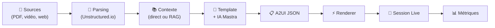

---

## 3. Widget Protocol Specification (WPS++)

Le **Widget Protocol Specification (WPS++)** est un standard ouvert qui définit comment créer, distribuer et exécuter des widgets dans l'écosystème Qiplim.

### 3.1 Philosophie et principes

| Principe | Description |
|----------|-------------|
| **Data-first** | Les widgets communautaires sont des spécifications JSON pures, pas du code exécutable |
| **A2UI Native** | Rendu standardisé via un catalogue de composants UI whitelistés |
| **Security by Design** | Isolation, sandbox et médiation IA pour tous les appels |
| **Accessibility First** | WCAG 2.1 niveau AA obligatoire |
| **i18n Ready** | Support multilingue et RTL dès la conception |

#### Architecture globale WPS++

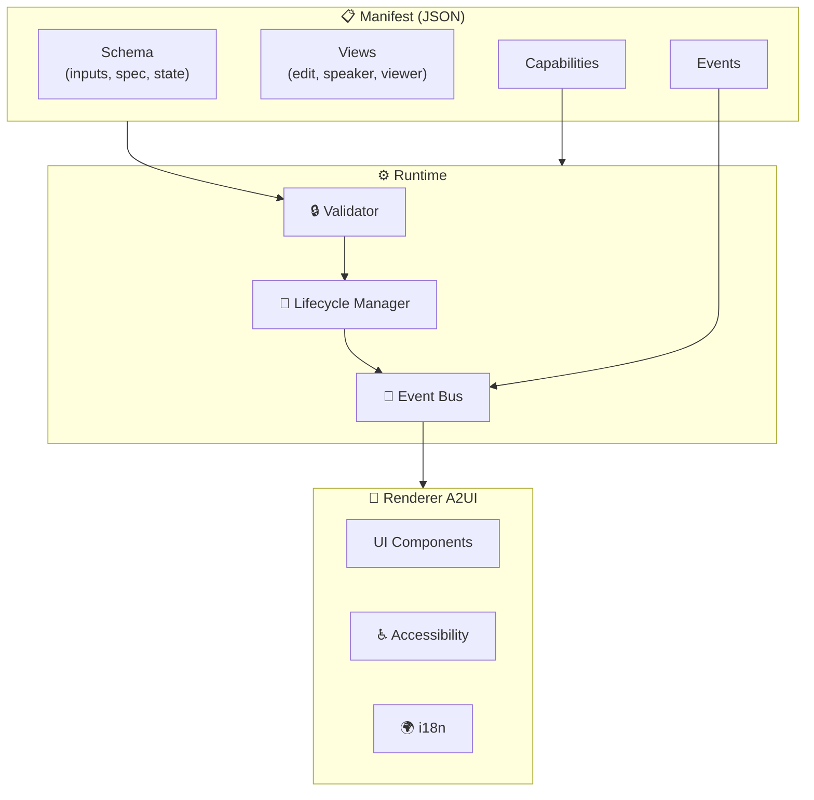

### 3.2 Structure d'un Widget

#### 3.2.1 Le Manifest

Le **manifest** est un fichier JSON qui décrit complètement un widget :

```json
{
  "apiVersion": "1.0",
  "id": "publisher/widget-name",
  "name": "Nom du Widget",
  "version": "1.0.0",
  "description": "Description du widget",

  "publisher": { "type": "official", "name": "Qiplim", "id": "qiplim" },

  "schema": {
    "inputs": { /* Paramètres configurables */ },
    "activitySpec": { /* Contenu généré */ },
    "state": { /* État runtime */ }
  },

  "views": {
    "edit": { /* Vue édition */ },
    "speaker": { /* Vue présentateur */ },
    "viewer": { /* Vue participant */ },
    "results": { /* Vue résultats */ }
  },

  "capabilities": { /* Fonctionnalités utilisées */ },
  "events": { /* Événements émis/consommés */ },
  "security": { /* Configuration sécurité */ },
  "a11y": { /* Accessibilité */ },
  "i18n": { /* Internationalisation */ }
}
```

#### 3.2.2 Types de widgets

| Type | Description | Exemples |
|------|-------------|----------|
| `leaf` | Widget terminal sans enfants | Quiz, Timer, WordCloud, Poll |
| `composite` | Widget avec slots prédéfinis | CourseModule, AssessmentSuite |
| `container` | Widget flexible acceptant N enfants | Sequence, Parallel, Conditional |

**Diagramme de composition :**

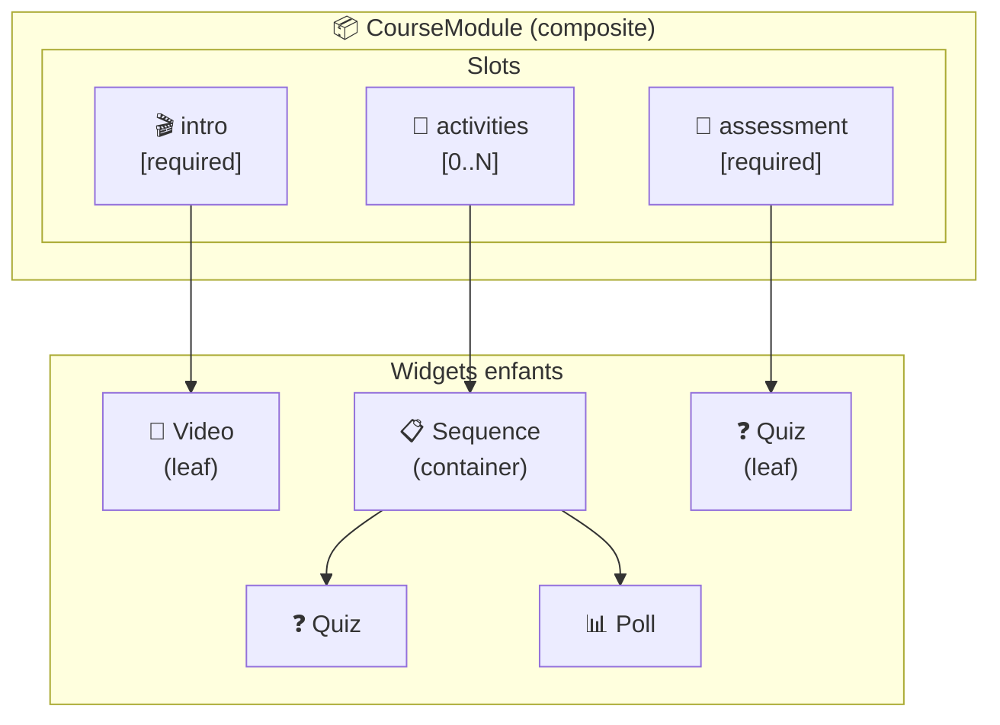

### 3.3 Lifecycle des widgets

Les widgets traversent des phases bien définies :

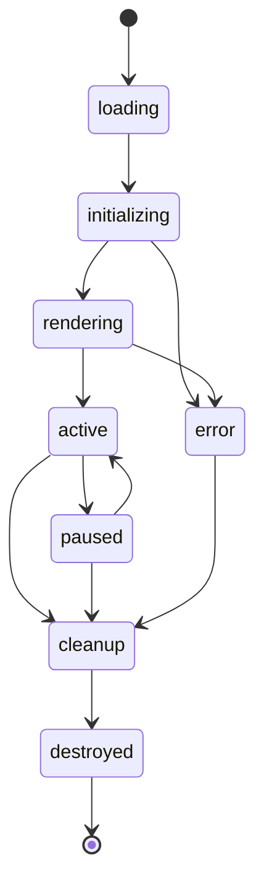

| État | Description | Transitions |
|------|-------------|-------------|
| `loading` | Chargement du manifest et ressources | → `initializing` |
| `initializing` | Initialisation avec config et contexte | → `rendering`, `error` |
| `rendering` | Génération du document A2UI | → `active`, `error` |
| `active` | Widget interactif, écoute des événements | → `paused`, `cleanup` |
| `paused` | Widget en pause (onglet inactif) | → `active`, `cleanup` |
| `cleanup` | Nettoyage des ressources | → `destroyed` |
| `destroyed` | Widget détruit | (terminal) |

**Méthodes clés du runtime :**

| Méthode | Description |
|---------|-------------|
| `initialize(config, context)` | Initialise le widget avec sa configuration |
| `render(view, state)` | Rend le widget pour une vue donnée, retourne un document A2UI |
| `handleEvent(event)` | Gère un événement entrant |
| `pause() / resume()` | Met en pause ou reprend le widget |
| `cleanup()` | Nettoie les ressources |

### 3.4 Capabilities (fonctionnalités)

Les capabilities déclarent les fonctionnalités utilisées par un widget.

#### Core Capabilities

| Capability | Description | Service exposé |
|------------|-------------|----------------|
| `ai` | Utilise l'IA pour génération/analyse | `services.ai` |
| `realtime` | Synchronisation temps réel | `services.realtime` |
| `collaboration` | Multi-participants simultanés | `services.collaboration` |
| `scoring` | Calcul et affichage de scores | `services.scoring` |
| `offline` | Support hors-ligne | `services.offline` |

#### Media Capabilities

| Capability | Description |
|------------|-------------|
| `mediaCapture` | Capture photo/vidéo |
| `fileUpload` | Upload de fichiers |
| `audio` | Enregistrement/lecture audio |

#### Export Capabilities

| Capability | Description |
|------------|-------------|
| `xapiExport` | Export vers LRS xAPI |
| `pdfExport` | Génération de rapports PDF |

#### Composition Capability (v1.1)

| Capability | Description |
|------------|-------------|
| `composition` | Widget peut contenir des enfants |

### 3.5 Système d'événements

#### Structure d'un événement

```typescript
interface WPSEvent {
  id: string;           // UUID v4
  type: string;         // Ex: "quiz.answer_submitted"
  occurredAt: string;   // ISO 8601

  actor: {
    type: 'viewer' | 'speaker' | 'system' | 'ai_agent';
    id: string;
    name?: string;
  };

  scope: {
    sessionId: string;
    widgetId: string;
    instanceId: string;
  };

  payload: Record<string, unknown>;
}
```

#### Événements par type de widget

**Quiz :**
| Événement | Description |
|-----------|-------------|
| `quiz.question_revealed` | Question révélée aux participants |
| `quiz.answer_submitted` | Réponse soumise par un participant |
| `quiz.results_shown` | Résultats affichés |
| `quiz.completed` | Quiz terminé |

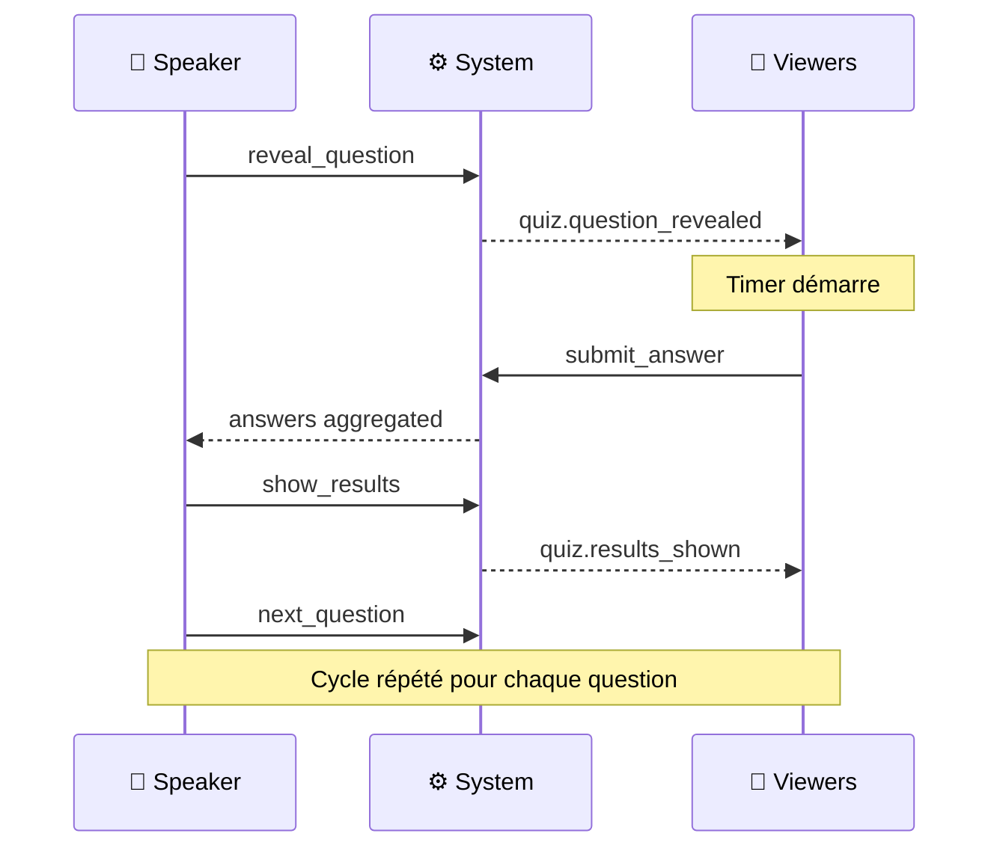

**Wordcloud :**
| Événement | Description |
|-----------|-------------|
| `wordcloud.word_submitted` | Mot soumis par un participant |
| `wordcloud.words_grouped` | Mots regroupés par l'IA |
| `wordcloud.cloud_generated` | Nuage généré |

**Post-it :**
| Événement | Description |
|-----------|-------------|
| `postit.created` | Post-it créé |
| `postit.voted` | Vote sur un post-it |
| `postit.categorized` | Post-it catégorisé |

**Composition (v1.1) :**
| Événement | Description |
|-----------|-------------|
| `composition:child_added` | Enfant ajouté à un slot |
| `composition:child_completed` | Enfant terminé |
| `composition:step_changed` | Changement d'étape (mode séquentiel) |
| `composition:state_transition` | Transition de state machine |

### 3.6 Sécurité - Modèle à 3 tiers

```
┌─────────────────────────────────────────────────────────────┐
│                     Tiers de Sécurité                        │
├─────────────────────────────────────────────────────────────┤
│   ┌─────────────────┐                                       │
│   │    OFFICIAL     │  Code natif, accès complet            │
│   │   (Qiplim)      │  Audité par l'équipe Qiplim           │
│   └────────┬────────┘                                       │
│            ▼                                                │
│   ┌─────────────────┐                                       │
│   │    VERIFIED     │  Code sandboxé, review manuelle       │
│   │  (Partenaires)  │  Paiements possibles (70/30)          │
│   └────────┬────────┘                                       │
│            ▼                                                │
│   ┌─────────────────┐                                       │
│   │   COMMUNITY     │  Data-only (JSON uniquement)          │
│   │  (Communauté)   │  Validation automatique               │
│   └─────────────────┘                                       │
└─────────────────────────────────────────────────────────────┘
```

| Aspect | Community | Verified | Official |
|--------|-----------|----------|----------|
| **Code exécutable** | Non (JSON only) | Oui (sandboxé) | Oui (natif) |
| **Review** | Automatique | Manuelle | Équipe Qiplim |
| **Accès IA** | Via médiation | Médiation + quotas | Direct |
| **Network** | Interdit | Whitelist | Configurable |
| **Participants** | 100 max | 500 max | Illimité |
| **Monétisation** | Non | Oui | Oui |

**Principe fondamental** : Les widgets n'ont **jamais** accès direct aux clés API. Toutes les requêtes IA passent par une médiation côté serveur.

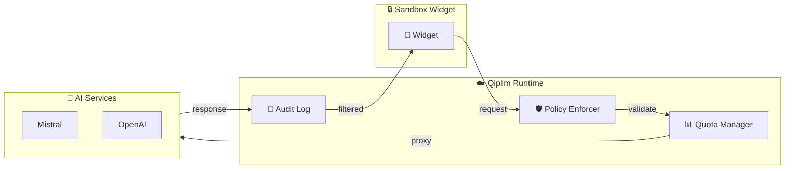

### 3.7 Composition des widgets (v1.1)

#### Slots

Les **slots** sont des emplacements pour accueillir des widgets enfants :

```json
{
  "composition": {
    "kind": "composite",
    "slots": [
      {
        "id": "intro",
        "name": "Introduction",
        "required": true,
        "accepts": [{ "tags": ["media", "content"] }],
        "maxChildren": 1
      },
      {
        "id": "activities",
        "name": "Activités",
        "required": false,
        "accepts": [{ "tags": ["interactive"] }],
        "minChildren": 0
      }
    ]
  }
}
```

#### Modes d'orchestration

| Mode | Description |
|------|-------------|
| `sequential` | Exécute les slots dans un ordre défini |
| `parallel` | Tous les slots sont actifs simultanément |
| `conditional` | Active des slots selon des conditions |
| `state-machine` | Orchestration basée sur des états et transitions |

#### State Machine Orchestration

Le mode `state-machine` permet de définir des états et transitions complexes :

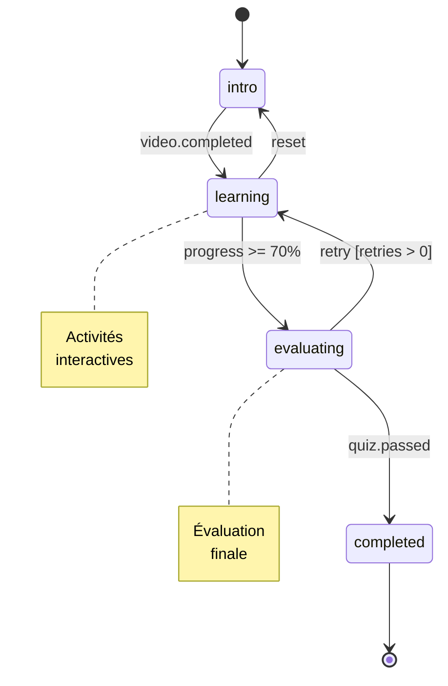

**Exemple séquentiel :**

```json
{
  "orchestration": {
    "mode": "sequential",
    "sequence": [
      { "slotId": "intro", "proceedOn": { "type": "video.completed" } },
      { "slotId": "activities", "proceedWhen": "$.state.score >= 70" },
      { "slotId": "assessment", "proceedOn": { "type": "quiz.completed" } }
    ]
  }
}
```

#### Data Pipelines

Les **pipelines** font circuler les données entre widgets enfants :

```json
{
  "dataPipelines": [{
    "id": "score-aggregation",
    "source": { "slotId": "activities", "eventType": "quiz.completed" },
    "transforms": [
      { "type": "aggregate", "function": "avg" }
    ],
    "target": { "path": "$.state.averageScore" }
  }]
}
```

### 3.8 Accessibilité et Internationalisation

#### Accessibilité (WCAG 2.1 AA)

| Catégorie | Exigences |
|-----------|-----------|
| **Clavier** | Navigation tabulaire complète, raccourcis documentés |
| **Lecteur d'écran** | Aria labels, live regions, landmarks |
| **Visuel** | Contraste min 4.5:1, texte redimensionnable, pas d'info par couleur seule |
| **Mouvement** | Respect de `prefers-reduced-motion`, animations pausables |
| **Médias** | Alt text sur images, sous-titres sur vidéos |

#### Internationalisation

```json
{
  "i18n": {
    "defaultLocale": "fr-FR",
    "supportedLocales": ["fr-FR", "en-US", "es-ES"],
    "rtlSupport": true,
    "translationMode": "static",
    "translations": {
      "fr-FR": { "ui.submit": "Valider" },
      "en-US": { "ui.submit": "Submit" }
    }
  }
}
```

---

## 4. Exemples concrets

### 4.1 Quiz Interactive (Leaf)

Un quiz à choix multiples avec timer, scoring et leaderboard en temps réel.

**Capabilities déclarées :**
- `ai`: Génération des questions
- `realtime`: Synchronisation des réponses
- `scoring`: Calcul et affichage des scores
- `xapiExport`: Export des résultats

**Cycle de vie d'une question :**

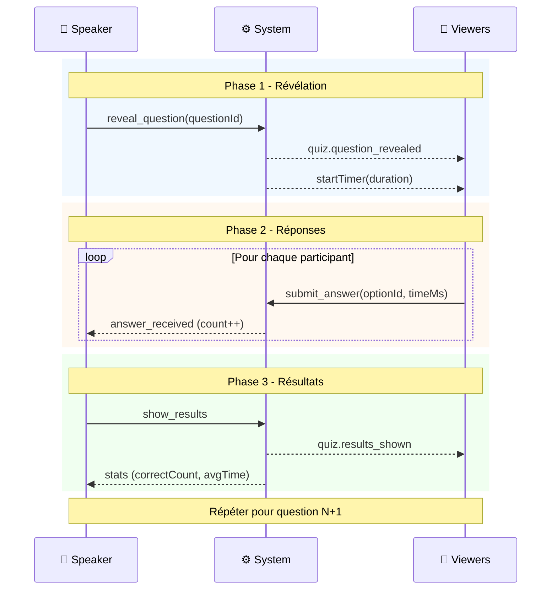

**Extrait du manifest :**

```json
{
  "id": "qiplim/quiz-interactive",
  "capabilities": {
    "ai": true,
    "realtime": true,
    "scoring": true,
    "offline": false
  },
  "events": {
    "emitted": [
      { "type": "quiz.answer_submitted", "payload": { "questionId": "string", "optionId": "string", "timeMs": "integer" } },
      { "type": "quiz.completed", "payload": { "totalScore": "integer", "correctAnswers": "integer" } }
    ]
  }
}
```

### 4.2 Course Module (Composite)

Un module de cours complet avec introduction, activités et évaluation finale.

**Structure avec 3 slots :**

| Slot | Description | Widgets acceptés |
|------|-------------|------------------|
| `intro` | Introduction obligatoire | Video, Slides, Text |
| `activities` | Activités interactives (0-N) | Quiz, Poll, Wordcloud |
| `assessment` | Évaluation finale obligatoire | Quiz, Exam |

**Orchestration séquentielle avec conditions :**

```json
{
  "orchestration": {
    "mode": "sequential",
    "sequence": [
      {
        "slotId": "intro",
        "proceedOn": { "type": "video.completed" },
        "onExit": [{ "type": "emit", "config": { "event": "module.intro_completed" } }]
      },
      {
        "slotId": "activities",
        "proceedWhen": "$.state.activitiesScore >= 70",
        "allowBack": true
      },
      {
        "slotId": "assessment",
        "proceedOn": { "type": "quiz.completed" }
      }
    ],
    "onComplete": [{ "type": "emit", "config": { "event": "module.completed" } }]
  }
}
```

**Diagramme d'orchestration :**

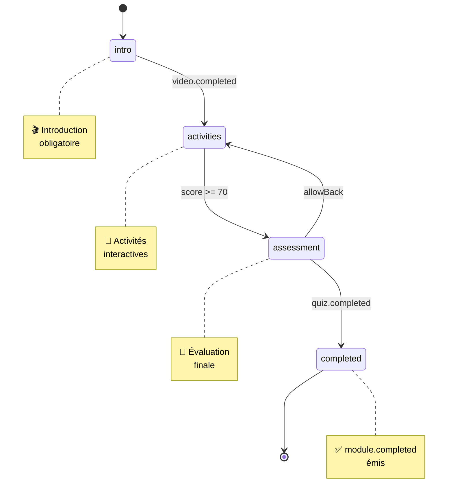

### 4.3 Formation Adaptive (Composite + Conditional)

Un formateur crée une présentation complète pour une formation sur la cybersécurité. Selon les résultats du quiz diagnostic, les participants suivent des **parcours différenciés** adaptés à leur niveau.

#### Structure de la présentation

| Widget | Type | Description |
|--------|------|-------------|
| Slides intro | `leaf` | Introduction au sujet et objectifs |
| Quiz diagnostic | `leaf` | Évalue le niveau initial des participants |
| **Embranchement** | `conditional` | Routage selon le score du quiz |
| → Parcours Débutant | `sequence` | Fondamentaux + exercices guidés |
| → Parcours Avancé | `sequence` | Concepts avancés + atelier pratique |
| Atelier collaboratif | `leaf` | Post-it + Wordcloud commun |
| Quiz final | `leaf` | Évaluation finale pour tous |

#### Diagramme de structure

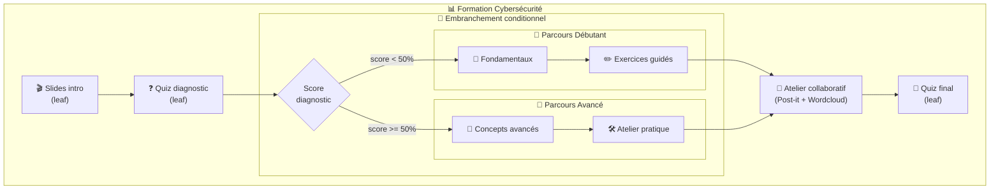

#### Diagramme d'états - Parcours conditionnel

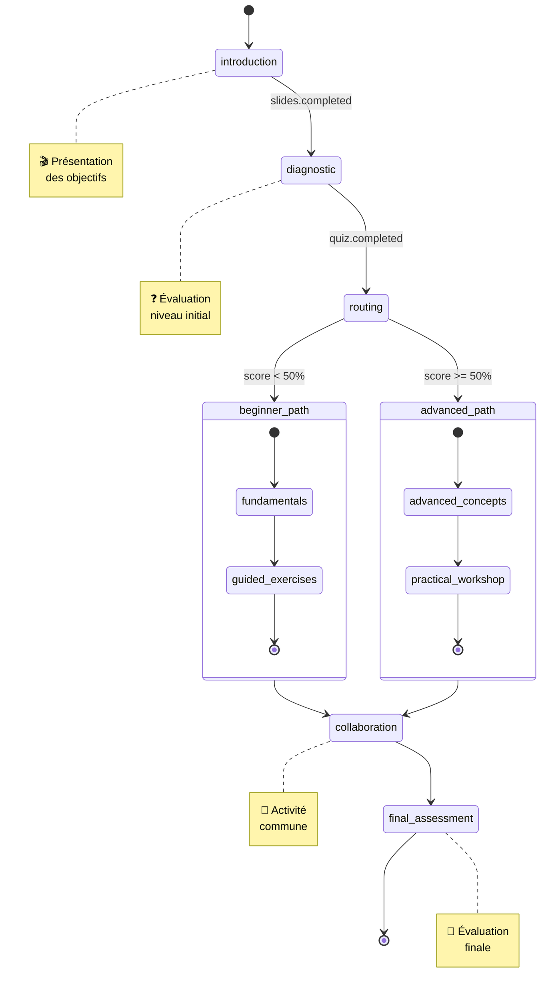

#### Diagramme de séquence - Flux participant

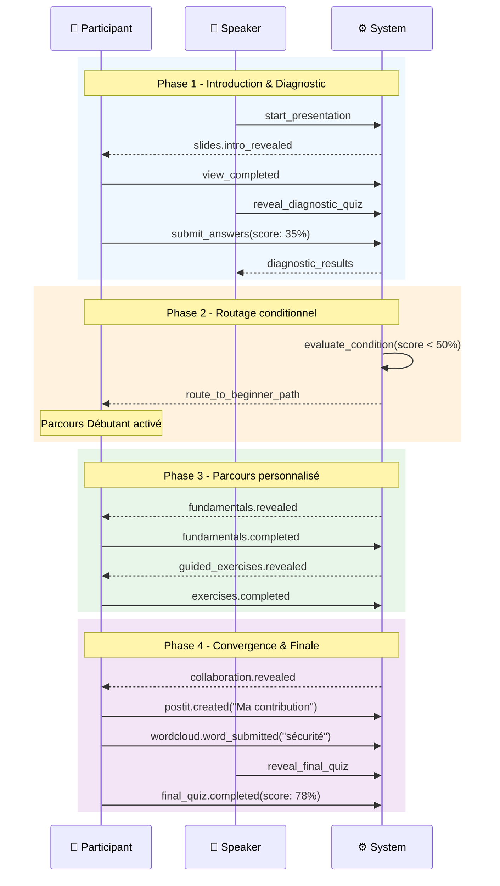

#### Configuration d'orchestration

```json
{
  "id": "formation-adaptive-cybersecurity",
  "composition": {
    "kind": "composite",
    "slots": [
      { "id": "intro", "required": true, "accepts": [{ "tags": ["content"] }] },
      { "id": "diagnostic", "required": true, "accepts": [{ "tags": ["quiz"] }] },
      { "id": "beginner_path", "required": false, "accepts": [{ "tags": ["sequence"] }] },
      { "id": "advanced_path", "required": false, "accepts": [{ "tags": ["sequence"] }] },
      { "id": "collaboration", "required": true, "accepts": [{ "tags": ["interactive"] }] },
      { "id": "final", "required": true, "accepts": [{ "tags": ["quiz"] }] }
    ]
  },
  "orchestration": {
    "mode": "state-machine",
    "states": {
      "introduction": { "activeSlots": ["intro"] },
      "diagnostic": { "activeSlots": ["diagnostic"] },
      "beginner_path": { "activeSlots": ["beginner_path"] },
      "advanced_path": { "activeSlots": ["advanced_path"] },
      "collaboration": { "activeSlots": ["collaboration"] },
      "final_assessment": { "activeSlots": ["final"] }
    },
    "transitions": [
      { "from": "introduction", "to": "diagnostic", "on": { "type": "slides.completed" } },
      { "from": "diagnostic", "to": "beginner_path", "when": "$.state.diagnosticScore < 50" },
      { "from": "diagnostic", "to": "advanced_path", "when": "$.state.diagnosticScore >= 50" },
      { "from": "beginner_path", "to": "collaboration", "on": { "type": "sequence.completed" } },
      { "from": "advanced_path", "to": "collaboration", "on": { "type": "sequence.completed" } },
      { "from": "collaboration", "to": "final_assessment", "on": { "type": "speaker.proceed" } }
    ],
    "initialState": "introduction"
  },
  "dataPipelines": [
    {
      "id": "diagnostic-score-capture",
      "source": { "slotId": "diagnostic", "eventType": "quiz.completed" },
      "transforms": [{ "type": "extract", "path": "$.payload.score" }],
      "target": { "path": "$.state.diagnosticScore" }
    }
  ]
}
```

---

### 4.4 Présentation Linéaire (Sequence)

Un speaker fait une présentation produit lors d'une conférence. Le flux est **linéaire et simple** avec des interactions ponctuelles pour engager l'audience.

#### Structure de la présentation

| Widget | Type | Description |
|--------|------|-------------|
| Slide titre | `leaf` | Accroche + QR code pour rejoindre |
| Wordcloud icebreaker | `leaf` | "Un mot pour décrire votre attente" |
| Slides contenu | `leaf` | 5 slides de présentation produit |
| Poll satisfaction | `leaf` | Vote en temps réel sur les fonctionnalités |
| Quiz récap | `leaf` | 3 questions rapides de validation |
| Slide conclusion | `leaf` | Call-to-action + contacts |

#### Diagramme de flux linéaire

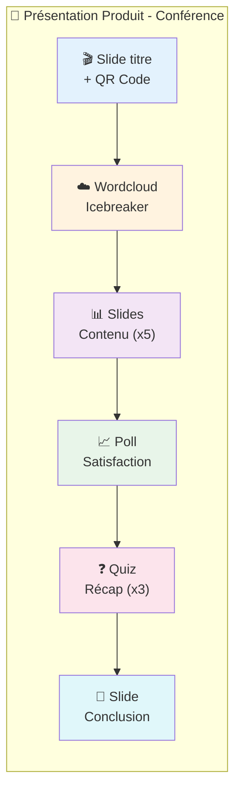

#### Diagramme de séquence - Interaction Wordcloud

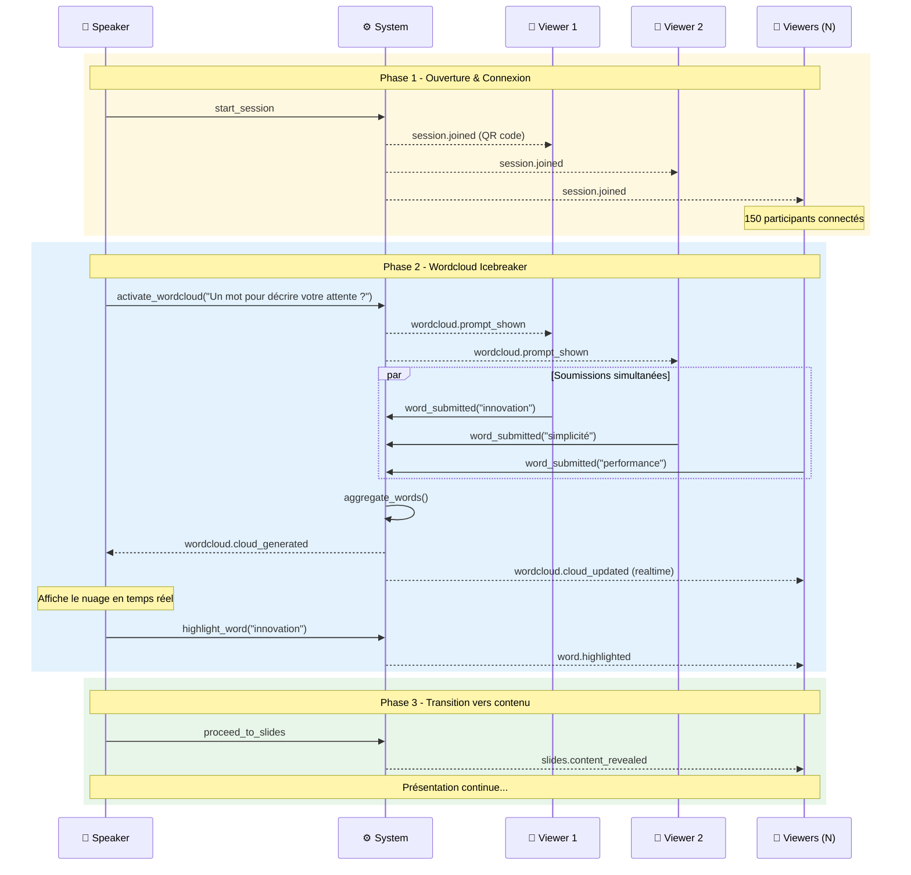

#### Diagramme de séquence - Flux complet simplifié

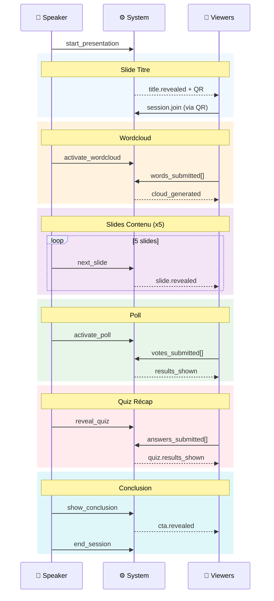

#### Configuration d'orchestration

```json
{
  "id": "presentation-lineaire-conference",
  "composition": {
    "kind": "container",
    "childrenMode": "sequence"
  },
  "orchestration": {
    "mode": "sequential",
    "sequence": [
      {
        "widgetId": "title-slide",
        "proceedOn": { "type": "speaker.proceed" },
        "onEnter": [{ "type": "emit", "config": { "event": "session.qr_displayed" } }]
      },
      {
        "widgetId": "wordcloud-icebreaker",
        "proceedOn": { "type": "speaker.proceed" },
        "config": {
          "prompt": "Un mot pour décrire votre attente ?",
          "maxWords": 3,
          "duration": 60
        }
      },
      {
        "widgetId": "content-slides",
        "proceedOn": { "type": "slides.completed" },
        "config": { "slideCount": 5, "autoAdvance": false }
      },
      {
        "widgetId": "satisfaction-poll",
        "proceedOn": { "type": "speaker.proceed" },
        "config": {
          "question": "Quelle fonctionnalité vous intéresse le plus ?",
          "options": ["Performance", "Simplicité", "Intégrations", "Prix"],
          "showResultsLive": true
        }
      },
      {
        "widgetId": "recap-quiz",
        "proceedOn": { "type": "quiz.completed" },
        "config": { "questionCount": 3, "timePerQuestion": 20 }
      },
      {
        "widgetId": "conclusion-slide",
        "proceedOn": { "type": "speaker.end_session" },
        "onEnter": [{ "type": "emit", "config": { "event": "presentation.ending" } }]
      }
    ],
    "navigation": {
      "allowBack": true,
      "showProgress": true
    },
    "onComplete": [
      { "type": "emit", "config": { "event": "presentation.completed" } },
      { "type": "export", "config": { "format": "xapi", "includeResponses": true } }
    ]
  }
}
```

---

## 5. Conclusion

### Points clés à retenir

| Aspect | Valeur |
|--------|--------|
| **Vision** | Transformer des documents en expériences interactives grâce à l'IA |
| **Architecture** | Interface 3 panneaux + Pipeline de génération |
| **WPS++** | Standard ouvert, data-first, sécurisé par design |
| **Types de widgets** | Leaf, Composite, Container |
| **Sécurité** | 3 tiers (Community, Verified, Official) avec médiation IA |
| **Accessibilité** | WCAG AA obligatoire dès la conception |

### Documentation technique complète

| Document | Lien |
|----------|------|
| Vue d'ensemble Studio | [00-index.md](./00-index.md) |
| Architecture | [01-architecture/01-overview.md](./01-architecture/01-overview.md) |
| **WPS++ Index** | [10-widget-protocol-spec/00-index.md](./10-widget-protocol-spec/00-index.md) |
| Manifest | [10-widget-protocol-spec/01-manifest.md](./10-widget-protocol-spec/01-manifest.md) |
| Lifecycle | [10-widget-protocol-spec/03-lifecycle.md](./10-widget-protocol-spec/03-lifecycle.md) |
| Capabilities | [10-widget-protocol-spec/04-capabilities.md](./10-widget-protocol-spec/04-capabilities.md) |
| Events | [10-widget-protocol-spec/05-events.md](./10-widget-protocol-spec/05-events.md) |
| Security | [10-widget-protocol-spec/06-security.md](./10-widget-protocol-spec/06-security.md) |
| Composition | [10-widget-protocol-spec/11-composition.md](./10-widget-protocol-spec/11-composition.md) |

### Exemples de manifests

| Exemple | Lien |
|---------|------|
| Quiz Interactive | [examples/quiz-manifest.json](./10-widget-protocol-spec/examples/quiz-manifest.json) |
| Roleplay | [examples/roleplay-manifest.json](./10-widget-protocol-spec/examples/roleplay-manifest.json) |
| Course Module | [examples/course-module-manifest.json](./10-widget-protocol-spec/examples/course-module-manifest.json) |

---

*Document généré le 23 janvier 2026*
