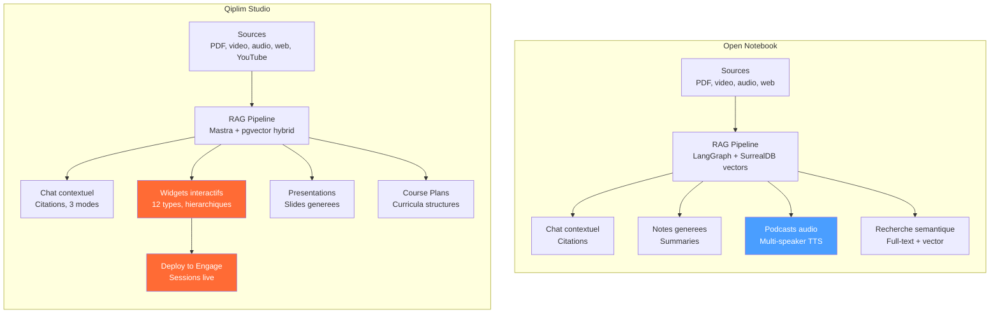
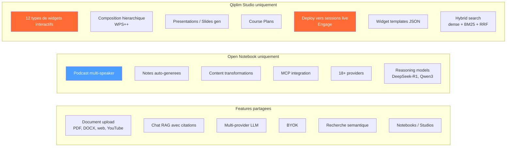
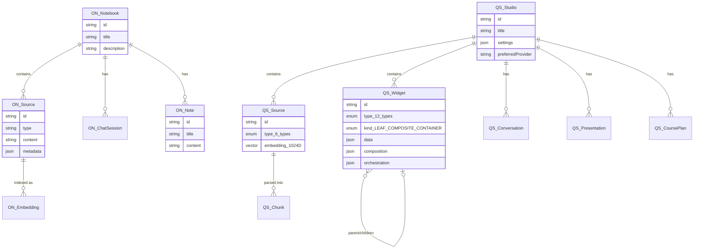
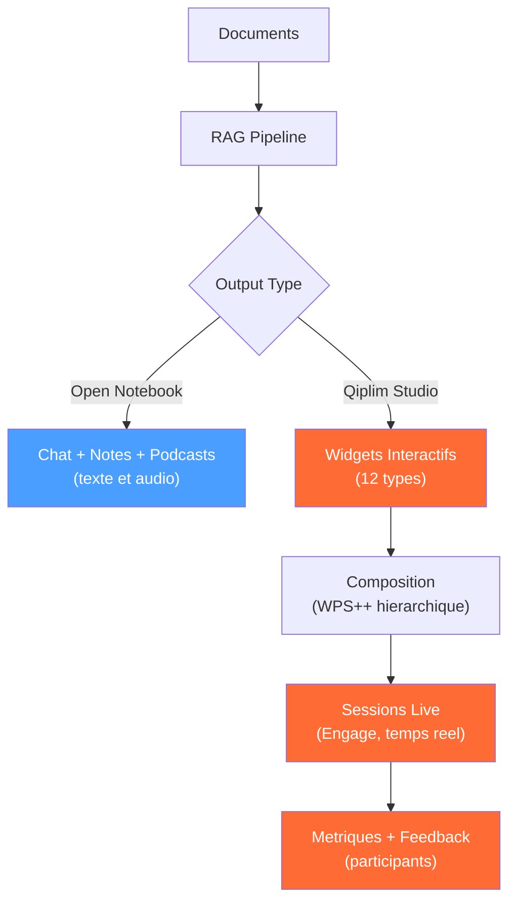

# Open Notebook vs Qiplim Studio — Comparaison approfondie

> Analyse comparative detaillee — Avril 2026
>
> - Open Notebook : https://github.com/lfnovo/open-notebook (22k stars, MIT, actif)
> - Qiplim Studio : branche `studio`, experimental

---

## Vue d'ensemble

**Open Notebook** = NotebookLM clone (documents → chat + notes + podcasts)
**Qiplim Studio** = RAG to Web Component (documents → widgets interactifs → sessions live)

---

## Matrice comparative

### Metadonnees

| | Open Notebook | Qiplim Studio |
|--|--------------|---------------|
| Stars | 22k | Private |
| Licence | MIT | Proprietary (OSS prevu) |
| Langage principal | Python (backend), TypeScript (frontend) | TypeScript (full stack) |
| Backend | FastAPI (Python) | Next.js API Routes (Node.js) |
| Frontend | Next.js 16, React 19 | Next.js 15, React 18 |
| Base de donnees | SurrealDB (graph/document) | PostgreSQL + pgvector |
| State management | Zustand + TanStack Query | React Context seul |
| Orchestration AI | LangGraph (workflows) | Mastra (workflows) |
| Queue | Async jobs (in-process) | BullMQ + Redis |
| Auth | Password middleware (basic) | BetterAuth + anonymous sessions |
| Self-hosting | Docker Compose, 2 min setup | Docker dev only, pas de prod Docker |
| Tests | Pytest (unit + integration) | Zero tests |

### Features

| Feature | Open Notebook | Studio | Notes |
|---------|:---:|:---:|-------|
| **Upload documents** | PDF, DOCX, audio, video, web | PDF, DOCX, PPTX, XLSX, web, YouTube | Studio supporte plus de formats bureautiques |
| **Chat RAG** | LangGraph ask workflow + citations | Hybrid search (dense+BM25+RRF) + streaming | Studio a un search plus sophistique |
| **Multi-provider LLM** | 18+ providers (Esperanto lib) | 4 providers (Mistral, OpenAI, Anthropic, Google) | Open Notebook largement devant |
| **BYOK** | Credentials chiffrees en DB | XOR encryption (non securise) | Open Notebook plus mature |
| **Podcast generation** | Multi-speaker, profiles, TTS multi-provider | Non | Absent de Studio |
| **Notes generation** | Summaries auto, notes | Non | Absent de Studio |
| **Content transformations** | Actions customisables | Non | Absent de Studio |
| **Widgets interactifs** | Non | 12 types (quiz, wordcloud, roleplay...) | Absent d'Open Notebook |
| **Composition hierarchique** | Non | WPS++ (leaf, composite, container) | Unique a Studio |
| **Presentations** | Non | Generation de slides | Absent d'Open Notebook |
| **Course Plans** | Non | Generation de curricula | Absent d'Open Notebook |
| **Sessions live** | Non | Via deploy vers Engage (Ably realtime) | Absent d'Open Notebook |
| **Templates de generation** | Non | JSON templates with prompts + schemas | Absent d'Open Notebook |
| **Recherche** | Vector + full-text (SurrealDB) | Hybrid RRF (pgvector + tsvector BM25) | Studio plus avance (fusion RRF) |
| **MCP integration** | Oui (Claude Desktop, VS Code) | Non | Open Notebook plus connecte |
| **Reasoning models** | DeepSeek-R1, Qwen3 | Non | Open Notebook plus large |
| **i18n** | Translation keys dans le frontend | Non | Open Notebook plus prepare |
| **Self-hosting** | Docker Compose 2 min | Dev Docker only | Open Notebook bien devant |
| **Tests** | Pytest (unit + graph integration) | Zero | Open Notebook plus mature |
| **REST API docs** | Swagger auto (FastAPI) | Non | Open Notebook plus documente |

---

## Architecture comparee

### Pipeline de traitement

```mermaid
flowchart TB
    subgraph ON["Open Notebook Pipeline"]
        direction LR
        ON_A["Upload"] --> ON_B["content-core<br/>extraction"]
        ON_B --> ON_C["Esperanto<br/>embedding"]
        ON_C --> ON_D["SurrealDB<br/>vector store"]
        ON_D --> ON_E["LangGraph<br/>ask workflow"]
        ON_E --> ON_F["LLM response<br/>+ citations"]
    end

    subgraph QS["Qiplim Studio Pipeline"]
        direction LR
        QS_A["Upload"] --> QS_B["Unstructured.io<br/>parsing"]
        QS_B --> QS_C["Structure-aware<br/>chunking"]
        QS_C --> QS_D["Mistral embed<br/>+ tsvector BM25"]
        QS_D --> QS_E["pgvector<br/>+ PostgreSQL"]
        QS_E --> QS_F["Hybrid search<br/>RRF fusion"]
        QS_F --> QS_G["Mastra workflow<br/>template + LLM"]
        QS_G --> QS_H["Widget<br/>ou Chat response"]
    end
```

### Data model

---

## Decisions architecturales comparees

| Decision | Open Notebook | Studio | Analyse |
|----------|--------------|--------|---------|
| **Langage backend** | Python (FastAPI) | TypeScript (Next.js API Routes) | ON: ecosysteme ML plus riche. Studio: stack unifiee TS |
| **Database** | SurrealDB (graph + vector) | PostgreSQL + pgvector | ON: schema flexible mais niche. Studio: ecosysteme mature, tooling (Prisma) |
| **Orchestration AI** | LangGraph (state machines) | Mastra (step workflows) | LangGraph plus expressif (cycles, conditions). Mastra plus simple mais lineaire |
| **Provider abstraction** | Esperanto (lib custom, 18+) | providers.ts (4 providers) | ON bien plus extensible |
| **Embedding storage** | SurrealDB native vectors | pgvector extension | Equivalent fonctionnel, PostgreSQL plus battle-tested |
| **Frontend state** | Zustand + TanStack Query | React Context + fetch manual | ON: patterns modernes. Studio: plus basique, moins performant |
| **Auth** | Password middleware | BetterAuth + anonymous | Studio plus complet en auth, ON plus simple |
| **Queue system** | In-process async (FastAPI) | BullMQ + Redis | Studio plus robuste pour jobs lourds |
| **Self-hosting** | Docker Compose tout-en-un | Dev Docker seulement | ON pret a deployer, Studio non |

---

## Ou Open Notebook excelle

1. **Self-hosting story** : Docker Compose en 2 minutes, un seul `docker compose up`. Studio n'a meme pas de Dockerfile.
2. **Provider diversity** : 18+ providers vs 4. Support Ollama/LM Studio pour le local. Reasoning models (DeepSeek-R1).
3. **Podcast generation** : Pipeline complet multi-speaker avec profiles et TTS multi-provider. Feature absente de Studio.
4. **Content transformations** : Actions customisables sur le contenu. Studio n'a que la generation via templates.
5. **MCP integration** : Connectivite avec Claude Desktop, VS Code. Studio est isole.
6. **Tests + API docs** : Pytest + Swagger auto. Studio a zero tests et zero docs API.
7. **i18n** : Translation keys des le depart. Studio n'a aucun support multilingue.
8. **Frontend stack** : Zustand + TanStack Query = patterns modernes et performants. Studio utilise Context + fetch brut.

## Ou Qiplim Studio excelle

1. **Widgets interactifs** : 12 types de widgets generatifs. Open Notebook ne produit que du texte/audio.
2. **Composition hierarchique** : WPS++ (leaf/composite/container avec slots). Rien d'equivalent dans Open Notebook.
3. **Sessions live** : Bridge vers Engage pour jouer les widgets en session temps reel avec participants. Open Notebook est offline-only.
4. **Hybrid search** : Dense + BM25 sparse + RRF fusion. Plus sophistique que le vector-only d'Open Notebook.
5. **Presentations** : Generation de slides structurees. Absent d'Open Notebook.
6. **Course Plans** : Generation de curricula pedagogiques. Absent d'Open Notebook.
7. **Template system** : JSON templates avec prompts, input/output schemas, RAG config. Pipeline de generation plus structuree.
8. **Auth** : BetterAuth + sessions anonymes. Plus complet que le password middleware d'Open Notebook.

---

## Lecons a tirer pour Studio

### Ce qu'on devrait adopter d'Open Notebook

| Pattern | Effort | Impact |
|---------|--------|--------|
| **Zustand + TanStack Query** au lieu de Context + fetch brut | M | Performance + DX |
| **Docker Compose prod** avec un seul `docker compose up` | M | Prerequis OSS |
| **Swagger/OpenAPI** auto-genere depuis les routes | S | Docs API gratuites |
| **Support Ollama/LM Studio** pour le local | S | Self-hosting credible |
| **Tests** (meme basiques) | M | Confiance code |
| **MCP integration** pour connecter Studio a Claude Desktop / VS Code | M | Ecosysteme |
| **i18n** avec translation keys | M | Marche international |

### Ce qu'on ne devrait PAS copier

| Pattern | Raison |
|---------|--------|
| SurrealDB | Niche, moins d'outillage que PostgreSQL. Notre choix pgvector est meilleur. |
| Python backend | On a un monorepo TypeScript unifie, pas de raison de splitter. |
| Password middleware pour auth | Trop basique. Notre BetterAuth est mieux. |
| In-process async jobs | BullMQ + Redis est plus robuste pour les jobs lourds de generation. |
| Podcast generation (pour l'instant) | Pas dans notre scope immnediat. A considerer Phase 6. |

### Notre avantage competitif irreductible

Open Notebook transforme des documents en **contenu passif** (texte, audio).
Studio transforme des documents en **experiences interactives** avec participants, scoring, et metriques temps reel.

**Aucun projet open source ne couvre ce segment.** C'est le differenciateur fondamental.

---

Sources:
- [Open Notebook GitHub](https://github.com/lfnovo/open-notebook)
- [Open Notebook Docs](https://open-notebook.ai)
